# NLP笔记

## NLP导论

### 定义

自然语言处理（Natural Language Processing, NLP），是人工智能领域的一个重要分支。自然语言，指人类日常使用的语言（如中文、英文），NLP 的目标是让计算机“理解”或“使用”这些语言。

### 常见任务

自然语言处理包含多个典型任务，主要可分为以下几类：

#### 文本分类

对整段文本进行判断或归类。

常见应用：情感分析（判断评价是正面还是负面）、垃圾邮件识别、新闻主题分类等。

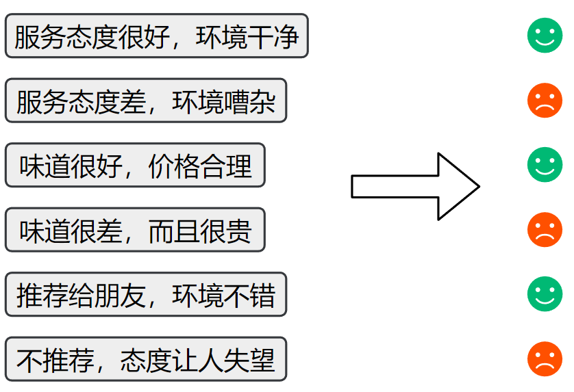

#### 序列标注

对一段文本中的每个词或字打上标签。

常见应用：命名实体识别（找出人名、地名、手机号码等）

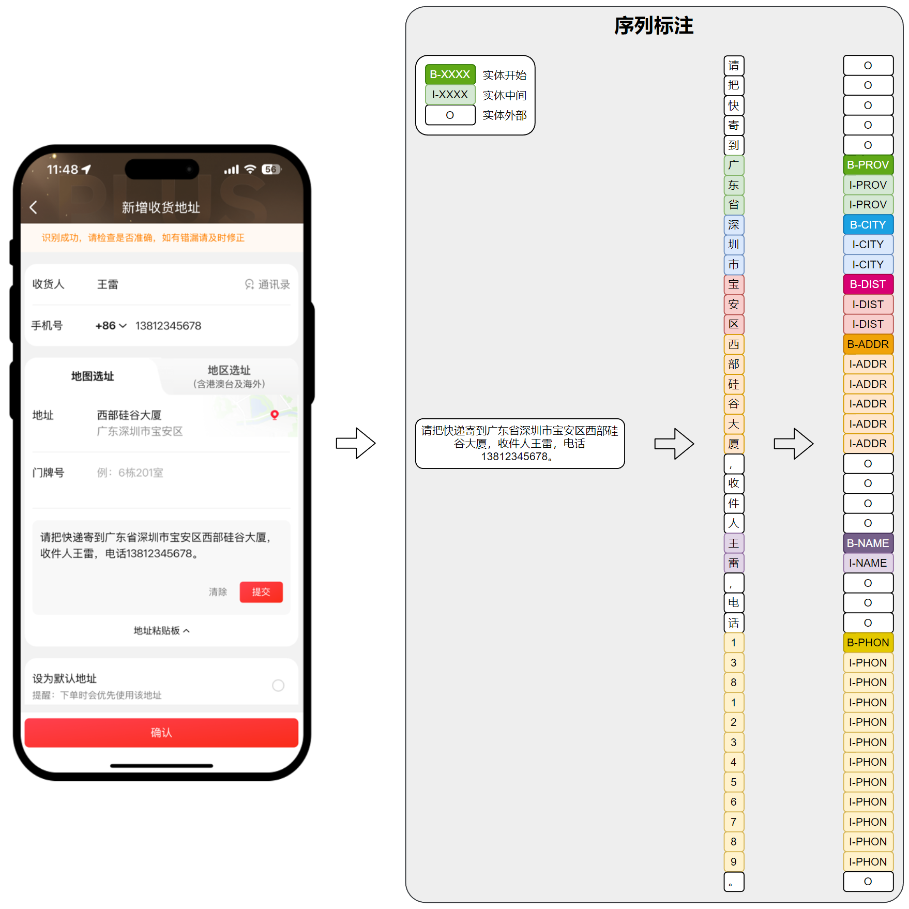

#### 文本生成

根据已有内容生成新的自然语言文本。

常见应用：自动写作、摘要生成、智能回复、对话系统等。

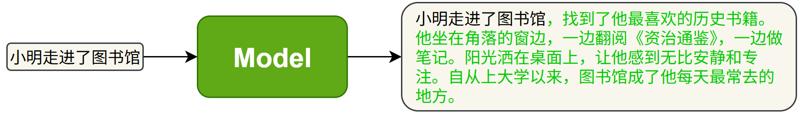

#### 信息抽取

从文本中提取出结构化的信息。

常见应用：给出一段文本和一个问题，从中抽取答案。

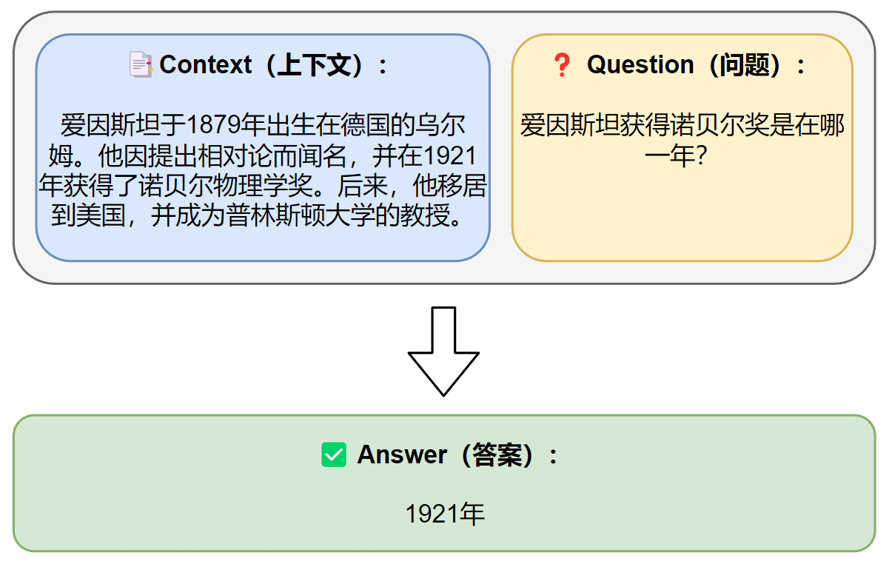

#### 文本转换

将一种文本转换为另一种形式。

常见应用：机器翻译，摘要生成等。


### 技术演进历史

#### 规则系统阶段

在20世纪50年代至80年代初，自然语言处理主要依赖人工编写的语言规则，这些规则由语言学家和程序员手动制定。这一阶段的代表系统有早期的机器翻译系统（如Georgetown-IBM实验）和ELIZA聊天机器人。这类系统在特定领域表现良好，但缺乏通用性，扩展性差，对语言的复杂性处理有限。

下面举例说明：

- Georgetown-IBM实验

该实验于1954年进行，由乔治城大学和IBM联合开发，实验演示了将60多个俄语句子完全自动翻译成英语。

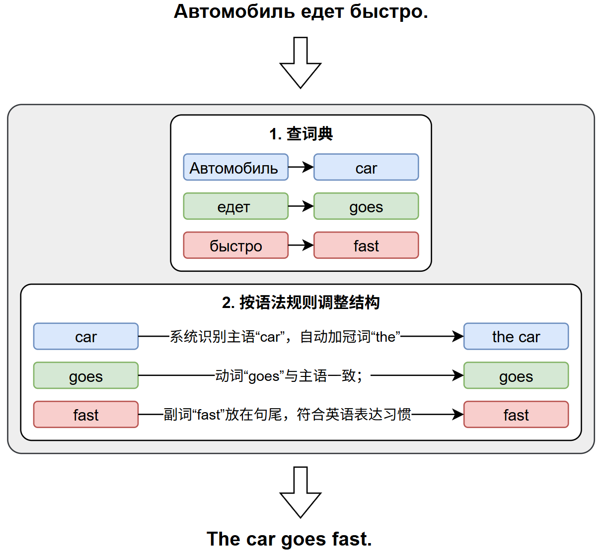

- ELIZA聊天机器人

ELIZA于1966年由约瑟夫·魏岑鲍姆（Joseph Weizenbaum）开发，目标是模拟一位心理医生，模仿“倾听式对话”，是世界上最早的“聊天机器人”。

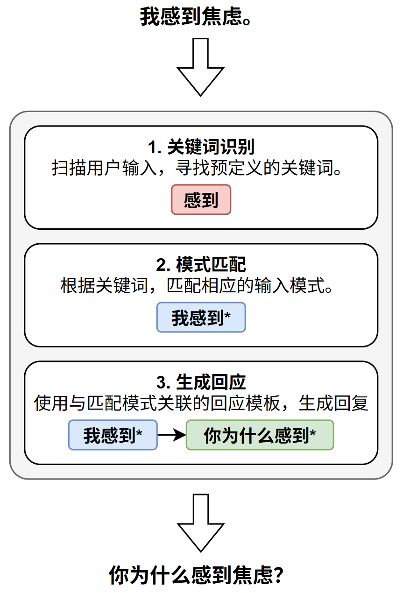

#### 统计方法阶段

90年代，随着计算能力的提升和语料资源的积累，统计方法逐渐成为主流。通过对大量文本数据进行概率建模，系统能够“学习”语言中的模式和规律。典型方法包括n-gram模型、隐马尔可夫模型（HMM）和最大熵模型。这一阶段标志着从“专家经验”向“数据驱动”方法的转变。

下面举例说明：

- N-gram模型

N-gram 模型是一种基于统计的方法，用于预测一个词在给定前几个词之后出现的可能性。它是自然语言处理中最早出现的语言建模方法之一。

该模型的核心思想是一个词出现的概率，只取决于它前面 N-1 个词。例如，在一个 Bigram（2-gram）模型 中，我们假设每个词只与它前面的一个词有关；而在 Trigram（3-gram）模型 中，我们考虑前两个词。

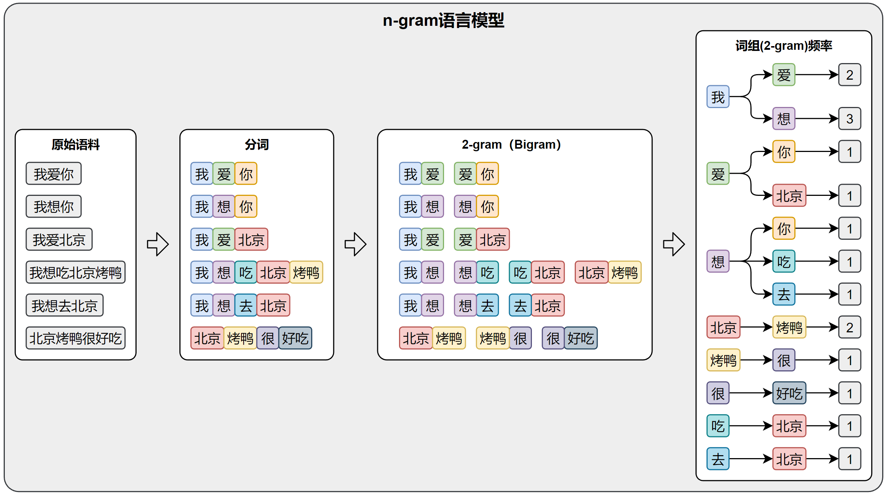

#### 机器学习阶段

进入21世纪，NLP技术逐步引入传统机器学习方法，如逻辑回归、支持向量机（SVM）、决策树、条件随机场（CRF）等。这些方法在命名实体识别、文本分类等任务上表现出色。在此阶段，特征工程成为关键环节，研究者需要设计大量手工特征来提升模型性能。该阶段的特点是学习算法更为复杂，模型泛化能力增强。

下面举例说明：

- 基于词袋模型与逻辑回归的文本分类示例

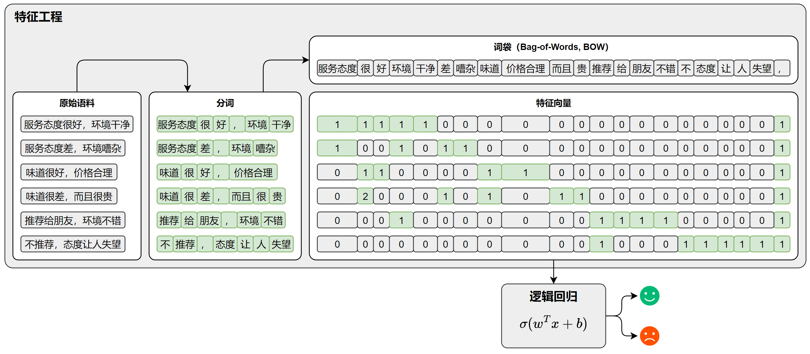

例子中提到的词袋模型，通过统计词频来表示文本，虽直接且简单，但它有一个明显的局限——它完全忽略了词语的顺序。

例如，如下两条完全相反的评论：

- 评论A：“服务很好但味道差劲”

- 评论B：“味道很好但服务差劲”

- 分词后结果分别是：

- “服务很好但味道差劲” [“服务”,“很”,“好”,“但”,“味道”,“差劲”]

- “味道很好但服务差劲” [“味道”,“很”,“好”,“但”,“服务”,“差劲”]

- 很明显，这两条评论在词袋模型中的特证向量是完全相同的。

为了解决这个问题，“古人”引入了n-gram。n-gram是将相邻的 n 个词作为一个整体来建模，这样就能保留一部分的词序信息。比如使用trigram（3-gram），上述两条评论就会变为如下：

- [“服务很好”,“很好但”,“好但味道”,“但味道差劲”]

- [“味道很好”,“很好但”,“好但服务”,“但服务差劲”]

其在词袋模型中的特征向量也就能够区分开了。

#### 深度学习阶段

自2010年代中期开始，深度学习在NLP中迅速崛起。基于神经网络的模型RNN、LSTM、GRU等，取代了传统手工特征工程，能够从海量数据中自动提取语义表示。随后，Transformer架构的提出极大提升了语言理解与生成的能力，深度学习不仅在精度上实现突破，也推动了预训练语言模型（如GPT、BERT等）和迁移学习的发展，使NLP技术更通用、更强大。

- RNN（Recurrent Neural Network）

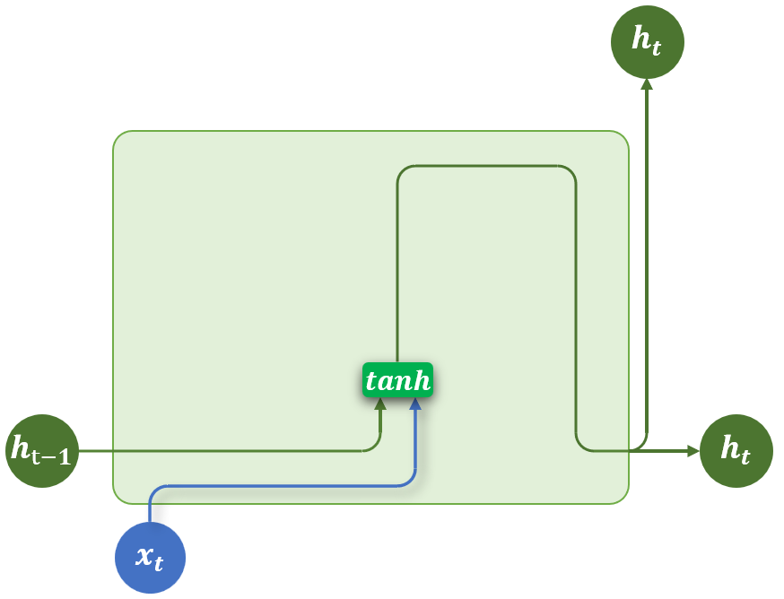

- LSTM（Long Short-Term Memory）

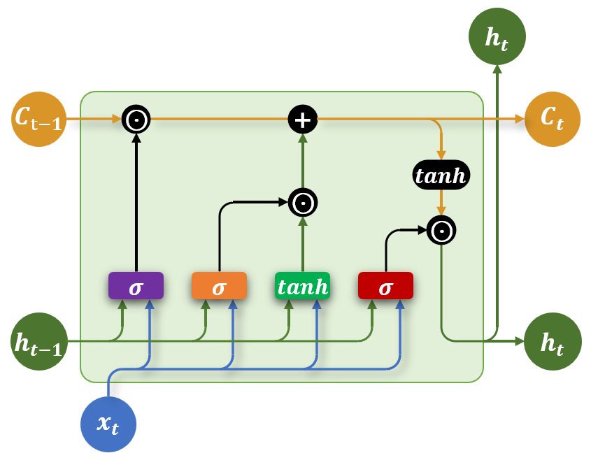

- GRU（Gated Recurrent Unit）

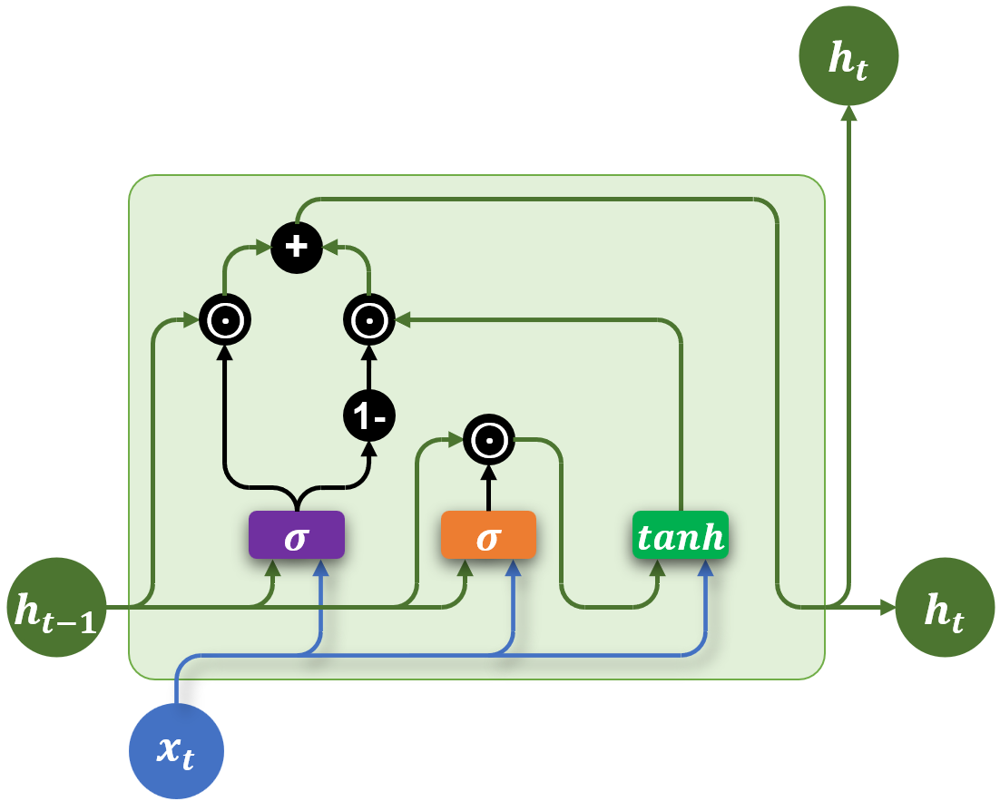

- Transformer

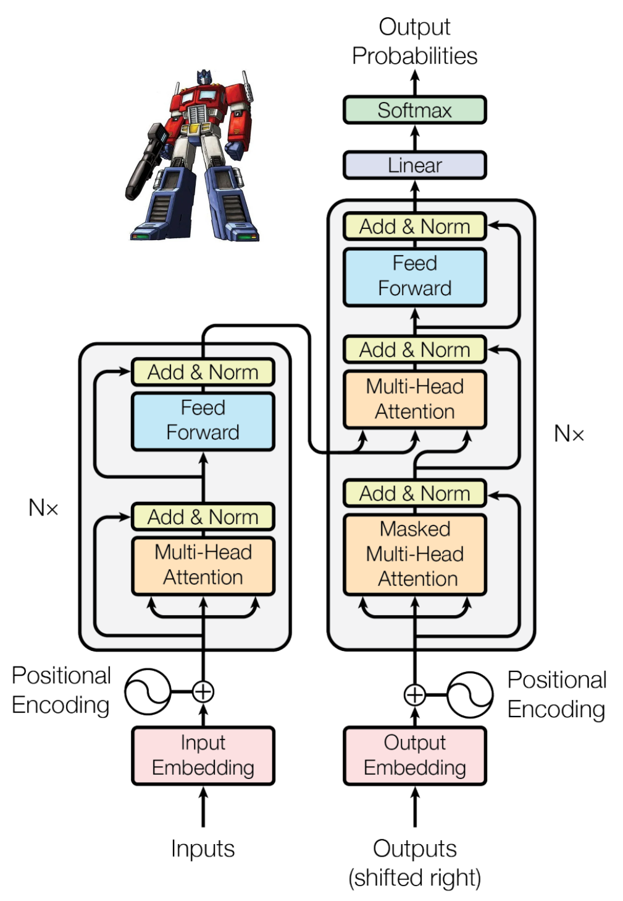

## 环境准备

### 创建conda环境

终端输入如下命令，创建项目的虚拟环境，并指定Python版本：

```
conda create -n nlp python=3.12
```

激活该虚拟环境：

```
conda activate nlp
```

### 安装所需依赖

本笔记依赖以下软件和库：

- pytorch：深度学习框架，主要用于模型的构建、训练与推理。

- jieba：高效的中文分词工具，用于对原始中文文本进行分词预处理。

- gensim：用于训练词向量模型（如 Word2Vec、FastText），提升模型对词语语义关系的理解。

- transformers：由 Hugging Face 提供的预训练模型库，用于加载和微调 BERT 等主流模型。

- datasets：Hugging Face 提供的数据处理库，用于高效加载和预处理大规模数据集。

- TensorBoard：可视化工具，用于展示训练过程中的损失函数、准确率等指标变化。

- tqdm：用于显示进度条，帮助实时监控训练与数据处理的进度。

- Jupyter Notebook：交互式开发环境，用于编写、测试和可视化模型代码与实验过程。

安装命令如下：

###### 安装pytorch

使用nvidia-smi查看CUDA版本，并根据其版本选择PyTorch版本进行安装：

```
pip3 install torch --index-url https://download.pytorch.org/whl/cu128
```

###### 安装其余依赖

其余依赖安装最新版本即可

```
pip install jieba gensim transformers datasets tensorboard tqdm jupyter
```

## 文本表示

### 概述

文本表示是将自然语言转化为计算机能够理解的数值形式，是绝大多数自然语言处理（NLP）任务的基础步骤。

早期的文本表示方法（如词袋模型）通常将整段文本编码为一个向量。这类方法实现简单、计算高效，但存在明显的局限性——表达语序和上下文语义的能力较弱。因此，现代 NLP 技术逐渐引入更加精细和表达力更强的文本表示方法，以更有效地建模语言的结构和含义。

文本表示的第一步通常是分词和词表构建，如下图所示：

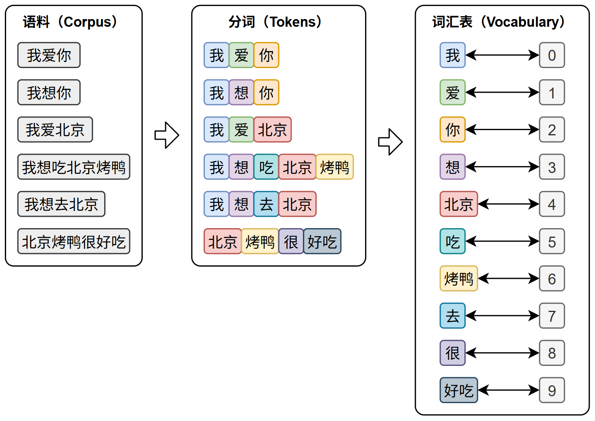

- 分词（Tokenization）是将原始文本切分为若干具有独立语义的最小单元（即token）的过程，是所有 NLP 任务的起点。

- 词表（Vocabulary）是由语料库构建出的、包含模型可识别 token 的集合。词表中每个token都分配有唯一的 ID，并支持 token 与 ID 之间的双向映射。

在后续训练或预测过程中，模型会首先对输入文本进行分词，再通过词表将每个 token 映射为其对应的 ID。接着，这些 ID 会被输入嵌入层（Embedding Layer），转换为低维稠密的向量表示（即词向量），如下图所示。

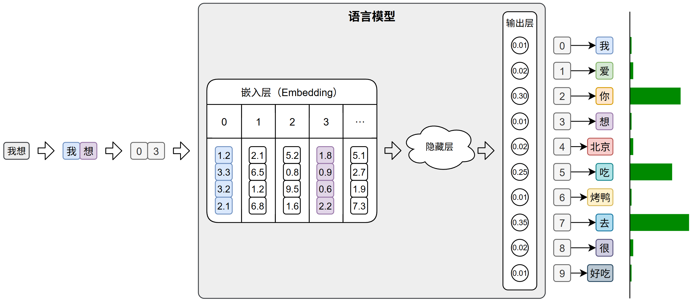

此外，在文本生成任务中，模型的输出层会针对词表中的每个 token 生成一个概率分布，表示其作为下一个词的可能性。系统通常选取具有最大概率的ID，并通过词表查找对应的 token，从而逐步生成最终的输出文本。

### 分词

不同语言由于语言结构、词边界的差异，其分词策略和算法也不尽相同，本节将分别介绍英文与中文中常见的分词方式。

#### 英文分词

按照分词粒度的大小，可分为词级（Word-Level）分词、字符级（CharacterLevel）分词和子词级（Subword‑Level）分词。下面逐一介绍

##### 词级分词

词级分词是指将文本按词语进行切分，是最传统、最直观的分词方式。在英文中，空格和标点往往是天然的分隔符。

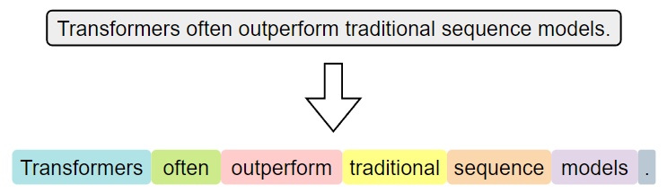

词级分词虽便于理解和实现，但在实际应用中容易出现 OOV（OutOfVocabulary，未登录词）问题。所谓 OOV，是指在模型使用阶段，输入文本中出现了不在预先构建词表中的词语，常见的包括网络热词、专有名词、复合词及拼写变体等。由于模型无法识别这些词，通常会将其统一替换为特殊标记（如 &lt;UNK&gt;），从而导致语义信息的丢失，影响模型的理解与预测能力。

##### 字符级分词

字符级分词（Character-level Tokenization）是以单个字符为最小单位进行分词的方法，文本中的每一个字母、数字、标点甚至空格，都会被视作一个独立的 token。

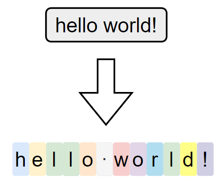

在这种分词方式下，词表仅由所有可能出现的字符组成，因此词表规模非常小，覆盖率极高，几乎不存在 OOV（Out-of-Vocabulary）问题。无论输入中出现什么样的新词或拼写变体，只要字符在词表中，都能被表示出来。

然而，由于单个字符本身语义信息极弱，模型必须依赖更长的上下文来推断词义和结构，这显著增加了建模难度和训练成本。此外，输入序列也会变得更长，影响模型效率。

##### 子词级分词

子词级分词是一种介于词级分词与字符级分词之间的分词方法，它将词语切分为更小的单元——子词（subword），例如词根、前缀、后缀或常见词片段。与词级分词相比，子词分词可以显著缓解OOV问题；与字符级分词相比，它能更好地保留一定的语义结构。

子词分词的基本思想是：即使一个完整的词没有出现在词表中，只要它可以被拆分为词表中存在的子词单元，就可以被模型识别和表示，从而避免整体被替换为&lt;UNK&gt;。

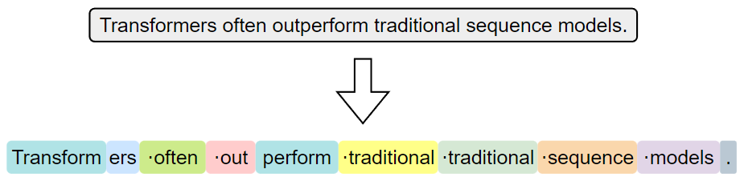

常见的子词分词算法包括 BPE（Byte Pair Encoding）、WordPiece 和 Unigram Language Model。

其中，BPE是最早被广泛应用的子词分词方法。其基本思想是，在训练阶段，首先将语料中的词汇拆分为单个字符，构建初始词表；然后迭代地统计语料中出现频率最高的相邻字符对，将其合并为新的子词单元，并加入词表。这个过程持续进行，直到词表大小达到预设上限。

在分词阶段，BPE 会根据构建好的词表和合并规则对新输入的文本进行处理。具体做法是：将文本拆分为最小单位（如字符或字节），然后按顺序应用训练中学习到的合并规则，逐步合并，直到无法继续。最终得到的就是由子词组成的分词结果。

详细的实现过程可参考Hugging Face提供的一篇优秀教程。

子词级分词已经成为现代英文 NLP 模型中的主流方法，如 BERT、GPT等模型均采用了基于子词的分词机制。

#### 中文分词

尽管中文的语言结构与英文存在显著差异，我们仍可以借助“分词粒度”的视角，对中文的分词方式进行归类和分析。

##### 字符级分词

字符级分词是中文处理中最简单的一种方式，即将文本按照单个汉字进行切分，文本中的每一个汉字都被视为一个独立的 token。

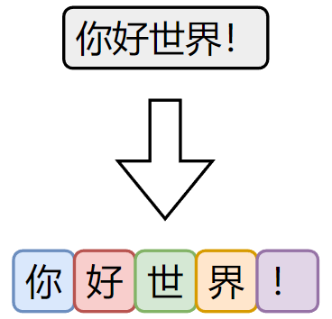

由于汉字本身通常具有独立语义，因此字符级分词在中文中具备天然的可行性。相比英文中的字符分词，中文的字符分词更加“语义友好”。

##### 词级分词

词级分词是将中文文本按照完整词语进行切分的传统方法，切分结果更贴近人类阅读习惯。

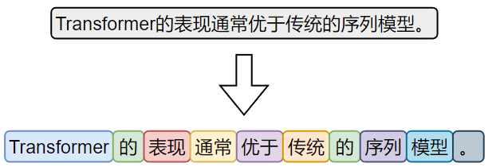

由于中文没有空格等天然词边界，词级分词通常依赖词典、规则或模型来识别词语边界。

##### 子词级分词

虽然中文没有英文中的子词结构（如前缀、后缀、词根等），但子词分词算法（如 BPE）仍可直接应用于中文。它们以汉字为基本单位，通过学习语料中高频的字组合（如“自然”、“语言”、“处理”），自动构建子词词表。这种方式无需人工词典，具有较强的适应能力。

在当前主流的中文大模型（如通义千问、DeepSeek）中，子词分词已成为广泛采用的文本切分策略。

#### 分词工具

##### 概述

目前市面上可用于中文分词的工具种类繁多，按照实现方式大致可以分为如下两类：

- 一类是基于词典或模型的传统方法，主要以“词”为单位进行切分；

- 另一类是基于子词建模算法（如BPE）的方式，从数据中自动学习高频字组合，构建子词词表。

前者的代表工具包括 jieba、HanLP等，这些工具广泛应用于传统 NLP 任务中。

后者的代表工具包括 Hugging Face Tokenizer、SentencePiece、tiktoken等，常用于大规模预训练语言模型中。

##### jieba分词器

###### 概述

jieba 是中文分词领域中应用广泛的开源工具之一，具有接口简洁、模式灵活、词典可扩展等特点，在各类传统 NLP 任务中依然具备良好的实用价值。

###### 安装

```
pip install jieba
```

###### 分词模式

jieba分词器提供了多种分词模式，以适应不同的应用场景。

###### 精确模式（默认）

试图将句子最精确地切开，适合文本分析。分词效果如下：

```
小明毕业于北京大学计算机系
⬇️
[小明|毕业|于|北京大学|计算机系]
```

精确模式分词可使用jieba.cut或者jieba.lcut方法，前者返回一个生成器对象，后者返回一个list。具体代码如下：

```
import jieba

text = "小明毕业于北京大学计算机系"

words_generator = jieba.cut(text)  # 返回一个生成器
for word in words_generator:
    print(word)

words_list = jieba.lcut(text)  # 返回一个列表
print(words_list)
```

###### 全模式

把句子中所有的可以成词的词语都扫描出来，分词效果如下：

```
小明毕业于北京大学计算机系
⬇️
[小|明|毕业|于|北京|北京大学|大学|计算|计算机|计算机系|算机|系]
```

全模式分词可使用jieba.cut或者jieba.lcut，并将cut_all参数设置为True，具体代码如下：

```
import jieba

text = "小明毕业于北京大学计算机系"

words_generator = jieba.cut(text, cut_all=True)  # 返回一个生成器
for word in words_generator:
    print(word)

words_list = jieba.lcut(text, cut_all=True)  # 返回一个列表
print(words_list)
```

###### 搜索引擎模式

在精确模式基础上，对长词进一步切分，适合用于搜索引擎分词，分词效果如下：

```
小明毕业于北京大学计算机系
```

⬇️

```
[小明|毕业|于|北京|大学|北京大学|计算|算机|计算机|计算机系]
```

可使用jieba.cut_for_search或者jieba.lcut_for_search，具体代码如下：

```
import jieba

text = "小明毕业于北京大学计算机系"

words_generator = jieba.cut_for_search(text)  # 返回一个生成器
for word in words_generator:
    print(word)

words_list = jieba.lcut_for_search(text)  # 返回一个列表
print(words_list)
```

###### 自定义词典

jieba支持用户自定义词典，以便包含 jieba 词库里没有的词，用于增强特定领域词汇的识别能力。

自定义词典的格式为：一个词占一行，每一行分三部分：词语、词频（可省略，词频决定某个词在分词时的优先级。词频越高被优先切分出来的概率越大）、词性标签（可省略，不影响分词结果），用空格隔开，顺序不可颠倒。例如

```
云计算
云原生 5
大模型 10 n
```

可使用jieba.load_userdict(file_name)加载词典文件，也可以使用jieba.add_word(word, freq=None, tag=None)与jieba.del_word(word)动态修改词典。

```
import jieba

jieba.load_userdict('dict.txt')
words_list = jieba.lcut("随着云计算技术的普及，越来越多企业开始采用云原生架构来部署服务，并借助大模型能力提升智能化水平，实现业务流程的自动化与智能决策。")
print(words_list)
```

### 词表示

#### 概述

在分词完成之后，文本被转换为一系列的 token（词、子词或字符）。然而，这些符号本身对计算机而言是不可计算的。因此，为了让模型能够理解和处理文本，必须将这些 token 转换为计算机可以识别和操作的数值形式，这一步就是所谓的词表示（word representation）。

词表示的发展经历了从稀疏的one-hot编码，到稠密的语义化词向量，再到近年来的上下文相关的词表示。不同的词表示方法在表达能力、语义建模、上下文适应性等方面存在显著差异。

#### One-hot编码

最早期的词向量表示方式是 One-hot 编码：它将词汇表中的每个词映射为一个稀疏向量，向量的长度等于整个词表的大小。该词在对应的位置为 1，其他位置为 0。

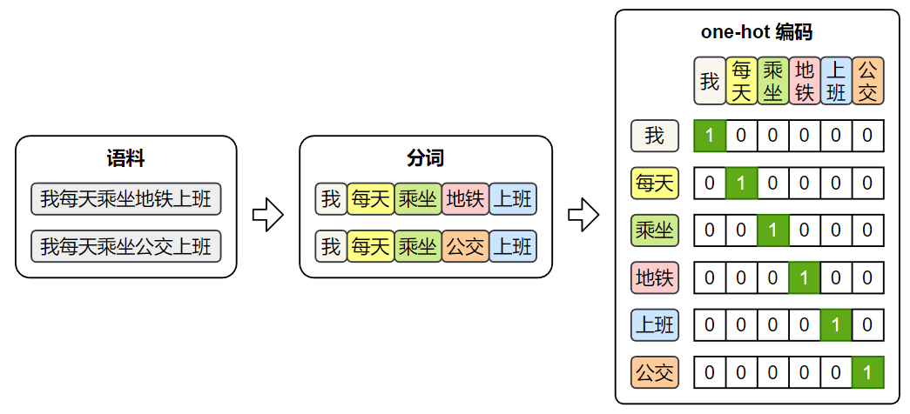

one-hot 虽然实现简单、直观易懂，但它无法体现词与词之间的语义关系，且随着词表规模的扩大，向量维度会迅速膨胀，导致计算效率低下。因此，在实际自然语言处理任务中，one-hot 表示已经很少被直接使用。

#### 语义化词向量

传统的one-hot表示虽然结构简单，但它无法反映词语之间的语义关系，也无法衡量词与词之间的相似度。为了解决这个问题，研究者提出了Word2Vec模型，它通过对大规模语料的学习，为每个词生成一个具有语义意义的稠密向量表示。这些向量能够在连续空间中表达词与词之间的关系，使得“意思相近”的词在空间中距离更近。

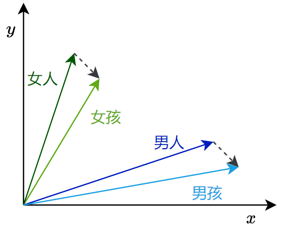

##### Word2Vec概述

Word2Vec的设计理念源自“分布假设”——即一个词的含义由它周围的词决定。

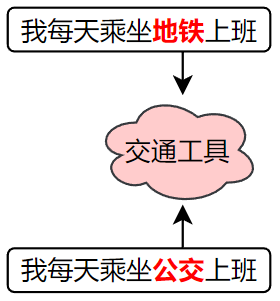

基于这一假设，Word2Vec构建了一个简洁的神经网络模型，通过学习词与上下文之间的关系，自动为每个词生成一个能够反映语义特征的向量表示。

Word2Vec提供了两种典型的模型结构，用于实现对词向量的学习：

- CBOW（Continuous Bag-of-Words）模型

输入是一个词的上下文（即前后若干个词），模型的目标是预测中间的目标词。

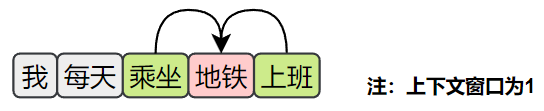

- Skip-gram 模型

输入是一个中心词，模型的目标是预测其上下文中的所有词（即前后若干个词）。

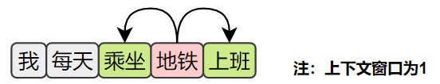

只要按照上述目标训练模型，就能得到语义化的词向量。

##### Word2Vec原理

###### 数据集

Word2Vec 不依赖人工标注，而是直接利用大规模原始文本（如书籍、新闻、网页等）作为数据源，从中自动构造训练样本。

由于两种模型的输入和输出都是词语，因此首先需要对原始文本进行分词，将连续文本转换为 token 序列。

此外，模型无法直接处理文本符号，训练时仍需将词语转换为 one-hot 编码，以便作为模型的输入和输出进行计算。

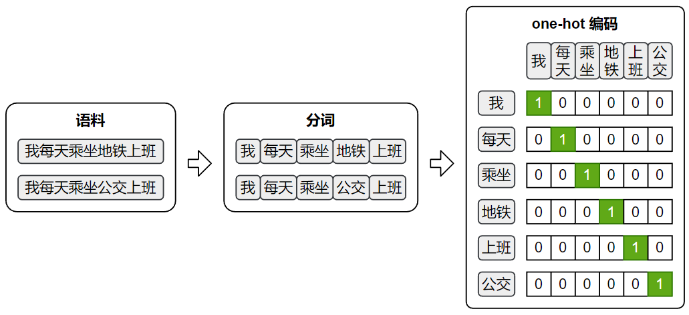

###### Skip-Gram

###### 训练数据集

Skip-Gram的目标是根据中间词预测上下文，所以其训练样本为：

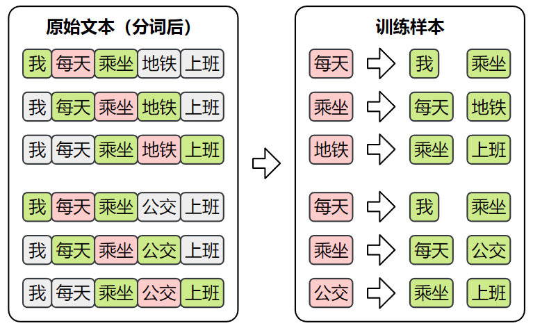

###### 模型结构

Skip-Gram模型结构如下图所示：

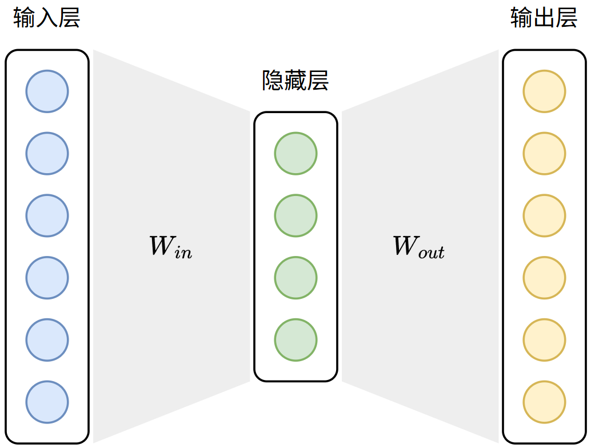

Skip-Gram模型损失值的计算图如下图所示：

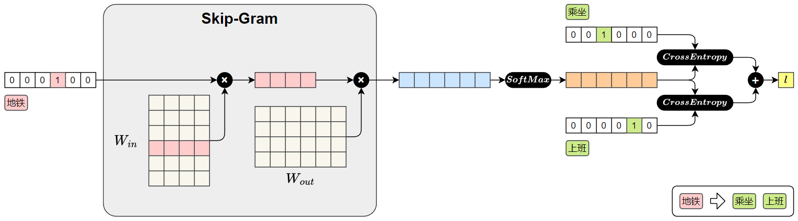

前向传播过程如下：

1.输入中心词（地铁）

“地铁”用 one-hot 向量表示

2.查找词向量（）

与参数矩阵相乘，取出“地铁”对应的词向量。（实际上就是词向量矩阵，每一行表示一个词的向量）

3.预测上下文

将中心词向量与参数矩阵 相乘，得到对整个词表的预测得分。

4.Softmax 输出

得分通过 Softmax 转为概率分布，表示各词作为上下文的可能性。

5.计算损失

与真实上下文词“乘坐”、“上班”进行比对，计算交叉熵损失并求和，得到总损失。

之后在进行反向传播时，参数矩阵中的“地铁”对应的词向量就会被更新，模型通过这个过程不断的进行学习，最终便能得到具有语义的词向量。

###### CBOW

###### 训练样本

CBOW的目标是根据上下文预测中间词，所以其训练样本为：

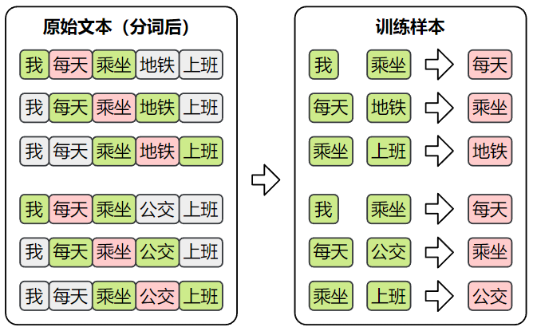

###### 模型结构

CBOW模型的结构如下图所示：


CBOW模型损失值的计算图如下图所示：

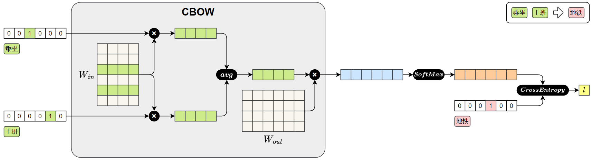

CBOW 模型的前向传播过程如下：

1.输入上下文词（乘坐、上班）

每个词用 one-hot 向量表示。

2.查找词向量（）

每个 one-hot 向量与参数矩阵 相乘，查出对应的词向量。

（ 实际上就是词向量矩阵，每一行表示一个词的向量）

3.平均上下文向量

将多个上下文词向量取平均，得到一个整体的上下文表示。

4.预测中心词

将平均后的上下文向量与参数矩阵相乘，得到对整个词表的预测得分。

5.Softmax 输出

将得分输入Softmax，得到每个词作为中心词的概率分布。

6.计算损失

将预测结果与真实中心词“地铁”的one-hot向量进行比对，计算交叉熵损失。

之后在进行反向传播时，参数矩阵中“乘坐”和“上班”对应的词向量就会被更新。模型通过不断训练，逐步优化这些向量，最终便能得到具有语义的词向量。

##### 获取Word2Vec词向量

词向量的获取通常有两种方式：一种是直接使用他人公开发布的词向量，另一种是在特定语料上自行训练。

在实际工作中，无论是加载已有模型还是从零训练，都可借助Gensim来完成，它提供了便捷的接口来加载 Word2Vec 格式的词向量，也支持基于自有语料训练属于自己的词向量模型。

可执行以下命令安装Gensim

```
pip install gensim
```

###### 使用公开词向量

公开的中文词向量，可从https://github.com/Embedding/Chinese-Word-Vectors下载，其提供了基于多个数据集训练得到的词向量。

词向量文件的格式为：第一行记录基本信息，包括两个整数，分别表示总词数和词向量维度。从第二行起，每一行表示一个词及其对应的词向量，格式为：词 + 向量的各个维度值。所有内容通过空格分隔，该格式已成为自然语言处理领域中广泛接受的约定俗成的通用格式。具体格式如下

```
<词汇总数> <向量维度>
word1 val11 val12 ... val1N
word2 val21 val22 ... val2N
...
```

可使用KeyedVectors.load_word2vec_format() 加载上述词向量文件，具体代码如下。

```
from gensim.models import KeyedVectors

model_path = 'sgns.weibo.word.bz2'
model = KeyedVectors.load_word2vec_format(model_path)
```

上述代码使用的sgns.weibo.word.bz2词向量文件包含195202个词，每个词向量300维。该文件可从该网址下载。

词向量加载完后，便可使用如下API查询词向量

- 查看词向量维度

```
print(model.vector_size)
```

- 查看某个词的向量

```
print(model['地铁'])
```

- 查看两个向量的相似度

```
similarity = model.similarity('地铁', '公交')
print('地铁 vs 公交 相似度：', similarity)
```

- model.similarity计算的是两个词向量的余弦相似度，计算公式如下

返回值介于[-1,1]。接近1表示高度相似，语义接近接近；接近0表示无明显相关；接近-1方向完全相反，极度不相似。

- 找出与某个词最相似的词

```
similar_words = model.most_similar(positive=["上班"], topn=5)
print(similar_words)

result = model.most_similar(positive=["爸爸", "女性"], negative=["男性"], topn=3)
print(result)
```

###### 自行训练词向量

###### 准备语料

Word2Vec的训练语料需要是已分词的文本序列，格式为：

```
sentences = [['我', '每天','乘坐', '地铁', '上班'], ['我','每天', '乘坐', '公交', '上班']]
```

###### 训练模型

gensim提供了十分方便的训练词向量的API——Word2Vec。

```
from gensim.models import Word2Vec

model = Word2Vec(
    sentences,            # 已分词的句子序列
    vector_size=100,      # 词向量维度
    window=5,             # 上下文窗口大小
    min_count=2,          # 最小词频（低于将被忽略）
    sg=1,                 # 1:Skip-Gram，0:CBOW
    workers=4             # 并行训练线程数
)
```

###### 保存词向量

```
model.wv.save_word2vec_format('my_vectors.kv')
```

###### 加载词向量

```
from gensim.models import KeyedVectors

my_model = KeyedVectors.load_word2vec_format('my_vectors.kv')
```

###### 完整案例如下：

数据集来源为ChineseNLPCorpus，格式CSV，具体结构如下

| cat | label | review |
| --- | --- | --- |
| 书籍 | 1 | 感谢于歌先生为大家带来这么精彩的一本好书！ |
| 书籍 | 0 | 这本书纸质不怎样，内容也不怎样。 |
| 水果 | 1 | 苹果酸甜可口，大小适中，好吃。 |
| 水果 | 0 | 不是很大，比较甜，不会回购，感觉加运费后不划算。 |

完成代码如下：

```
import jieba
from gensim.models import Word2Vec, KeyedVectors
import pandas as pd

df = pd.read_csv('online_shopping_10_cats.csv', encoding='utf-8', usecols=['review'])

sentences = [[token for token in jieba.lcut(review) if token.strip() != ''] for review in df["review"]]

model = Word2Vec(
    sentences,  # 已分词的句子序列
    vector_size=100,  # 词向量维度
    window=5,  # 上下文窗口大小
    min_count=2,  # 最小词频（低于将被忽略）
    sg=1,  # 1 = Skip-Gram，0 = CBOW
    workers=4  # 并行训练线程数
)

model.wv.save_word2vec_format('my_vectors.kv')

my_model = KeyedVectors.load_word2vec_format('my_vectors.kv')
print(my_model)
```

##### 应用Word2Vec词向量

训练好的词向量，通常用于初始化下游NLP任务的嵌入层。

在现代深度学习的 NLP 模型中，大多数任务的输入第一层都是嵌入层。本质上，嵌入层就是一个查找表（lookup table）：输入是词在词汇表中的索引；输出是该词对应的向量表示。

嵌入层的参数矩阵可以有两种典型的初始化方式：

- 随机初始化

模型训练开始时，嵌入向量是随机生成的，模型会通过反向传播逐步学习每个词的表示。

- 使用预训练词向量初始化

加载训练好的词向量（如 Word2Vec）到嵌入层中作为初始参数，这样可以为模型注入丰富的语言知识，尤其在低资源任务中优势明显。并且，加载预训练词向量后，可选择是否让嵌入层继续参与训练。

下面以PyTorch为例，演示如何使用预训练词向量初始化Embedding层

核心API为nn.Embedding.from_pretrained

```
embedding_layer = nn.Embedding.from_pretrained(
    embedding_matrix, # 词向量矩阵，形状为(num_embeddigns,embedding_dim)
    freeze=False  # 是否冻结词向量
)
```

以下是完整案例

```
import torch
import torch.nn as nn
from gensim.models import KeyedVectors

# 1. 加载预训练的 Word2Vec 模型
word_vectors = KeyedVectors.load_word2vec_format("my_vectors.kv")

# 2. 构建词表和词向量矩阵
word2index = word_vectors.key_to_index  # 词到索引的映射
embedding_dim = word_vectors.vector_size  # 词语向量维度
num_embeddings = len(word2index)  # 词表大小

embedding_matrix = torch.zeros(num_embeddings, embedding_dim)  # 构造词向量矩阵,形状为(词表大小,词向量维度大小)
for word, idx in word2index.items():
    embedding_matrix[idx] = torch.tensor(word_vectors[word])

# 3. 构建 PyTorch 的嵌入层
embedding_layer = nn.Embedding.from_pretrained(
    embedding_matrix, # 词向量矩阵，形状为(num_embeddigns,embedding_dim)
    freeze=False  # 是否冻结词向量
)

# 4. 示例：将词索引转换为向量
input_words = ["我", "喜欢", "乘坐", "地铁"]  # 分词后的句子
input_indices = [word2index[word] for word in input_words]  # token转为索引
input_tensor = torch.tensor([input_indices])  # 构造嵌入层输入张量

# 5. 查询嵌入（即词向量查找）
output = embedding_layer(input_tensor)  # 通过嵌入层查找预训练词向量

print(output.shape)  # 例如 torch.Size([1, 4, 100])
```

#### 上下文相关词表示（暂时了解）

虽然像Word2Vec这样的模型已经能够为词语提供具有语义的向量表示，但是它只为每个词分配一个固定的向量表示，不论它在句中出现的语境如何。这种表示被称为静态词向量（static embeddings）。

然而，语言的表达极其灵活，一个词在不同上下文中可能有完全不同的含义。例如：

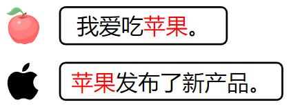

这时，使用同一个静态词向量去表示“苹果”，显然无法区分这两种语义。这就推动了上下文相关的词表示的发展。

上下文相关词表示（Contextual Word Representations），是指词语的向量表示会根据它所在的句子上下文动态变化，从而更好地捕捉其语义。一个具有代表性的模型是——ELMo。

该模型全称为 Embeddings from Language Models，发表于2018年2月。其基于LSTM 语言模型，使用上下文动态生成每个词的表示，每个词的向量由其前文和后文共同决定，是第一个被广泛应用于下游任务的上下文词向量模型。


## 传统序列模型

### RNN

#### 概述

在自然语言中，词语的顺序对于理解句子的含义至关重要。虽然词向量能够表示词语的语义，但它本身并不包含词语之间的顺序信息。

为了解决这一问题，研究者提出RNN（Recurrent Neural Network，循环神经网络）。

RNN 会逐个读取句子中的词语，并在每一步结合当前词和前面的上下文信息，不断更新对句子的理解。通过这种机制，RNN 能够持续建模上下文，从而更准确地把握句子的整体语义。因此RNN曾是序列建模领域的主流模型，被广泛应用于各类NLP任务。

说明：

随着技术的发展，RNN已经逐渐被结构更灵活、计算效率更高的Transformer 模型所取代，后者已经成为当前自然语言处理的主流方法。

尽管如此，RNN 仍然具有重要的学习价值。它所体现的“循环建模上下文”的思想，不仅为 LSTM 和 GRU 等改进模型奠定了基础，也有助于我们更好地理解 Transformer 等更复杂的架构。

#### 基础结构

RNN（循环神经网络）的核心结构是一个具有循环连接的隐藏层，它以时间步（time step）为单位，依次处理输入序列中的每个 token。

在每个时间步，RNN 接收当前 token 的向量和上一个时间步的隐藏状态（即隐藏层的输出），计算并生成新的隐藏状态，并将其传递到下一时间步。

具体结构如下图所示

其中隐藏层的计算公式为 ，计算细节如下图所示：

说明：

前面详细展示了基础 RNN 的内部结构，但 RNN还存在更复杂的结构形式。为了更清晰地展示这些结构的连接方式，接下来将使用简化的示意图来表示，省略内部细节，突出整体结构。

基础RNN的示意图如下

#### 多层结构

为了让模型捕捉更复杂的语言特征，可以将多个 RNN 层按层次堆叠起来，使不同层学习不同层次的语义信息。

这种设计的核心假设是：底层网络更容易捕捉局部模式（如词组、短语），而高层网络则能学习更抽象的语义信息（如句子主题或语境）。

多层RNN结构中，每一层的输出序列会作为下一层的输入序列，最底层RNN接收原始输入序列，顶层 RNN的输出作为最终结果用于后续任务。

#### 双向结构

基础的 RNN 在每个时间步只输出一个隐藏状态，该状态仅包含来自上文的信息，而无法利用当前词之后的下文。

对于一些任务而言，这是一个明显的限制。比如在序列标注任务中，模型需要为每个 token 预测一个标签，如果只能参考前文信息，往往难以做出准确判断。


而使用双向 RNN（Bidirectional RNN），模型可以在每个时间步同时利用前文和后文的信息，从而获得更全面的上下文表示，有助于提升序列标注等任务的预测效果。

双向RNN同时使用两层 RNN：

正向 RNN：按照时间顺序（从前到后）处理序列；

反向 RNN：按照逆时间顺序（从后到前）处理序列。

每个时间步的输出，是正向和反向隐藏状态的组合（例如拼接或求和）。具体结构如下图所示

#### 多层+双向结构

多层结构和双向结构还可组合使用，每层都是一个双向RNN，如下图所示

#### API使用

PyTorch 提供了 torch.nn.RNN 模块用于构建循环神经网络（Recurrent Neural Network, RNN）。该模块支持单层或多层结构，也可通过设置参数启用双向 RNN（bidirectional），适用于处理序列建模相关任务。

##### 参数说明

构造RNN层所需的参数如下：

```
torch.nn.RNN(
    input_size,
    hidden_size,
    num_layers=1,
    nonlinearity="tanh",
    bias=True,
    batch_first=False,
    dropout=0.0,
    bidirectional=False,
    device=None,
    dtype=None,
)
```

各参数含义如下

| 参数名 | 类型 | 说明 |
| --- | --- | --- |
| input_size | int | 每个时间步输入特征的维度（词向量维度） |
| hidden_size | int | 隐藏状态的维度 |
| num_layers | int | RNN 层数，默认为 1 |
| nonlinearity | str | 激活函数，'tanh'（默认）或 'relu' |
| bias | bool | 是否使用偏置项，默认 True |
| batch_first | bool | 输入张量是否是 (batch, seq, feature)，默认 False 表示 (seq, batch, feature) |
| dropout | float | 除最后一层外，其余层之间的 dropout 概率 |
| bidirectional | bool | 是否为双向 RNN，默认 False |
| device | torch.device or str | 模块的初始化设备，如 'cuda', 'cpu' |
| dtype | torch.dtype | 模块初始化时的默认数据类型，如torch.float32 |

##### 输入输出

示例代码如下

```
rnn = torch.nn.RNN()
output, h_n = rnn(input, h_0)
```

输入输出内容如下

| 类别 | 项 | 说明 |
| --- | --- | --- |
| 输<br>入 | input | 输入序列，形状为(seq_len, batch_size, input_size)，如果 batch_first=True，则为 (batch_size, seq_len, input_size) |
|  | h_0 | 可选，初始隐藏状态，形状为 (num_layers × num_directions, batch_size, hidden_size) |
| 输<br>出 | output | RNN层的输出，包含最后一层每个时间步的隐藏状态，形状为 (seq_len, batch_size, num_directions × hidden_size )，如果如果 batch_first=True，则为(batch_size, seq_len, num_directions × hidden_size ) |
|  | h_n | 最后一个时间步的隐藏状态，包含每一层的每个方向，形状为 (num_layers × num_directions, batch_size, hidden_size) |

输入输出形状如下

- 单层单向


- 多层单向

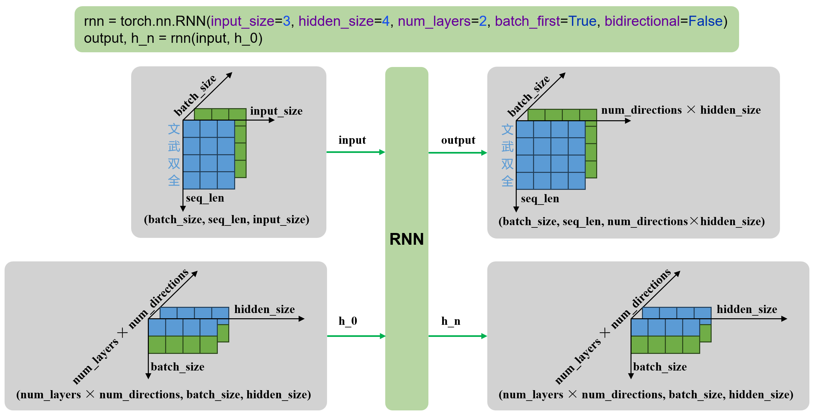

- 单层双向

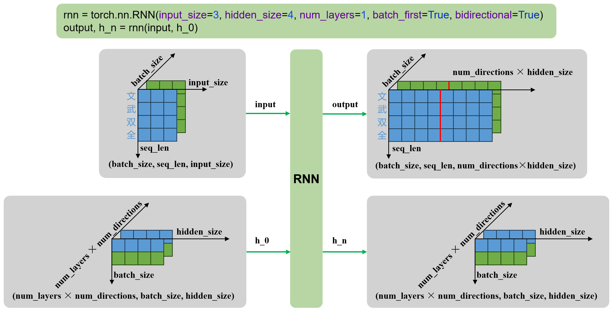

- 多层双向


#### 案例实操（智能输入法）

##### 需求说明

本案例旨在实现一个用于手机输入法的智能词语联想模型。
具体需求为：根据用户当前已输入的文本内容，预测下一个可能输入的词语，要求返回概率最高的 5 个候选词供用户选择。

例如：向模型输入“自然语言”，模型输出[“处理”、“理解”、“的”、“描述”、“生成”] ，如下图所示


##### 需求分析

###### 数据集处理

在本任务中，模型需要根据用户已输入的文本预测下一个可能输入的词语，因此训练数据应具备自然语言上下文连续性和贴近真实使用场景的特点。

可选数据来源包括：

- 用户真实输入内容：如聊天记录、搜索历史、输入法日志等。这类数据最能反映真实输入场景，有助于模型学习用户输入习惯和上下文联想模式。

- 开放领域对话语料：如论坛回复、社交平台评论、闲聊对话等。这类语料具有较强的口语化特征，能够提升模型在真实输入场景中的泛化能力。

- 本任务使用的数据集为https://huggingface.co/datasets/Jax-dan/HundredCV-Chat

为了构造适用于“下一词预测”任务的训练样本，首先需要对原始语料进行分词。随后，采用滑动窗口的方式，从分词后的序列中提取连续的上下文片段，并以每个窗口的下一个词作为预测目标，构成输入-输出对，如下图所示

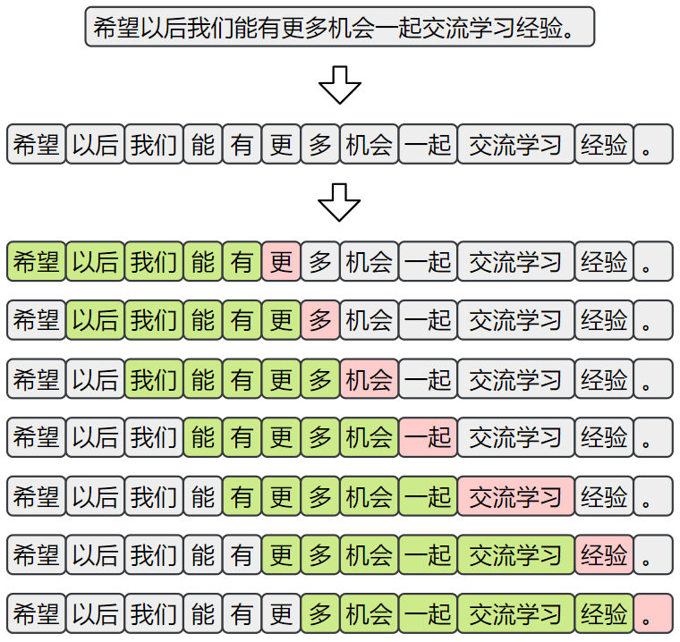

###### 模型结构设计

本任务采用基于循环神经网络（RNN）的语言模型结构来实现“下一词预测”功能。模型整体由以下三个主要部分组成：

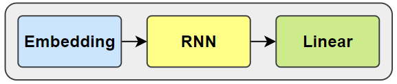

- 嵌入层（Embedding）

将输入的词或字索引映射为稠密向量表示，便于后续神经网络处理。

- 循环神经网络层（RNN）

用于建模输入序列的上下文信息，输出最后一个时间步的隐藏状态作为上下文表示。

- 输出层（Linear）

将隐藏状态映射到词表大小的维度，生成对下一个词的概率预测。

###### 训练方案

- 损失函数

下一个词的预测本质为多分类问题，所以损失函数采用 CrossEntropyLoss，其结合了softmax和交叉熵计算。

- 优化器

使用 Adam 优化器，具有较强的收敛能力和稳定性。

##### 需求实现

###### 项目结构

项目结构如下图所示

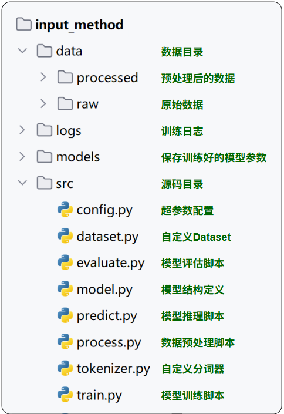

###### 完整代码

###### 数据预处理

本模块负责将原始数据进行清洗、分词、编码与划分，最终生成模型可直接读取的标准格式数据集，并保存到jsonl文件中，如下图所示

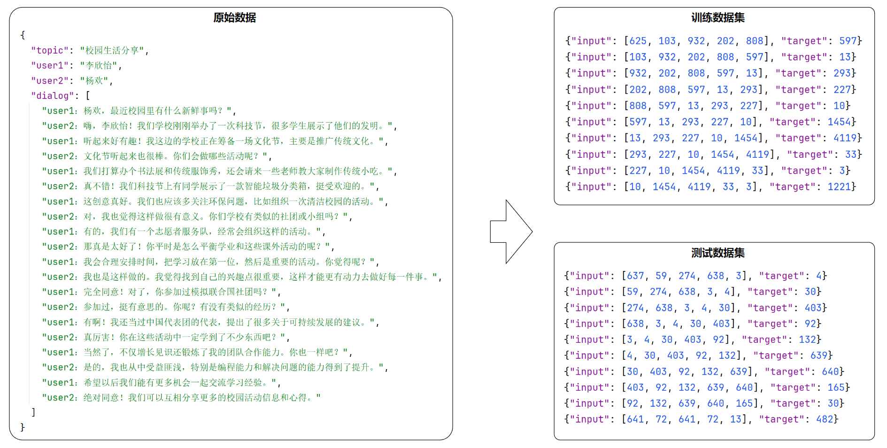

具体代码如下：

```
# process.py

import time

import torch
from torch import nn
from torch.utils.tensorboard import SummaryWriter
from tqdm import tqdm

from dataset import get_dataloader
from model import InputMethodModel
from tokenizer import JiebaTokenizer
import config

def train_one_epoch(model, dataloader, loss_function, optimizer, device):
    """
    训练一个 epoch。

    :param model: 输入法模型。
    :param dataloader: 数据加载器。
    :param loss_function: 损失函数。
    :param optimizer: 优化器。
    :param device: 设备。
    :return: 平均损失。
    """
    total_loss = 0
    model.train()

    for inputs, targets in tqdm(dataloader, desc='训练'):
        # 将数据移到设备
        inputs, targets = inputs.to(device), targets.to(device)

        optimizer.zero_grad()

        # 前向传播
        outputs = model(inputs)

        # 计算损失
        loss = loss_function(outputs, targets)

        # 反向传播
        loss.backward()

        # 更新参数
        optimizer.step()

        total_loss += loss.item()

    avg_loss = total_loss / len(dataloader)
    return avg_loss

def train():
    """
    模型训练主函数。
    """
    device = torch.device('cuda' if torch.cuda.is_available() else 'cpu')
    print('设备:', device)

    # 获取数据加载器
    dataloader = get_dataloader()

    # 加载 tokenizer 和模型
    tokenizer = JiebaTokenizer.from_vocab(config.PROCESSED_DATA_DIR / 'vocab.txt')
    model = InputMethodModel(vocab_size=tokenizer.vocab_size).to(device)

    loss_function = nn.CrossEntropyLoss()
    optimizer = torch.optim.Adam(model.parameters(), lr=config.LEARNING_RATE)

    # TensorBoard 日志
    writer = SummaryWriter(log_dir=config.LOG_DIR / time.strftime('%Y-%m-%d_%H-%M-%S'))

    best_loss = float('inf')

    for epoch in range(1, config.EPOCHS + 1):
        print(f'========== Epoch: {epoch} ==========')

        # 训练一个 epoch
        avg_loss = train_one_epoch(model, dataloader, loss_function, optimizer, device)
        print(f'Loss: {avg_loss:.4f}')

        # 记录到 TensorBoard
        writer.add_scalar('Loss/train', avg_loss, epoch)

        # 保存最优模型
        if avg_loss < best_loss:
            best_loss = avg_loss
            torch.save(model.state_dict(), config.MODELS_DIR / 'model.pt')
            print('模型保存成功！')

if __name__ == '__main__':
    train()
```

###### 自定义分词器

本模块负责分词、词表构建等功能。

```
# tokenizer.py

import jieba
from tqdm import tqdm

jieba.setLogLevel(jieba.logging.WARNING)

class JiebaTokenizer:
    """
    基于 jieba 的分词器，用于分词、编码和词表管理。
    """

    unk_token = '<unk>'

    @staticmethod
    def tokenize(sentence):
        """
        对句子进行分词。

        :param sentence: 输入句子。
        :return: 分词后的 token 列表。
        """
        # 调用 jieba 分词
        return jieba.lcut(sentence)

    @classmethod
    def build_vocab(cls, sentences, vocab_file):
        """
        构建词表并保存到文件。

        :param sentences: 句子列表。
        :param vocab_file: 保存词表的文件路径。
        """
        unique_words = set()
        for sentence in tqdm(sentences, desc='分词'):
            # 收集所有唯一词
            for word in cls.tokenize(sentence):
                unique_words.add(word)

        # 将 <unk> 放在词表首位
        vocab_list = [cls.unk_token] + list(unique_words)

        # 保存词表到文件
        with open(vocab_file, 'w', encoding='utf-8') as f:
            for word in vocab_list:
                f.write(word + '\n')

    @classmethod
    def from_vocab(cls, vocab_file):
        """
        从文件加载词表。

        :param vocab_file: 词表文件路径。
        :return: JiebaTokenizer 实例。
        """
        with open(vocab_file, 'r', encoding='utf-8') as f:
            vocab_list = [line.strip() for line in f.readlines()]
        return cls(vocab_list)

    def __init__(self, vocab_list):
        """
        初始化 tokenizer。

        :param vocab_list: 词表列表。
        """
        self.vocab_list = vocab_list
        self.vocab_size = len(vocab_list)
        # 建立词到索引映射
        self.word2index = {word: index for index, word in enumerate(vocab_list)}
        # 建立索引到词的映射
        self.index2word = {index: word for index, word in enumerate(vocab_list)}
        # 获取未知词索引
        self.unk_token_index = self.word2index[self.unk_token]

    def encode(self, sentence):
        """
        将句子编码为索引列表。

        :param sentence: 输入句子。
        :return: 索引列表。
        """
        tokens = self.tokenize(sentence)
        # 将 token 转为索引，未知词用 unk 索引替代
        return [self.word2index.get(token, self.unk_token_index) for token in tokens]
```

###### 自定义数据集

```
# dataset.py

import torch
from torch.utils.data import Dataset, DataLoader
import pandas as pd

import config

class InputMethodDataset(Dataset):
    """
    输入法数据集类，用于加载 JSONL 文件并生成张量。
    """

    def __init__(self, file_path):
        """
        初始化数据集。

        :param file_path: 数据文件路径（JSONL 格式）。
        """
        self.data = pd.read_json(file_path, lines=True).to_dict(orient='records')

    def __len__(self):
        """
        获取数据集样本数量。

        :return: 样本数量。
        """
        return len(self.data)

    def __getitem__(self, index):
        """
        获取指定索引的数据样本。

        :param index: 数据索引。
        :return: (input_tensor, target_tensor)
        """
        input_tensor = torch.tensor(self.data[index]['input'], dtype=torch.long)
        target_tensor = torch.tensor(self.data[index]['target'], dtype=torch.long)
        return input_tensor, target_tensor

def get_dataloader(train=True):
    """
    获取数据加载器。

    :param train: 是否加载训练集（True 加载训练集，False 加载测试集）。
    :return: DataLoader 对象。
    """
    file_name = 'indexed_train.jsonl' if train else 'indexed_test.jsonl'
    dataset = InputMethodDataset(config.PROCESSED_DATA_DIR / file_name)
    return DataLoader(dataset, batch_size=config.BATCH_SIZE, shuffle=True)

if __name__ == '__main__':
    dataloader = get_dataloader()
    for input_tensor, target_tensor in dataloader:
        print(input_tensor.shape, target_tensor.shape)
        break
```

###### 模型定义

```
# model.py

import torch
from torch import nn
from torchinfo import summary

import config

class InputMethodModel(nn.Module):
    """
    输入法预测模型，基于 RNN 的序列模型。
    """

    def __init__(self, vocab_size):
        """
        初始化模型。

        :param vocab_size: 词表大小。
        """
        super().__init__()
        # 嵌入层：将 token 索引映射为稠密向量
        self.embedding = nn.Embedding(num_embeddings=vocab_size, embedding_dim=config.EMBEDDING_DIM)
        # RNN：处理序列数据，提取上下文特征
        self.rnn = nn.RNN(
            input_size=config.EMBEDDING_DIM,
            hidden_size=config.HIDDEN_SIZE,
            batch_first=True
        )
        # 全连接层：将隐藏状态映射到词表大小的概率分布
        self.linear = nn.Linear(in_features=config.HIDDEN_SIZE, out_features=vocab_size)

    def forward(self, x):
        """
        前向传播。

        :param x: 输入张量，形状 (batch_size, seq_len)。
        :return: 模型输出，形状 (batch_size, vocab_size)。
        """
        # 嵌入层处理输入序列
        embed = self.embedding(x)  # (batch_size, seq_len, embedding_dim)

        # RNN 处理嵌入向量序列
        output, _ = self.rnn(embed)  # (batch_size, seq_len, hidden_size)

        # 取最后一个时间步的输出进行分类
        result = self.linear(output[:, -1, :])  # (batch_size, vocab_size)

        return result

if __name__ == '__main__':
    model = InputMethodModel(vocab_size=20000).to('cuda')

    # 创建随机 dummy 输入用于展示模型结构
    dummy_input = torch.randint(
        low=0,
        high=20000,
        size=(config.BATCH_SIZE, config.SEQ_LEN),
        dtype=torch.long,
        device='cuda'
    )

    # 打印模型摘要
    summary(model, input_data=dummy_input)
```

###### 模型训练

```
# train.py

import time

import torch
from torch import nn
from torch.utils.tensorboard import SummaryWriter
from tqdm import tqdm

from dataset import get_dataloader
from model import InputMethodModel
from tokenizer import JiebaTokenizer
import config

def train_one_epoch(model, dataloader, loss_function, optimizer, device):
    """
    训练一个 epoch。

    :param model: 输入法模型。
    :param dataloader: 数据加载器。
    :param loss_function: 损失函数。
    :param optimizer: 优化器。
    :param device: 设备。
    :return: 平均损失。
    """
    total_loss = 0
    model.train()

    for inputs, targets in tqdm(dataloader, desc='训练'):
        # 将数据移到设备
        inputs, targets = inputs.to(device), targets.to(device)

        optimizer.zero_grad()

        # 前向传播
        outputs = model(inputs)

        # 计算损失
        loss = loss_function(outputs, targets)

        # 反向传播
        loss.backward()

        # 更新参数
        optimizer.step()

        total_loss += loss.item()

    avg_loss = total_loss / len(dataloader)
    return avg_loss

def train():
    """
    模型训练主函数。
    """
    device = torch.device('cuda' if torch.cuda.is_available() else 'cpu')
    print('设备:', device)

    # 获取数据加载器
    dataloader = get_dataloader()

    # 加载 tokenizer 和模型
    tokenizer = JiebaTokenizer.from_vocab(config.PROCESSED_DATA_DIR / 'vocab.txt')
    model = InputMethodModel(vocab_size=tokenizer.vocab_size).to(device)

    loss_function = nn.CrossEntropyLoss()
    optimizer = torch.optim.Adam(model.parameters(), lr=config.LEARNING_RATE)

    # TensorBoard 日志
    writer = SummaryWriter(log_dir=config.LOG_DIR / time.strftime('%Y-%m-%d_%H-%M-%S'))

    best_loss = float('inf')

    for epoch in range(1, config.EPOCHS + 1):
        print(f'========== Epoch: {epoch} ==========')

        # 训练一个 epoch
        avg_loss = train_one_epoch(model, dataloader, loss_function, optimizer, device)
        print(f'Loss: {avg_loss:.4f}')

        # 记录到 TensorBoard
        writer.add_scalar('Loss/train', avg_loss, epoch)

        # 保存最优模型
        if avg_loss < best_loss:
            best_loss = avg_loss
            torch.save(model.state_dict(), config.MODELS_DIR / 'model.pt')
            print('模型保存成功！')

if __name__ == '__main__':
    train()
```

###### 模型预测

本模块用于展示模型预测效果，具体效果如下：

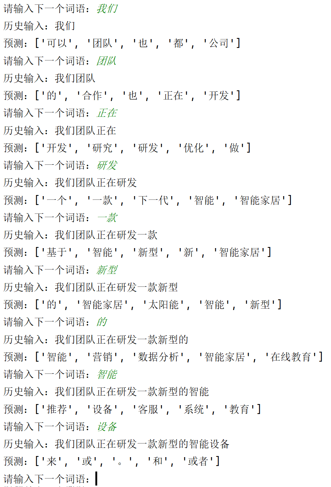

具体代码如下：

```
# predict.py

import torch
from model import InputMethodModel
from tokenizer import JiebaTokenizer
import config

def predict_batch(input_tensor, model):
    """
    对一个 batch 的输入进行预测。

    :param input_tensor: 输入张量，形状 (batch_size, seq_len)。
    :param model: 输入法模型。
    :return: 每个样本 top-5 的索引列表。
    """
    model.eval()
    with torch.no_grad():
        # 前向传播获取输出 logits
        output = model(input_tensor)  # (batch_size, vocab_size)

        # 选取 top-5 概率最高的 token 索引
        predict_ids = torch.topk(output, k=5, dim=-1).indices  # (batch_size, 5)

    return predict_ids.tolist()

def predict(text, model, tokenizer, device):
    """
    对单条文本进行预测。

    :param text: 用户输入文本。
    :param model: 输入法模型。
    :param tokenizer: 分词器。
    :param device: 设备。
    :return: top-5 预测结果词汇列表。
    """
    # 编码文本为 token 索引
    input_ids = tokenizer.encode(text)

    # 转换为张量并移动到设备
    input_tensor = torch.tensor([input_ids], dtype=torch.long, device=device)

    # 调用 batch 预测
    topk_ids = predict_batch(input_tensor, model)[0]

    # 索引映射回词语
    return [tokenizer.index2word[topk_id] for topk_id in topk_ids]

def run_predict():
    """
    启动预测交互程序。
    """
    device = torch.device('cuda' if torch.cuda.is_available() else 'cpu')

    # 加载 tokenizer
    tokenizer = JiebaTokenizer.from_vocab(config.PROCESSED_DATA_DIR / 'vocab.txt')

    # 创建并加载模型
    model = InputMethodModel(vocab_size=tokenizer.vocab_size).to(device)
    model.load_state_dict(torch.load(config.MODELS_DIR / 'model.pt'))

    print('请输入词语：（输入q或者quit退出系统）')

    text = ''
    while True:
        user_input = input('> ')
        if user_input in ['q', 'quit']:
            print('感谢使用！')
            break

        if not user_input:
            print('请输入词语！')
            continue

        # 更新历史输入
        text += user_input
        print('历史输入：', text)

        # 获取预测结果
        topk_tokens = predict(text, model, tokenizer, device)
        print('预测结果：', topk_tokens)

if __name__ == '__main__':
run_predict()
```

###### 模型评估

本模块用于评估模型效果，评估指标为Top-1准确率和Top-5准确率。

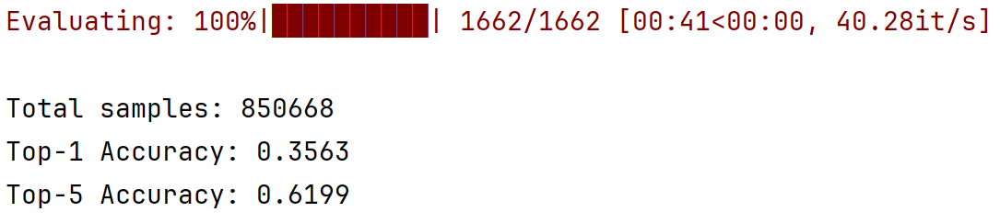

具体代码如下：

```
# evaluate.py

import torch
from tqdm import tqdm

from tokenizer import JiebaTokenizer
import config
from model import InputMethodModel
from dataset import get_dataloader
from predict import predict_batch

def evaluate(model, dataloader, device):
    """
    评估模型。

    :param model: 输入法模型。
    :param dataloader: 数据加载器。
    :param device: 设备。
    :return: (top1_acc, topk_acc)
    """
    total_count = 0
    top1_correct = 0
    topk_correct = 0

    model.eval()
    for inputs, targets in tqdm(dataloader, desc='评估'):
        inputs = inputs.to(device)
        targets = targets.tolist()

        # 获取 top-5 预测结果
        predicted_ids = predict_batch(inputs, model)

        # 统计 top-1 和 top-5 正确率
        for pred, target in zip(predicted_ids, targets):
            if pred[0] == target:
                top1_correct += 1
            if target in pred:
                topk_correct += 1
            total_count += 1

    top1_acc = top1_correct / total_count
    topk_acc = topk_correct / total_count
    return top1_acc, topk_acc

def run_evaluate():
    """
    运行评估流程。
    """
    device = torch.device('cuda' if torch.cuda.is_available() else 'cpu')

    tokenizer = JiebaTokenizer.from_vocab(config.PROCESSED_DATA_DIR / 'vocab.txt')

    model = InputMethodModel(vocab_size=tokenizer.vocab_size).to(device)
    model.load_state_dict(torch.load(config.MODELS_DIR / 'model.pt'))

    dataloader = get_dataloader(train=False)

    # 执行评估
    top1_acc, topk_acc = evaluate(model, dataloader, device)

    # 输出评估结果
    print("======= 评估结果 =======")
    print(f"Top-1 准确率: {top1_acc:.4f}")
    print(f"Top-5 准确率: {topk_acc:.4f}")
    print("========================")

if __name__ == '__main__':
    run_evaluate()
```

###### 配置文件

```
# config.py

from pathlib import Path

# 项目根目录
ROOT_DIR = Path(__file__).parent.parent

# 数据路径
RAW_DATA_DIR = ROOT_DIR / 'data' / 'raw'
PROCESSED_DATA_DIR = ROOT_DIR / 'data' / 'processed'

# 模型和日志路径
MODELS_DIR = ROOT_DIR / 'models'
LOG_DIR = ROOT_DIR / 'logs'

# 训练参数
SEQ_LEN = 5  # 输入序列长度
BATCH_SIZE = 64  # 批大小
EMBEDDING_DIM = 64  # 嵌入层维度
HIDDEN_SIZE = 128  # RNN 隐藏层维度
LEARNING_RATE = 1e-3  # 学习率
EPOCHS = 30  # 训练轮数
```

#### 存在问题

##### 概述

尽管循环神经网络（RNN）在处理序列数据方面具有天然优势，但它在实际应用中面临一个非常严重的问题：长期依赖建模困难。这指的是：在训练过程中，当输入序列很长时，模型难以有效学习早期输入对最终输出的影响。


##### 问题分析

上述问题的根本原因在于训练过程中存在的梯度消失或梯度爆炸问题。

在训练RNN时，采用的是时间反向传播（Backpropagation Through Time, BPTT）方法，在反向传播过程中，梯度需要在每个时间步上不断链式传递，下图为RNN在训练过程中的计算图：

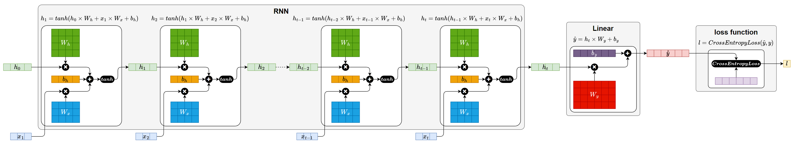

高清大图：

根据上述计算图，可以得出

其中每一项表示每条路径对贡献。

展开早期时间步的某一条路径（例如）可以得到

展开其中一环（为简单起见，按照标量推导）

现有，令

则有

可得，

所以，早期路径的展开可以写为：

可以看到上述公式中有很多次的连乘，其中的范围是(0,1]，如下图所示


所以若也小于1，那么经过的多次连乘，早期路径（例如）的值就会指数级衰减，并迅速接近于0，这个现象称为梯度消失。

由于早期时间步的梯度值几乎为0，所以总梯度几乎只会受到最近时间步的输入影响，换句话说，在权重参数更新（）时，早期输入的信息几乎不会对的更新产生贡献。

这就导致模型只能学到短期依赖，而无法学到长期依赖。

另外，若大于1（大到大于1），那么经过的多次连乘，早期路径（例如）的值就会指数级增长，这个现象称为梯度爆炸，梯度爆炸又会使得参数更新极不稳定。

这两个问题是制约RNN 学习长期依赖的主要瓶颈。

### LSTM

#### 概述

为了缓解RNN梯度消失或者梯度爆炸的问题，Hochreiter 和 Schmidhuber 于 1997 年提出了长短期记忆网络（Long Short-Term Memory, LSTM）。

#### 基础结构

LSTM 通过引入特殊的记忆单元（Memory Cell，图中的），有效提升了模型对长序列依赖关系的建模能力。其沿时间步展开后的结构如下图所示：

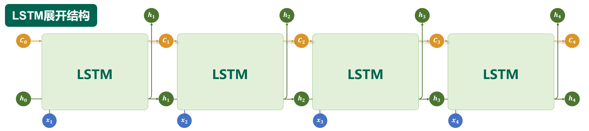

其内部结构如下图所示，核心结构是三个“门”，分别是遗忘门、输入门和输出门。

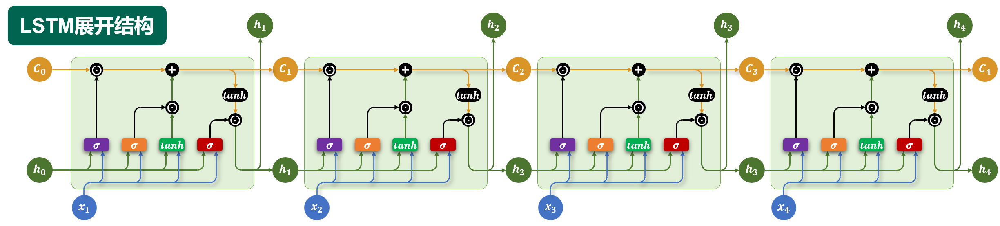

各部分具体说明如下：

- 记忆单元（Memory Cell）

记忆单元负责在序列中长期保存关键信息。它相当于一条“信息通道”，在多个时间步之间直接传递信息（记忆单元是缓解梯度消失和梯度爆炸问题的核心），如下图中的。

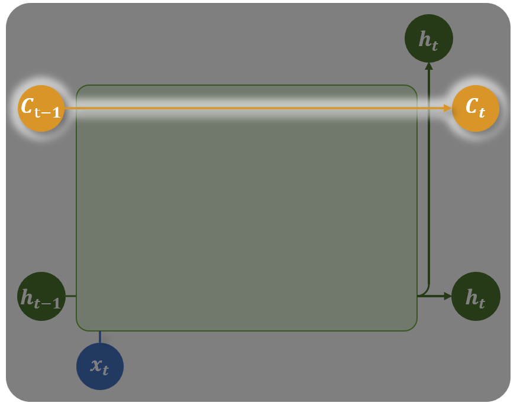

- 遗忘门（Forget Gate）

遗忘门决定当前时间步要忘记多少过去的记忆。

例如在上一节的输入法智能提示案例中，假如历史输入为：“小帅是一名程序员，他每天都加班；”，然后当前时间步的输入为“小美”，意味着当前的主语变为了“小美”，后续应该生成和“小美”相关的内容，所以此时记忆单元就应该忘记之前的主语信息“小帅”。

遗忘门会根据上一个时间步的隐藏状态和当前时间步的输入，生成一个0到1之间的控制系数，然后与上一个时间步的记忆单元状态相乘，从而动态调整哪些信息应该被遗忘。

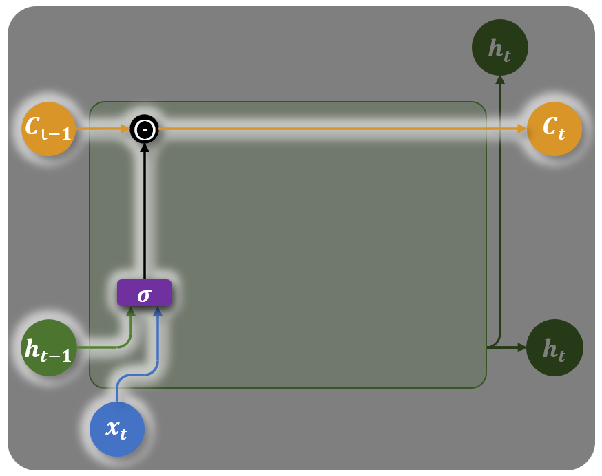

遗忘门的计算公式为：

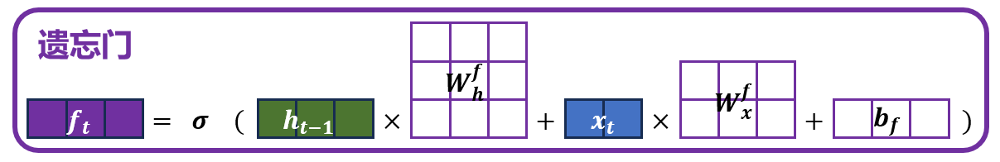

图中的⊙符号为阿达玛乘积（Hadamard product），表示逐元素相乘。

- 输入门（Input Gate）

输入门控制要从当前时间步的输入向记忆单元存入多少新的信息。例如上述案例中，当前时间步的输入为“小美”，所以此时记忆单元就应该存入新的主语信息“小美”。

当前时间步的信息由当前输入和上一个隐藏状态计算而成，同时输入门也由当前输入和上一个隐藏状态计算而成，然后新的信息和输入门相乘得到需要存入记忆单元的信息，如下图所示

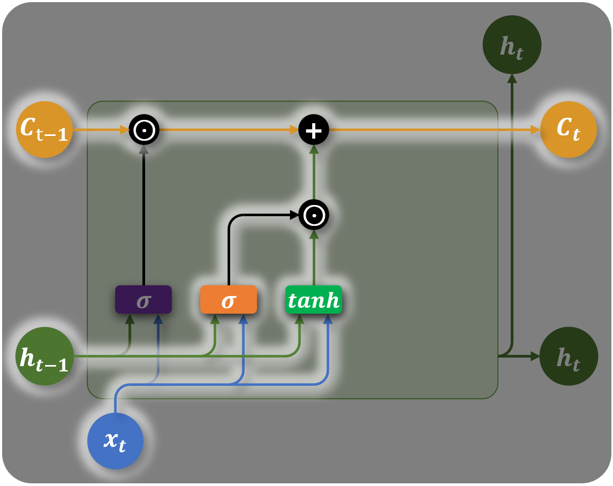

当前时间步的信息计算公式为：

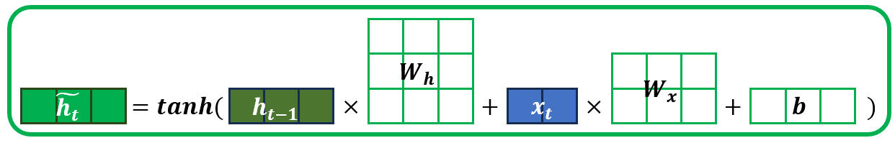

输入门的计算公式为：

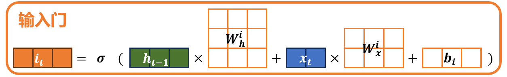

综上所述可以得到记忆单元更新的完整公式为：

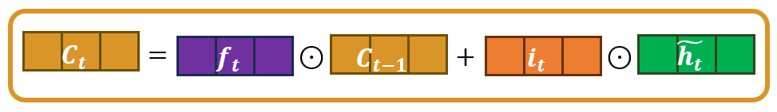

- 输出门（Output Gate）

输出门控制从记忆单元中读取多少信息作为当前时间步的隐藏状态进行输出。例如上述输入法智能提示案例中，记忆单元中存入新主语信息“小美”之后，当前时间步就应该从记忆单元中提取该主语信息，生成与“小美”相关的内容。

输出门同样由当前时间步的输入和上一个时间步的隐藏状态计算而成，如下图所示。

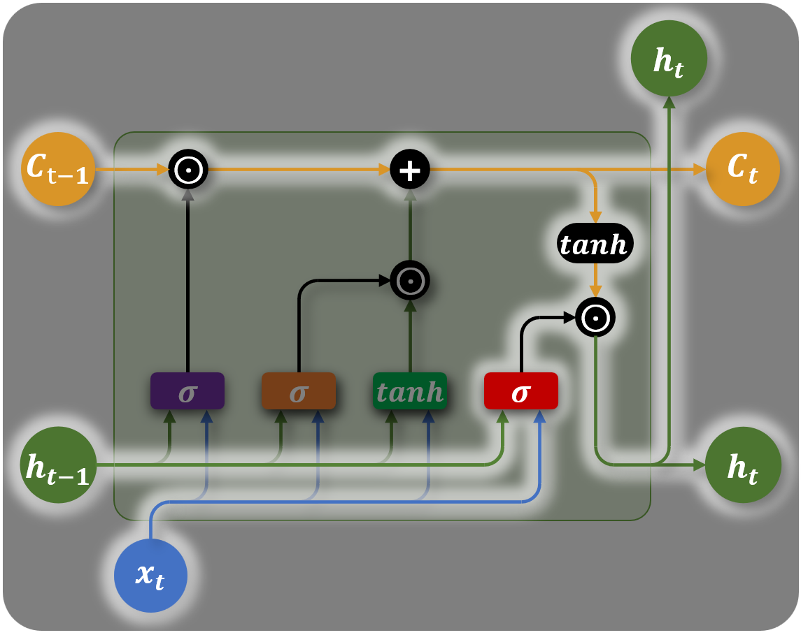

输出门的计算公式为：

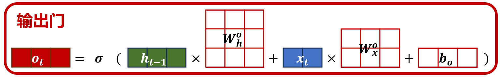

当前时间步输出的隐藏状态计算公式为：

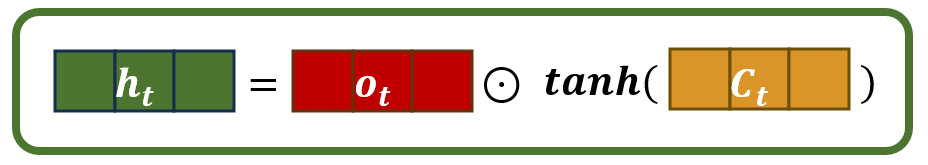

LSTM的完整结构如下图所示

思考题：LSTM为何能缓解梯度消失和梯度爆炸？

LSTM的计算图如下：

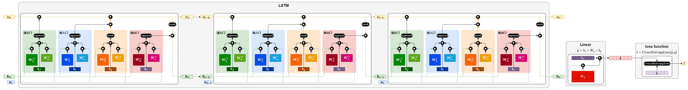

高清大图：

LSTM通过引入记忆单元（Memory Cell），在时间步之间提供了一条稳定的梯度传播路径。

记忆单元的更新公式为

所以（简单起见，按照标量推导）

在反向传播时，沿记忆单元路径，梯度传播实际上是多个连乘的结果。虽然每个的取值小于1，但通常较接近于1。这是因为由遗忘门生成，在一般任务中，遗忘门倾向于“记得多、忘得少”，因此 的值通常较大。

由于乘积中的每一项 较接近1，整体衰减速度远小于传统RNN中隐藏状态链式传播时的指数衰减。这使得早期时间步的输入，能够通过记忆单元路径稳定地影响到最终的总梯度，从而有效参与参数的更新，保证了模型对长序列依赖的学习能力。

#### 多层结构

与RNN类似，LSTM 也可以通过堆叠多个层来构建更深的网络，以增强模型对序列特征的建模能力。

在多层 LSTM 中，每一层 LSTM 的输出隐藏状态，会作为下一层 LSTM 的输入，同时每一层都维护独立的记忆单元。通过层层传递和提取信息，多层结构能够捕捉更复杂、更抽象的时序特征。

具体结构如下图所示

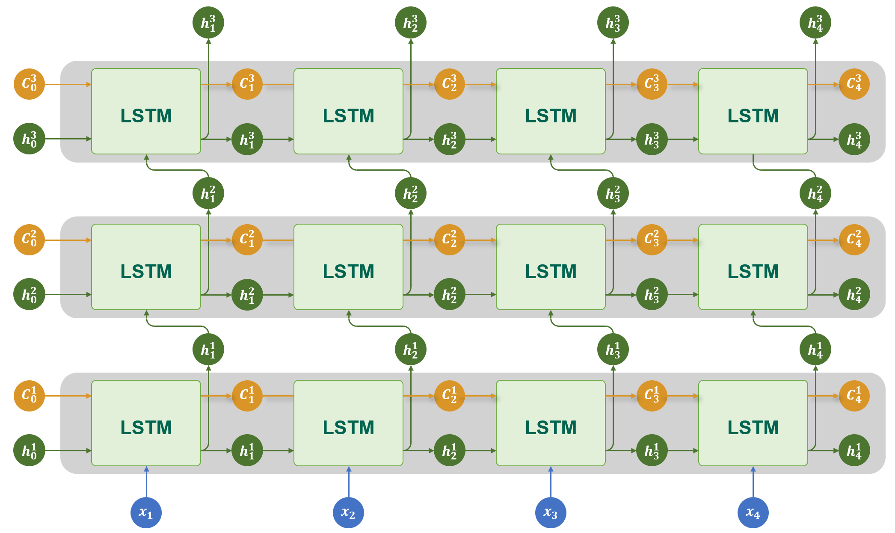

#### 双向结构

对于 LSTM，同样可以通过双向机制，利用序列中的过去信息和未来信息，进一步提升模型的建模能力。

在双向 LSTM 中，使用两套独立的 LSTM 网络：

正向 LSTM 按时间顺序处理输入序列；

反向 LSTM 按逆时间顺序处理输入序列。

每个时间步同时得到两个隐藏状态，通常将它们进行拼接，形成最终的输出，具体结构如下图所示：

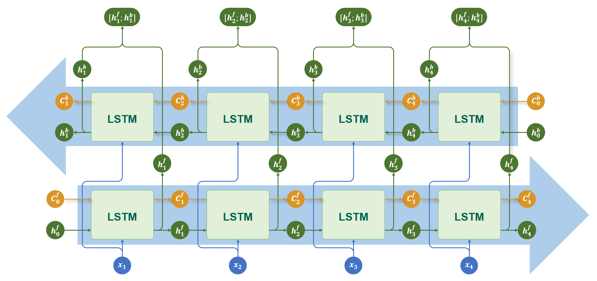

#### 多层+双向结构

对于LSTM而言，多层结构和双向结构也可组合使用，每层都是一个双向LSTM，如下图所示

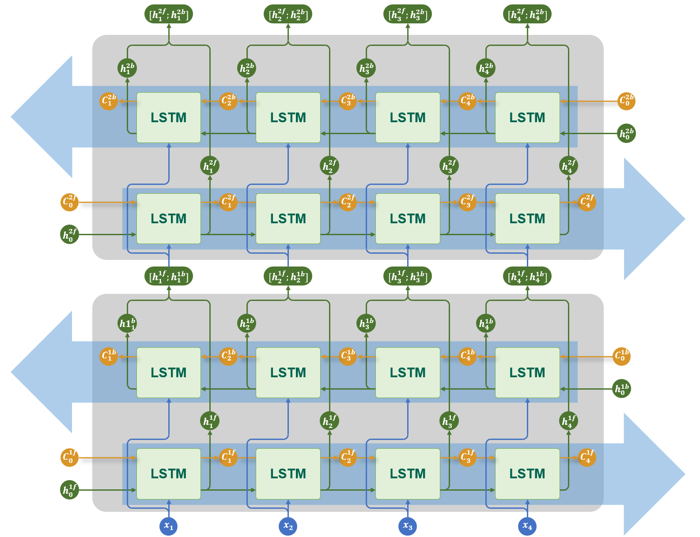

#### API使用

torch.nn.LSTM是 PyTorch 中实现长短期记忆网络（Long Short-Term Memory, LSTM）的模块。它用于对序列数据建模，在自然语言处理（NLP）、时间序列预测等任务中广泛使用。该模块支持单层或多层 LSTM，可选择是否使用双向结构（bidirectional）。

torch.nn.LSTM与torch.nn.RNN的API十分相似，主要区别在于相较于RNN，多了一个记忆单元需要处理。

##### 参数说明

构造RNN层所需的参数如下：

```
torch.nn.LSTM(input_size, hidden_size, num_layers=1, bias=True, batch_first=False, dropout=0.0, bidirectional=False, proj_size=0, device=None, dtype=None)
```

各参数含义如下

| 参数名 | 类型 | 说明 |
| --- | --- | --- |
| input_size | int | 每个时间步输入特征的维度（词向量维度） |
| hidden_size | int | 隐藏状态的维度 |
| num_layers | int | RNN 层数，默认为 1 |
| nonlinearity | str | 激活函数，'tanh'（默认）或 'relu' |
| bias | bool | 是否使用偏置项，默认 True |
| batch_first | bool | 输入张量是否是 (batch, seq, feature)，默认 False 表示 (seq, batch, feature) |
| dropout | float | 除最后一层外，其余层之间的 dropout 概率 |
| bidirectional | bool | 是否为双向 RNN，默认 False |
| proj_size | int | 隐藏状态的投影输出维度；若为 0，则不使用 projection。（详见官方文档） |
| device | torch.device or str | 模块的初始化设备，如 'cuda', 'cpu' |
| dtype | torch.dtype | 模块初始化时的默认数据类型，如 torch.float32, torch.float64 |

##### 输入输出

示例代码如下

```
lstm = torch.nn.LSTM()
output, (h_n, c_n) = lstm(input, (h_0, c_0))
```

输入输出内容如下

| 类别 | 项 | 说明 |
| --- | --- | --- |
| 输入 | input | 输入序列，形状为(seq_len, batch_size, input_size)，如果 batch_first=True，则为 (batch_size, seq_len, input_size) |
|  | h_0 | 可选，初始隐藏状态，形状为 (num_layers × num_directions, batch_size, hidden_size) |
|  | c_0 | 可选，初始细胞状态，形状为 (num_layers × num_directions, batch_size, hidden_size) |
| 输出 | output | LSTM层的输出，包含最后一层每个时间步的隐藏状态，形状为 (seq_len, batch_size, num_directions × hidden_size )，如果如果 batch_first=True，则为(batch_size, seq_len, num_directions × hidden_size ) |
|  | h_n | 最后一个时间步的隐藏状态，包含每一层的每个方向，形状为 (num_layers × num_directions, batch_size, hidden_size) |
|  | c_n | 最后一个时间步的细胞状态，包含每一层的每个方向，形状为 (num_layers × num_directions, batch_size, hidden_size) |

输入输出形状如下

- 单层单向

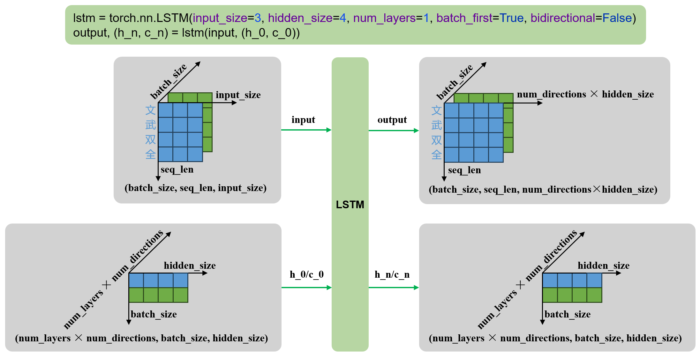

- 多层单向

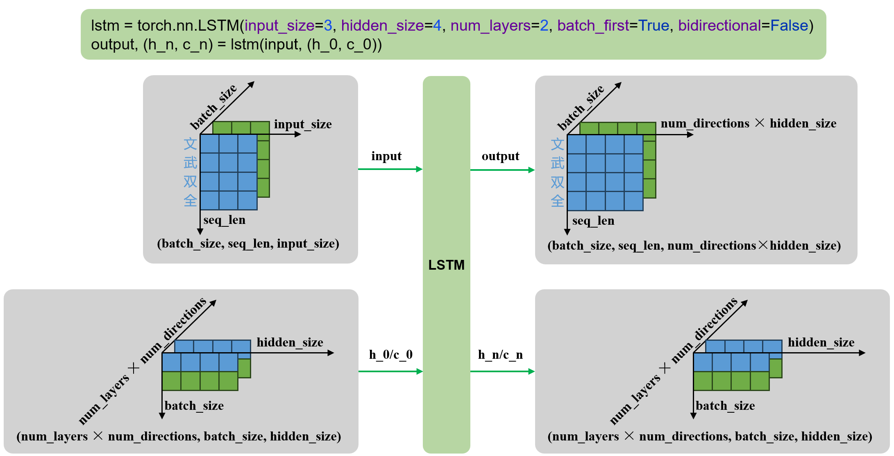

- 单层双向

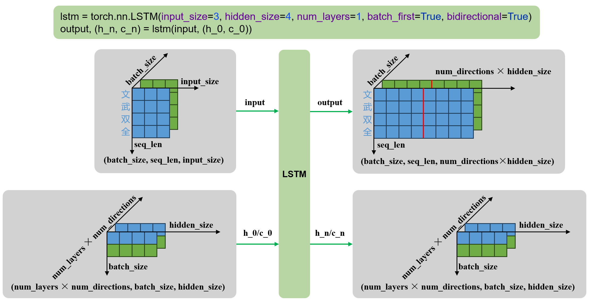

- 多层双向

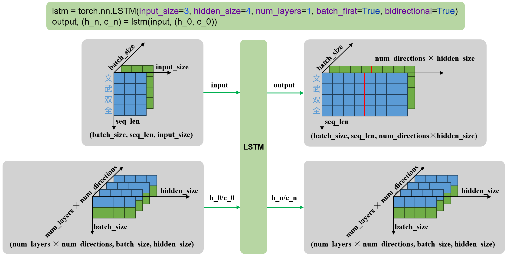

#### 案例实操（AI智评V1.0）

##### 需求说明

本案例的目标是基于 LSTM 构建一个文本情感分类模型，对评论内容进行二分类判断（正面或负面）。

##### 需求分析

###### 数据集处理

本案例的目标对用户评论文本进行性感分类，因此需使用带有情感标签（正面/负面）的评论数据集。

数据集来源为ChineseNLPCorpus，格式CSV，具体结构如下

| cat | label | review |
| --- | --- | --- |
| 书籍 | 1 | 感谢于歌先生为大家带来这么精彩的一本好书！ |
| 书籍 | 0 | 这本书纸质不怎样，内容也不怎样。 |
| 水果 | 1 | 苹果酸甜可口，大小适中，好吃。 |
| 水果 | 0 | 不是很大，比较甜，不会回购，感觉加运费后不划算。 |

本案例只需选取数据集中的review和label字段，构造输入-输出对即可。

###### 模型结构设计

模型整体由以下三个主要部分组成：

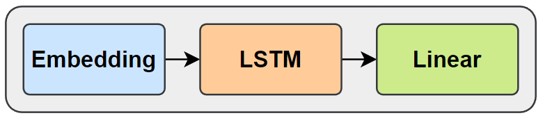

- 嵌入层（Embedding）

将输入的词或字索引映射为稠密向量表示，便于后续神经网络处理。

- 长短期记忆网络（LSTM）

用于建模输入序列的上下文信息，输出最后一个时间步的隐藏状态作为上下文表示。

- 输出层（Linear）

将 LSTM 的隐藏状态输出映射为一个标量，表示该评论为正面情感的倾向得分（经sigmod函数后，大于0.5判定为正面情感，小于等于0.5判定为负面情感）。

###### 训练方案

- 损失函数：

使用 BCEWithLogitsLoss，结合了sigmoid激活和二分类交叉熵计算，数值稳定且适合二分类任务。

- 优化器：

使用Adam优化器进行参数更新，提升训练效率。

###### 评估方案

模型训练完毕后，使用测试集统计正确率。

##### 需求实现

###### 项目结构

项目结构如下

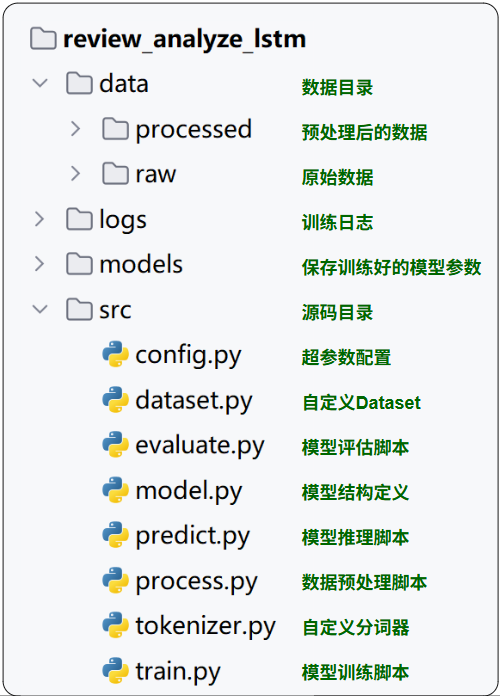

###### 完整代码

完整代码如下

###### 数据预处理

```
# process.py

import pandas as pd
from sklearn.model_selection import train_test_split
from tokenizer import JiebaTokenizer

import config

def process():
    """
    数据预处理主函数。
    """
    print("开始处理数据")

    # 1. 读取原始数据文件
    df = pd.read_csv(
        config.RAW_DATA_DIR / 'online_shopping_10_cats.csv',
        usecols=['review', 'label'],
        encoding='utf-8'
    )

    # 2. 数据清洗：去除空值和空字符串
    df = df.dropna()
    df = df[df['review'].str.strip().ne('')]

    # 3. 划分训练集和测试集
    train_df, test_df = train_test_split(df, test_size=0.2, random_state=42)

    # 4. 构建词表并保存
    JiebaTokenizer.build_vocab(
        train_df['review'].tolist(),
        config.PROCESSED_DATA_DIR / 'vocab.txt'
    )

    # 5. 加载词表
    tokenizer = JiebaTokenizer.from_vocab(config.PROCESSED_DATA_DIR / 'vocab.txt')

    # 6. 编码训练集并保存
    train_df['review'] = train_df['review'].apply(
        lambda x: tokenizer.encode(x, seq_len=config.SEQ_LEN)
    )
    train_df.to_json(
        config.PROCESSED_DATA_DIR / 'indexed_train.jsonl',
        orient='records',
        lines=True
    )

    # 7. 编码测试集并保存
    test_df['review'] = test_df['review'].apply(
        lambda x: tokenizer.encode(x, seq_len=config.SEQ_LEN)
    )
    test_df.to_json(
        config.PROCESSED_DATA_DIR / 'indexed_test.jsonl',
        orient='records',
        lines=True
    )

    print("数据处理完成")

if __name__ == '__main__':
    process()
```

###### 自定义分词器

```
# tokenizer.py

import jieba
from tqdm import tqdm

jieba.setLogLevel(jieba.logging.WARNING)

class JiebaTokenizer:
    """
    基于 jieba 的分词器，用于分词、编码和词表管理。
    """

    unk_token = '<unk>'
    pad_token = '<pad>'

    @staticmethod
    def tokenize(sentence):
        """
        对句子进行分词。

        :param sentence: 输入句子。
        :return: 分词后的 token 列表。
        """
        return jieba.lcut(sentence)

    @classmethod
    def build_vocab(cls, sentences, vocab_file):
        """
        构建词表并保存到文件。

        :param sentences: 句子列表。
        :param vocab_file: 保存词表的文件路径。
        """
        unique_words = set()
        for sentence in tqdm(sentences, desc='分词'):
            # 收集所有唯一词
            for word in cls.tokenize(sentence):
                unique_words.add(word)

        # 将 pad 和 unk 放在词表开头
        vocab_list = [cls.pad_token, cls.unk_token] + list(unique_words)

        # 保存词表到文件
        with open(vocab_file, 'w', encoding='utf-8') as f:
            for word in vocab_list:
                f.write(word + '\n')

    @classmethod
    def from_vocab(cls, vocab_file):
        """
        从文件加载词表。

        :param vocab_file: 词表文件路径。
        :return: JiebaTokenizer 实例。
        """
        with open(vocab_file, 'r', encoding='utf-8') as f:
            vocab_list = [line.strip() for line in f.readlines()]
        return cls(vocab_list)

    def __init__(self, vocab_list):
        """
        初始化 tokenizer。

        :param vocab_list: 词表列表。
        """
        self.vocab_list = vocab_list
        self.vocab_size = len(vocab_list)
        self.word2index = {word: index for index, word in enumerate(vocab_list)}
        self.index2word = {index: word for index, word in enumerate(vocab_list)}
        self.unk_token_index = self.word2index[self.unk_token]
        self.pad_token_index = self.word2index[self.pad_token]

    def encode(self, sentence, seq_len):
        """
        将句子编码为索引列表。

        :param sentence: 输入句子。
        :param seq_len: 序列长度。
        :return: 索引列表。
        """
        tokens = self.tokenize(sentence)
        indexes = [self.word2index.get(token, self.unk_token_index) for token in tokens]

        # 填充或截断
        if len(indexes) >= seq_len:
            return indexes[:seq_len]
        else:
            return indexes + [self.pad_token_index] * (seq_len - len(indexes))
```

###### 自定义数据集

```
# dataset.py

import torch
from torch.utils.data import Dataset, DataLoader
import pandas as pd

import config

class ReviewAnalyzeDataset(Dataset):
    """
    评论情感分析数据集。
    """

    def __init__(self, file_path):
        """
        初始化数据集。

        :param file_path: 数据文件路径（JSONL 格式）。
        """
        # 加载 JSONL 数据到内存
        self.data = pd.read_json(file_path, lines=True).to_dict(orient='records')

    def __len__(self):
        """
        获取数据集样本数。

        :return: 样本数量。
        """
        return len(self.data)

    def __getitem__(self, index):
        """
        获取指定索引的样本。

        :param index: 样本索引。
        :return: (input_tensor, target_tensor)
        """
        # 构建输入和目标张量
        input_tensor = torch.tensor(self.data[index]['review'], dtype=torch.long)
        target_tensor = torch.tensor(self.data[index]['label'], dtype=torch.float)

        return input_tensor, target_tensor

def get_dataloader(train=True):
    """
    创建数据加载器。

    :param train: 是否加载训练集（True）或测试集（False）。
    :return: DataLoader 实例。
    """
    file_name = 'indexed_train.jsonl' if train else 'indexed_test.jsonl'

    # 创建数据集实例
    dataset = ReviewAnalyzeDataset(config.PROCESSED_DATA_DIR / file_name)

    # 返回 DataLoader
    return DataLoader(dataset, batch_size=config.BATCH_SIZE, shuffle=True)

if __name__ == '__main__':
    # 简单测试数据加载器
    dataloader = get_dataloader()
    for input_tensor, target_tensor in dataloader:
        print(input_tensor.shape, target_tensor.shape)
        break
```

###### 模型定义

```
# model.py

import torch
from torch import nn
import config
from torchinfo import summary

class ReviewAnalyzeModel(nn.Module):
    """
    评论情感分析模型，基于 LSTM。
    """

    def __init__(self, vocab_size, padding_idx):
        """
        初始化模型。

        :param vocab_size: 词表大小。
        :param padding_idx: padding token 的索引。
        """
        super().__init__()
        # 嵌入层：将索引映射为词向量
        self.embedding = nn.Embedding(
            num_embeddings=vocab_size,
            embedding_dim=config.EMBEDDING_DIM,
            padding_idx=padding_idx
        )
        # LSTM 层：提取序列特征
        self.lstm = nn.LSTM(
            input_size=config.EMBEDDING_DIM,
            hidden_size=config.HIDDEN_DIM,
            batch_first=True
        )
        # 线性层：映射到单输出，用于二分类
        self.linear = nn.Linear(in_features=config.HIDDEN_DIM, out_features=1)

    def forward(self, x):
        """
        前向传播。

        :param x: 输入张量，形状 (batch_size, seq_len)。
        :return: 模型输出张量，形状 (batch_size,)。
        """
        # 嵌入层处理
        embed = self.embedding(x)  # (batch_size, seq_len, embedding_dim)

        # LSTM 处理序列
        output, _ = self.lstm(embed)  # (batch_size, seq_len, hidden_dim)

        # 取最后时间步隐藏状态用于分类
        result = self.linear(output[:, -1, :]).squeeze(dim=1)  # (batch_size,)

        return result

if __name__ == '__main__':
    model = ReviewAnalyzeModel(vocab_size=1000, padding_idx=0)

    # 创建 dummy 输入张量用于结构展示
    dummy_input = torch.randint(
        low=0,
        high=1000,
        size=(config.BATCH_SIZE, config.SEQ_LEN),
        dtype=torch.long
    )

    # 打印模型结构信息
summary(model, input_data=dummy_input)
```

###### 模型训练

```
# train.py

import time

import torch
from torch.utils.tensorboard import SummaryWriter
from tqdm import tqdm

from dataset import get_dataloader
from tokenizer import JiebaTokenizer
import config
from model import ReviewAnalyzeModel

def train_one_epoch(model, dataloader, loss_function, optimizer, device):
    """
    训练一个 epoch。

    :param model: 模型。
    :param dataloader: 数据加载器。
    :param loss_function: 损失函数。
    :param optimizer: 优化器。
    :param device: 设备。
    :return: 平均损失。
    """
    total_loss = 0
    model.train()

    for inputs, targets in tqdm(dataloader, desc='训练'):
        # 移动数据到设备
        inputs, targets = inputs.to(device), targets.to(device)

        optimizer.zero_grad()

        # 前向传播
        outputs = model(inputs)

        # 计算损失
        loss = loss_function(outputs, targets)

        # 反向传播
        loss.backward()

        # 参数更新
        optimizer.step()

        total_loss += loss.item()

    return total_loss / len(dataloader)

def train():
    """
    模型训练主函数。
    """
    device = torch.device('cuda' if torch.cuda.is_available() else 'cpu')

    dataloader = get_dataloader()

    tokenizer = JiebaTokenizer.from_vocab(config.PROCESSED_DATA_DIR / 'vocab.txt')

    model = ReviewAnalyzeModel(
        vocab_size=tokenizer.vocab_size,
        padding_idx=tokenizer.pad_token_index
    ).to(device)

    loss_function = torch.nn.BCEWithLogitsLoss()
    optimizer = torch.optim.Adam(model.parameters(), lr=config.LEARNING_RATE)

    writer = SummaryWriter(log_dir=config.LOG_DIR / time.strftime('%Y-%m-%d_%H-%M-%S'))

    best_loss = float('inf')

    for epoch in range(1, config.EPOCHS + 1):
        print(f'========== Epoch: {epoch} ==========')

        avg_loss = train_one_epoch(model, dataloader, loss_function, optimizer, device)

        print(f'Loss: {avg_loss:.4f}')

        writer.add_scalar('Loss/Train', avg_loss, epoch)

        if avg_loss < best_loss:
            best_loss = avg_loss
            torch.save(model.state_dict(), config.MODELS_DIR / 'model.pt')
            print('模型保存成功')

if __name__ == '__main__':
    train()
```

###### 模型预测

```
# predict.py

import torch
import config

from tokenizer import JiebaTokenizer
from model import ReviewAnalyzeModel

def predict_batch(input_tensor, model):
    """
    对一个 batch 的输入进行预测。

    :param input_tensor: 输入张量，形状 (batch_size, seq_len)。
    :param model: 模型。
    :return: 概率列表。
    """
    model.eval()
    with torch.no_grad():
        # 前向传播获取 logits
        output = model(input_tensor)

        # 使用 sigmoid 将 logits 转换为概率
        probs = torch.sigmoid(output)

    return probs.tolist()

def predict(user_input, model, tokenizer, device):
    """
    对单条用户输入进行预测。

    :param user_input: 用户输入文本。
    :param model: 模型。
    :param tokenizer: 分词器。
    :param device: 设备。
    :return: 概率值。
    """
    # 编码并填充输入文本
    input_ids = tokenizer.encode(user_input, config.SEQ_LEN)

    # 转换为张量并移动到设备
    input_tensor = torch.tensor([input_ids], dtype=torch.long).to(device)

    # 获取预测概率
    probs = predict_batch(input_tensor, model)
    prob = probs[0]

    return prob

def run_predict():
    """
    启动预测交互程序。
    """
    device = torch.device('cuda' if torch.cuda.is_available() else 'cpu')

    # 加载 tokenizer
    tokenizer = JiebaTokenizer.from_vocab(config.PROCESSED_DATA_DIR / 'vocab.txt')

    # 创建并加载模型
    model = ReviewAnalyzeModel(
        vocab_size=tokenizer.vocab_size,
        padding_idx=tokenizer.pad_token_index
    ).to(device)
    model.load_state_dict(torch.load(config.MODELS_DIR / 'model.pt'))

    print('请输入要预测的评论：（输入 q 或 quit 退出）')

    while True:
        user_input = input('> ')
        if user_input in ['q', 'quit']:
            print('退出程序')
            break

        if not user_input:
            print('输入为空，请重新输入')
            continue

        # 预测结果
        prob = predict(user_input, model, tokenizer, device)
        if prob > 0.5:
            print(f'正面评价（置信度：{prob:.2f}）')
        else:
            print(f'负面评价（置信度：{1 - prob:.2f}）')

if __name__ == '__main__':
    run_predict()
```

###### 模型评估

```
# evaluate.py

import torch
from tokenizer import JiebaTokenizer
import config
from model import ReviewAnalyzeModel
from dataset import get_dataloader
from predict import predict_batch

def evaluate(model, dataloader, device):
    """
    模型评估。

    :param model: 模型。
    :param dataloader: 数据加载器。
    :param device: 设备。
    :return: 准确率。
    """
    total_count = 0
    correct_count = 0

    model.eval()
    for inputs, targets in dataloader:
        # 数据转移到设备
        inputs = inputs.to(device)
        targets = targets.tolist()

        # 获取预测概率
        probs = predict_batch(inputs, model)

        # 统计准确率
        for prob, target in zip(probs, targets):
            pred_label = 1 if prob > 0.5 else 0
            if pred_label == target:
                correct_count += 1
            total_count += 1

    return correct_count / total_count

def run_evaluate():
    """
    运行评估流程。
    """
    device = torch.device('cuda' if torch.cuda.is_available() else 'cpu')

    tokenizer = JiebaTokenizer.from_vocab(config.PROCESSED_DATA_DIR / 'vocab.txt')

    model = ReviewAnalyzeModel(
        vocab_size=tokenizer.vocab_size,
        padding_idx=tokenizer.pad_token_index
    ).to(device)
    model.load_state_dict(torch.load(config.MODELS_DIR / 'model.pt'))

    dataloader = get_dataloader(train=False)

    acc = evaluate(model, dataloader, device)

    print("========== 评估结果 ==========")
    print(f"准确率：{acc:.4f}")
    print("=============================")

if __name__ == '__main__':
    run_evaluate()
```

###### 配置文件

```
# config.py

# 项目根目录
from pathlib import Path

# 项目根目录
ROOT_DIR = Path(__file__).parent.parent

# 数据路径
RAW_DATA_DIR = ROOT_DIR / 'data' / 'raw'
PROCESSED_DATA_DIR = ROOT_DIR / 'data' / 'processed'

# 模型与日志路径
MODELS_DIR = ROOT_DIR / 'models'
LOG_DIR = ROOT_DIR / 'logs'

# 训练参数
SEQ_LEN = 128  # 输入序列长度
BATCH_SIZE = 64  # 批大小
EMBEDDING_DIM = 64  # 嵌入层维度
HIDDEN_DIM = 128  # LSTM 隐藏层维度
LEARNING_RATE = 1e-3  # 学习率
EPOCHS = 30  # 总训练轮数
```

#### 存在问题

尽管 LSTM 相较传统 RNN 解决了长期依赖问题，性能大幅提升，但在实际应用中，仍存在一些明显的局限性和问题，主要包括：

- 难以并行计算

LSTM 的时间步之间具有强依赖性（后一个时间步的输入依赖前一个时间步的输出），导致无法进行大规模并行加速，训练和推理速度受限。

- 参数量大，计算开销高

每个 LSTM 单元内部包含多个门控机制（输入门、遗忘门、输出门），每个门都需要独立计算，导致参数数量和计算量远大于普通 RNN。

在资源受限的场景下（如移动端、嵌入式设备），部署 LSTM 会面临挑战。

- 长期依赖建模仍然有限

虽然 LSTM 延缓了梯度消失问题，但并不能完全消除。当序列极长时，模型依然难以有效捕捉非常远距离的依赖关系。

### GRU

#### 概述

Gated Recurrent Unit（GRU）是为了进一步简化 LSTM 结构、降低计算成本而提出的一种变体。GRU 保留了门控机制的核心思想，但相比 LSTM，结构更为简洁，参数更少，训练效率更高。

在许多实际任务中，GRU 能在保持类似性能的同时，显著减少训练时间。

#### 基础结构

与LSTM相比，GRU做出了以下改进：

- 取消了LSTM中独立的记忆单元，只保留隐藏状态。

- 通过两个门控结构控制信息流动：更新门（Update Gate）和 重置门（Reset Gate）。

- 具体结构如下图所示：

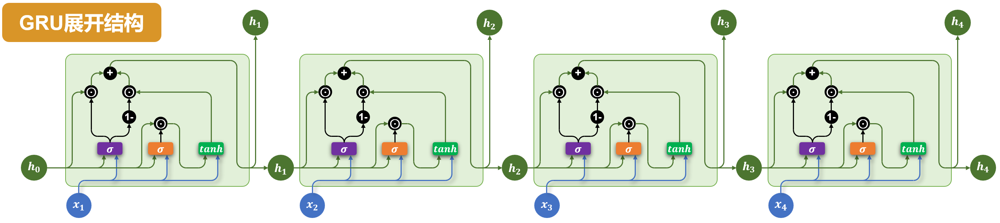

各部分说明如下：

- 重置门（Reset Gate）

- 重置门由上一个时间步的隐藏状态和当前时间步的输入计算得到：

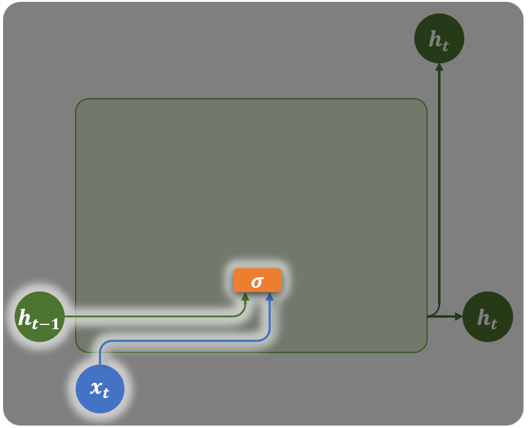

- 计算公式如下：

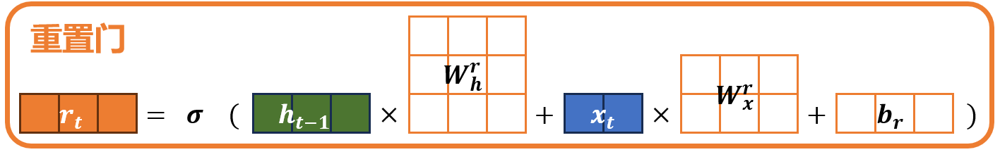

重置门会在计算当前时间步信息（候选隐藏状态）时，作用在上一个时间步的隐藏状态，用于控制遗忘多少旧信息，如下图所示：

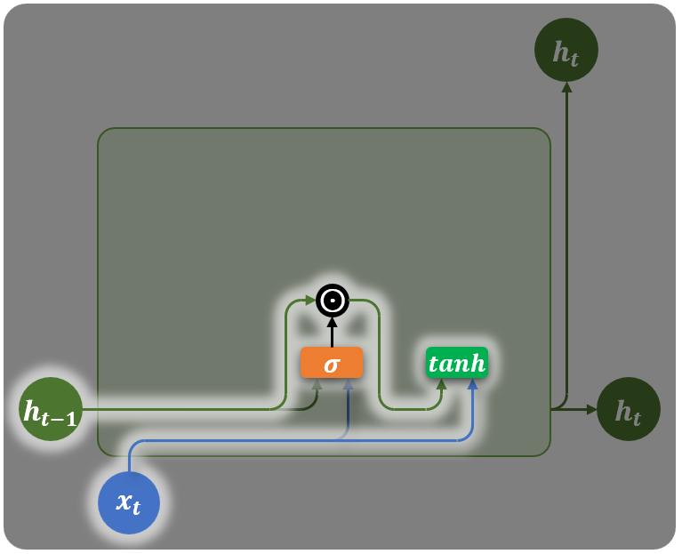

当前时间步的信息（候选隐藏状态）的计算公式为：

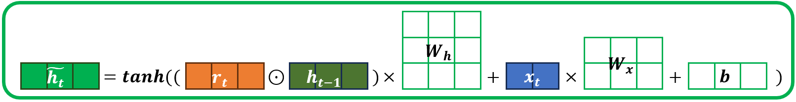

- 更新门（Update Gate）

更新门也由上一时间步的隐藏状态和当前时间步的输入计算得到，如下图所示

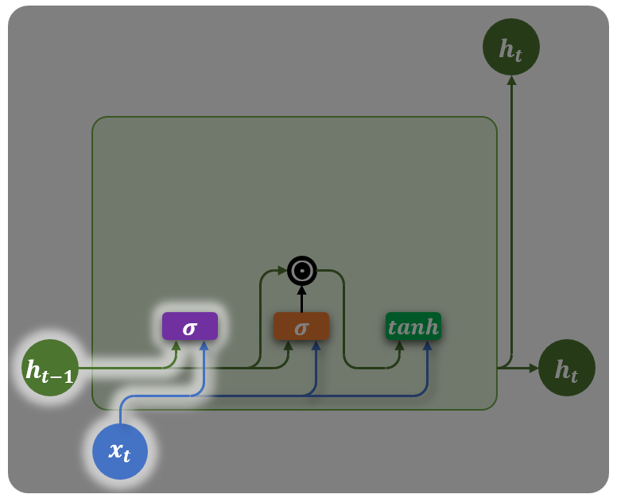

计算公式为

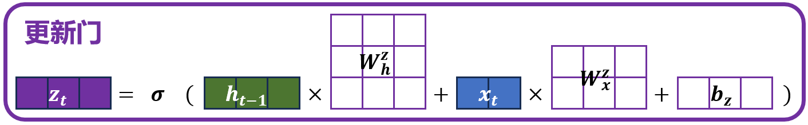

更新门会在计算当前时间步最终的隐藏状态时，分别作用在上一时刻的隐藏状态和当前新计算出的候选隐藏状态，用于控制保留多少旧信息，以及引入多少新信息。

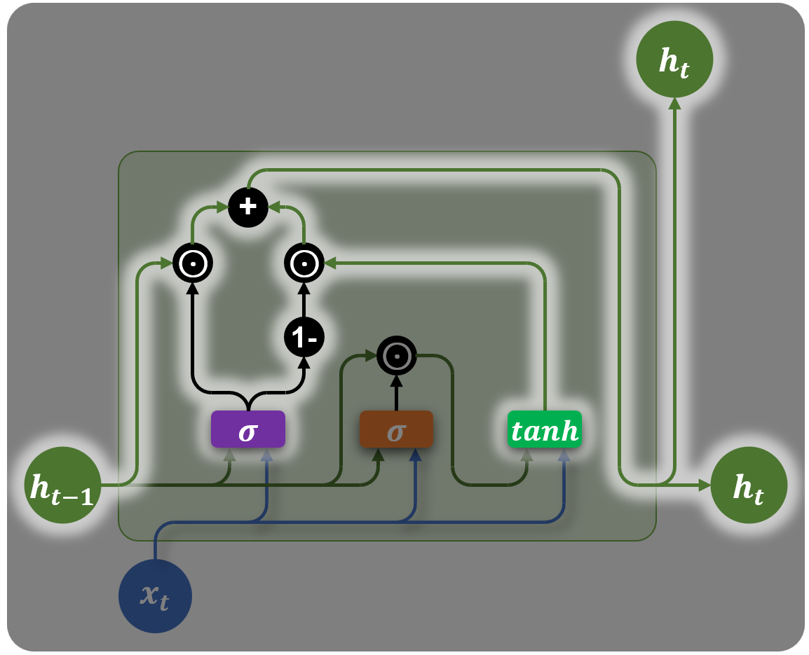

最终隐藏状态的计算公式为：


完整结构如下下图所示

#### 多层结构

GRU同样支持多层结构

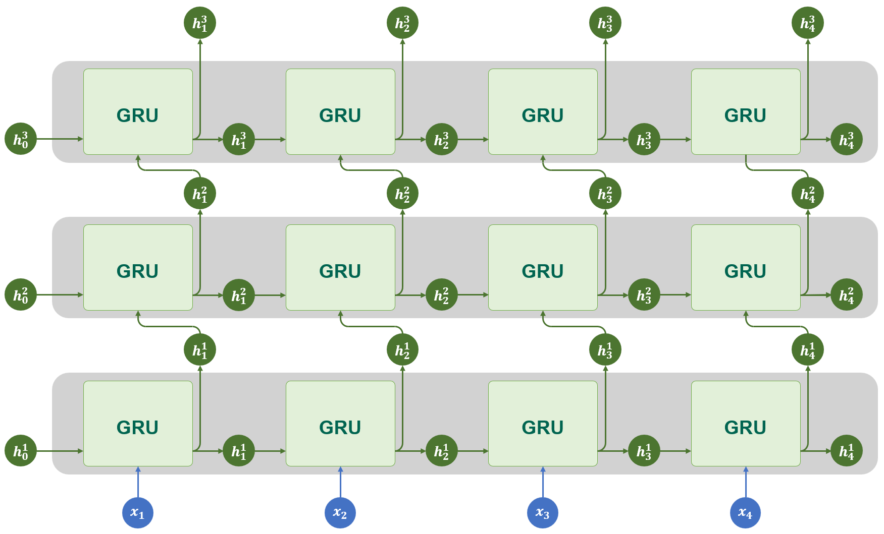

#### 双向结构

GRU同样支持双向结构

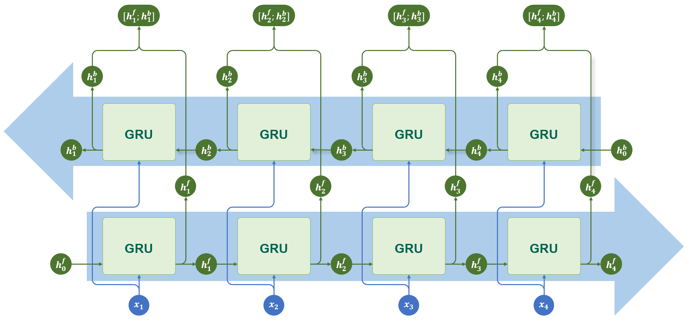

#### 多层+双向结构

GRU同样支持多层结构和双向结构

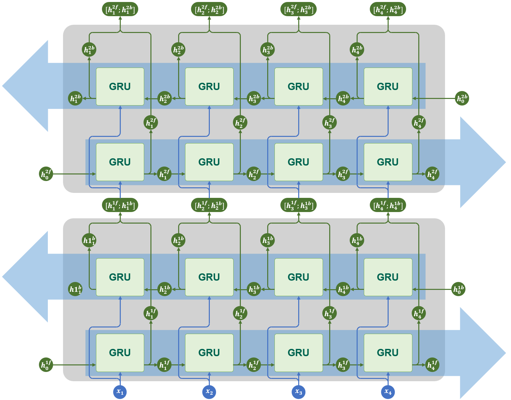

#### API使用

torch.nn.GRU 是 PyTorch 中实现门控循环单元（Gated Recurrent Unit, GRU）的模块。它用于对序列数据建模，在自然语言处理（NLP）、时间序列预测等任务中广泛使用。该模块支持单层或多层 GRU，可选择是否使用双向结构（bidirectional）。

torch.nn.GRU与torch.nn.RNN的API几乎完全相同。

##### 参数说明

构造GRU层所需的参数如下：

```
torch.nn.GRU(input_size, hidden_size, num_layers=1, bias=True, batch_first=False, dropout=0.0, bidirectional=False, device=None, dtype=None)
```

各参数含义如下

| 参数名 | 类型 | 说明 |
| --- | --- | --- |
| input_size | int | 每个时间步输入特征的维度（词向量维度） |
| hidden_size | int | 隐藏状态的维度 |
| num_layers | int | RNN 层数，默认为 1 |
| bias | bool | 是否使用偏置项，默认 True |
| batch_first | bool | 输入张量是否是 (batch, seq, feature)，默认 False 表示 (seq, batch, feature) |
| dropout | float | 除最后一层外，其余层之间的 dropout 概率 |
| bidirectional | bool | 是否为双向 RNN，默认 False |
| device | torch.device or str | 模块的初始化设备，如 'cuda', 'cpu' |
| dtype | torch.dtype | 模块初始化时的默认数据类型，如torch.float32 |

##### 输入输出

示例代码如下

```
gru= torch.nn.GRU()
output, h_n = gru(input, h_0)
```

输入输出内容如下

| 类别 | 项 | 说明 |
| --- | --- | --- |
| 输<br>入 | input | 输入序列，形状为(seq_len, batch_size, input_size)，如果 batch_first=True，则为 (batch_size, seq_len, input_size) |
|  | h_0 | 可选，初始隐藏状态，形状为 (num_layers × num_directions, batch_size, hidden_size) |
| 输<br>出 | output | RNN层的输出，包含最后一层每个时间步的隐藏状态，形状为 (seq_len, batch_size, num_directions × hidden_size )，如果如果 batch_first=True，则为(batch_size, seq_len, num_directions × hidden_size ) |
|  | h_n | 最后一个时间步的隐藏状态，包含每一层的每个方向，形状为 (num_layers × num_directions, batch_size, hidden_size) |

输入输出形状如下

- 单层单向

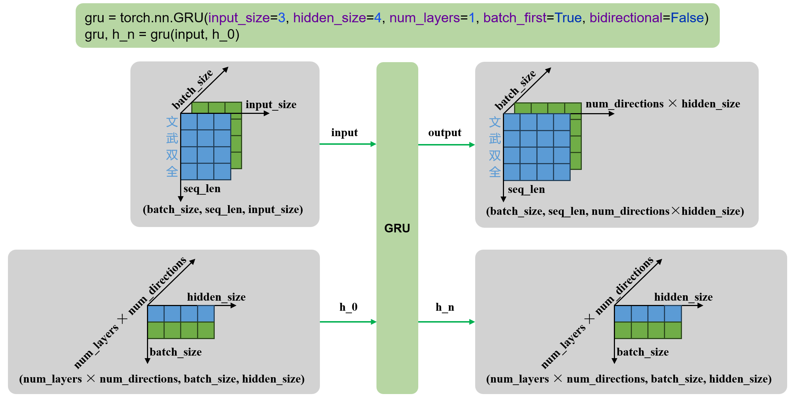

- 多层单向

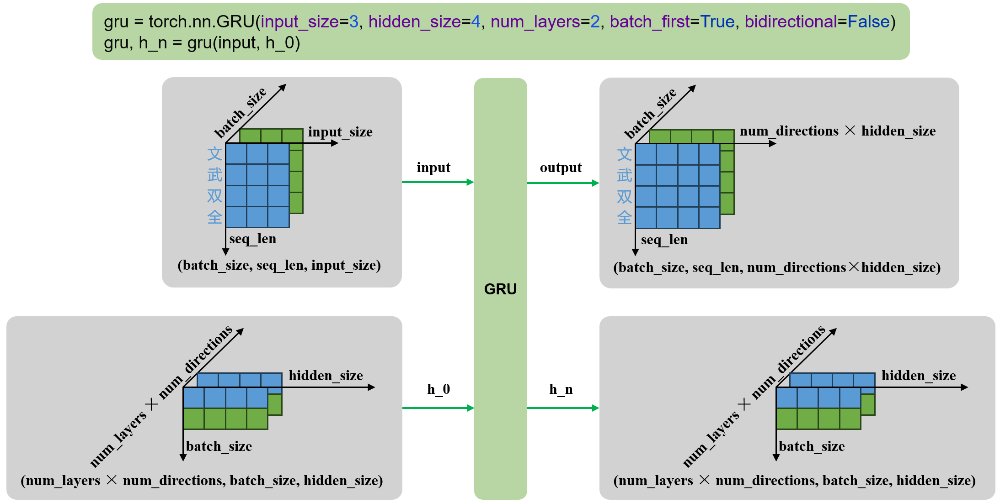

- 单层双向

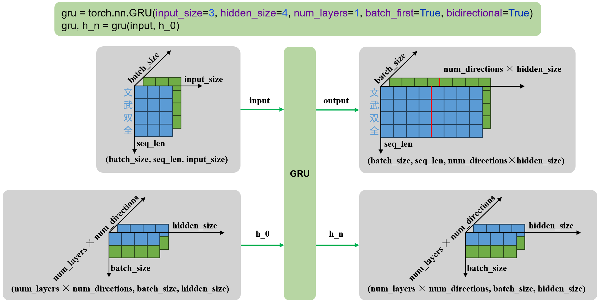

- 多层双向

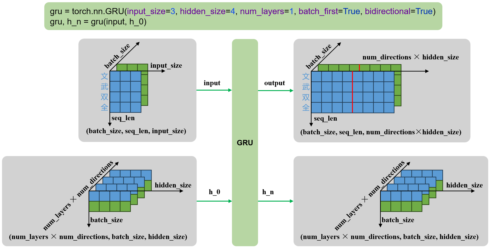

#### 案例实操（AI智评V2.0）

将上一节使用LSTM实现的评论情感分析模型改为使用GRU，并对比两者的效果，另外也改用RNN实现，对比其效果。

###### 项目结构

项目结构如下：

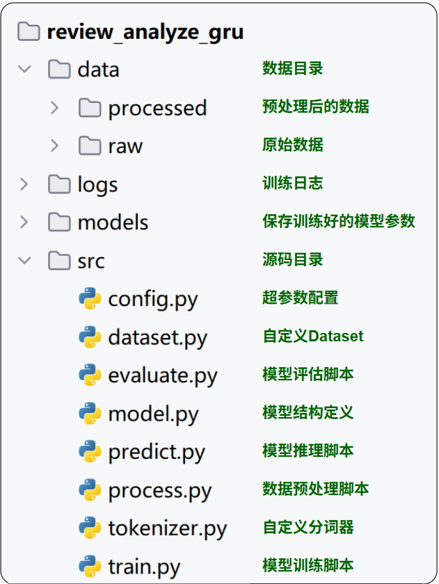

###### 完整代码

###### 数据预处理

```
# process.py

import pandas as pd
from sklearn.model_selection import train_test_split
from tokenizer import JiebaTokenizer

import config

def process():
    print("开始处理数据")
    # 1.读取数据
    df = pd.read_csv(config.RAW_DATA_DIR / 'online_shopping_10_cats.csv', usecols=['review', 'label'], encoding='utf-8')

    # 2.过滤数据
    df = df.dropna()
    df = df[df['review'].str.strip().ne('')]

    # 3.划分数据集
    train_df, test_df = train_test_split(df, test_size=0.2, random_state=42)

    # 4.构建词表
    JiebaTokenizer.build_vocab(train_df['review'].tolist(), config.PROCESSED_DATA_DIR / 'vocab.txt')

    # 5.构建Tokenizer对象
    tokenizer = JiebaTokenizer.from_vocab(config.PROCESSED_DATA_DIR / 'vocab.txt')

    # 6.构建训练集并保存
    train_df['review'] = train_df['review'].apply(lambda x: tokenizer.encode(x, seq_len=config.SEQ_LEN))
    train_df.to_json(config.PROCESSED_DATA_DIR / 'indexed_train.jsonl', orient='records', lines=True)

    # 7.构建测试集并保存
    test_df['review'] = test_df['review'].apply(lambda x: tokenizer.encode(x, seq_len=config.SEQ_LEN))
    test_df.to_json(config.PROCESSED_DATA_DIR / 'indexed_test.jsonl', orient='records', lines=True)

    print("数据处理完成")

if __name__ == '__main__':
    process()
```

###### 自定义分词器

```
# tokenizer.py

import jieba
from tqdm import tqdm

jieba.setLogLevel(jieba.logging.WARNING)

class JiebaTokenizer:
    unk_token = '<unk>'
    pad_token = '<pad>'

    @staticmethod
    def tokenize(sentence):
        """
        分词
        :param sentence: 句子
        :return: token列表
        """
        return jieba.lcut(sentence)

    @classmethod
    def build_vocab(cls, sentences, vocab_file):
        """
        构建并保存词表
        :param sentences: 句子列表
        :param vocab_file: 词表文件路径
        """

        # 1.获取词表
        unique_words = set()
        for sentence in tqdm(sentences, desc='分词'):
            for word in cls.tokenize(sentence):
                unique_words.add(word)

        vocab_list = [cls.pad_token, cls.unk_token] + list(unique_words)

        # 2.保存词表
        with open(vocab_file, 'w', encoding='utf-8') as f:
            for word in vocab_list:
                f.write(word + '\n')

    def __init__(self, vocab_list):
        """
        初始化tokenizer
        :param vocab_list: 词表列表
        """

        self.vocab_list = vocab_list  # 此表列表(实例属性)
        self.vocab_size = len(vocab_list)  # 词表大小(实例属性)
        self.word2index = {word: index for index, word in enumerate(vocab_list)}  # 词到索引(实例属性)
        self.index2word = {index: word for index, word in enumerate(vocab_list)}  # 索引到词(实例属性)

        self.unk_token_index = self.word2index[self.unk_token]  # 未知词索引(实例属性)
        self.pad_token_index = self.word2index[self.pad_token]

    @classmethod
    def from_vocab(cls, vocab_file):
        """
        加载词表并创建Tokenizer对象
        :param vocab_file: 词表文件
        :return: tokenizer对象
        """
        with open(vocab_file, 'r', encoding='utf-8') as f:
            vocab_list = [line[:-1] for line in f.readlines()]
        return cls(vocab_list)

    def encode(self, sentence, seq_len):
        """
        编码
        :param sentence: 句子
        :param seq_len: 长度
        :return: 索引列表
        """
        tokens = self.tokenize(sentence)
        indexes = [self.word2index.get(token, self.unk_token_index) for token in tokens]

        if len(indexes) >= seq_len:
            return indexes[:seq_len]
        else:
            return indexes + [self.pad_token_index] * (seq_len - len(indexes))
```

###### 自定义数据集

```
# dataset.py

import torch
from torch.utils.data import Dataset, DataLoader
import pandas as pd
import config

class ReviewAnalyzeDataset(Dataset):
    """
    评论情感分析数据集。
    """

    def __init__(self, file_path):
        """
        初始化数据集。
        :param file_path: 数据文件路径（jsonl 格式）
        """
        self.data = pd.read_json(file_path, lines=True).to_dict(orient='records')

    def __len__(self):
        """
        返回数据集大小。
        :return: 数据集长度
        """
        return len(self.data)

    def __getitem__(self, index):
        """
        获取单条样本。
        :param index: 索引
        :return: (input_tensor, target_tensor)
        """
        input_tensor = torch.tensor(self.data[index]['review'], dtype=torch.long)
        target_tensor = torch.tensor(self.data[index]['label'], dtype=torch.float)
        return input_tensor, target_tensor

def get_dataloader(train: bool = True):
    """
    获取数据加载器。
    :param train: 是否加载训练集
    :return: DataLoader
    """
    file_name = 'indexed_train.jsonl' if train else 'indexed_test.jsonl'
    dataset = ReviewAnalyzeDataset(config.PROCESSED_DATA_DIR / file_name)
    return DataLoader(dataset, batch_size=config.BATCH_SIZE, shuffle=True)

if __name__ == '__main__':
    dataloader = get_dataloader()
    for input_tensor, target_tensor in dataloader:
        print(f"输入形状: {input_tensor.shape}, 标签形状: {target_tensor.shape}")
        break
```

###### 模型定义

```
# model.py

import torch
from torch import nn
import config
from torchinfo import summary

class ReviewAnalyzeModel(nn.Module):
    """
    评论情感分析模型：Embedding -> GRU -> Linear
    """

    def __init__(self, vocab_size, padding_idx):
        """
        初始化模型。
        :param vocab_size: 词表大小
        :param padding_idx: padding token 的索引
        """
        super().__init__()
        self.embedding = nn.Embedding(
            num_embeddings=vocab_size,
            embedding_dim=config.EMBEDDING_DIM,
            padding_idx=padding_idx
        )
        self.gru = nn.GRU(
            input_size=config.EMBEDDING_DIM,
            hidden_size=config.HIDDEN_DIM,
            batch_first=True
        )
        self.linear = nn.Linear(
            in_features=config.HIDDEN_DIM,
            out_features=1
        )

    def forward(self, x):
        """
        前向传播。
        :param x: 输入索引张量，形状 (batch_size, seq_len)
        :return: 输出 logits，形状 (batch_size,)
        """
        embed = self.embedding(x)  # 嵌入层输出: (batch_size, seq_len, embedding_dim)
        gru_output, _ = self.gru(embed)  # GRU输出: (batch_size, seq_len, hidden_dim)
        final_output = gru_output[:, -1, :]  # 取最后时间步输出
        logits = self.linear(final_output).squeeze(dim=1)  # 线性层 + squeeze: (batch_size,)
        return logits

if __name__ == '__main__':
    model = ReviewAnalyzeModel(vocab_size=1000, padding_idx=0)
    dummy_input = torch.randint(low=0, high=1000, size=(config.BATCH_SIZE, config.SEQ_LEN), dtype=torch.long)
    summary(model, input_data=dummy_input)
```

###### 模型训练

```
# train.py

import time
import torch
from torch.utils.tensorboard import SummaryWriter
from tqdm import tqdm
from dataset import get_dataloader
from tokenizer import JiebaTokenizer
from model import ReviewAnalyzeModel
import config

def train_one_epoch(model, dataloader, loss_function, optimizer, device):
    """
    单轮训练。
    :param model: 模型
    :param dataloader: 数据加载器
    :param loss_function: 损失函数
    :param optimizer: 优化器
    :param device: 设备
    :return: 平均损失
    """
    model.train()
    total_loss = 0
    for input_tensor, target_tensor in tqdm(dataloader, desc='训练'):
        input_tensor = input_tensor.to(device)
        target_tensor = target_tensor.to(device)

        optimizer.zero_grad()
        outputs = model(input_tensor)
        loss = loss_function(outputs, target_tensor)
        loss.backward()
        optimizer.step()

        total_loss += loss.item()
    return total_loss / len(dataloader)

def train():
    """
    模型训练主逻辑。
    """
    device = torch.device('cuda' if torch.cuda.is_available() else 'cpu')
    dataloader = get_dataloader(train=True)

    tokenizer = JiebaTokenizer.from_vocab(config.PROCESSED_DATA_DIR / 'vocab.txt')
    model = ReviewAnalyzeModel(vocab_size=tokenizer.vocab_size,
                               padding_idx=tokenizer.pad_token_index).to(device)

    loss_function = torch.nn.BCEWithLogitsLoss()
    optimizer = torch.optim.Adam(model.parameters(), lr=config.LEARNING_RATE)

    writer = SummaryWriter(log_dir=config.LOG_DIR / time.strftime('%Y-%m-%d_%H-%M-%S'))

    best_loss = float('inf')
    for epoch in range(1, config.EPOCHS + 1):
        print(f'========== Epoch: {epoch} ==========')
        avg_loss = train_one_epoch(model, dataloader, loss_function, optimizer, device)
        print(f'Loss: {avg_loss:.4f}')
        writer.add_scalar('Loss/Train', avg_loss, epoch)

        # 保存最佳模型
        if avg_loss < best_loss:
            best_loss = avg_loss
            torch.save(model.state_dict(), config.MODELS_DIR / 'model.pt')
            print('模型保存成功')

if __name__ == '__main__':
    train()
```

###### 模型预测

```
# predict.py

import torch
from tokenizer import JiebaTokenizer
from model import ReviewAnalyzeModel
import config

def predict_batch(input_tensor, model):
    """
    对一个批次输入进行预测。
    :param input_tensor: 输入张量 (batch_size, seq_len)
    :param model: 模型
    :return: 概率列表
    """
    model.eval()
    with torch.no_grad():
        logits = model(input_tensor)
    probs = torch.sigmoid(logits)
    return probs.tolist()

def predict(user_input: str, model, tokenizer, device):
    """
    对单条用户输入进行预测。
    :param user_input: 用户输入字符串
    :param model: 模型
    :param tokenizer: 分词器
    :param device: 设备
    :return: 概率值
    """
    input_indexes = tokenizer.encode(user_input, config.SEQ_LEN)
    input_tensor = torch.tensor([input_indexes], dtype=torch.long).to(device)
    probs = predict_batch(input_tensor, model)
    return probs[0]

def run_predict():
    """
    预测交互主逻辑。
    """
    device = torch.device('cuda' if torch.cuda.is_available() else 'cpu')

    tokenizer = JiebaTokenizer.from_vocab(config.PROCESSED_DATA_DIR / 'vocab.txt')
    model = ReviewAnalyzeModel(vocab_size=tokenizer.vocab_size,
                               padding_idx=tokenizer.pad_token_index).to(device)
    model.load_state_dict(torch.load(config.MODELS_DIR / 'model.pt'))

    print('请输入要预测的评论：（输入 q 或 quit 退出）')
    while True:
        user_input = input('> ').strip()
        if user_input in ['q', 'quit']:
            print('退出程序')
            break
        if not user_input:
            print('输入为空，请重新输入')
            continue

        prob = predict(user_input, model, tokenizer, device)
        if prob > 0.5:
            print(f'正面评价（置信度：{prob:.2f}）')
        else:
            print(f'负面评价（置信度：{1 - prob:.2f}）')

if __name__ == '__main__':
    run_predict()
```

###### 模型评估

```
# evaluate.py

import torch
from tokenizer import JiebaTokenizer
from model import ReviewAnalyzeModel
from dataset import get_dataloader
from predict import predict_batch
import config

def evaluate(model, dataloader, device):
    """
    模型评估。
    :param model: 模型
    :param dataloader: 数据加载器
    :param device: 设备
    :return: 准确率
    """
    model.eval()
    total_count = 0
    correct_count = 0

    for input_tensor, target_tensor in dataloader:
        input_tensor = input_tensor.to(device)
        target_tensor = target_tensor.tolist()

        probs = predict_batch(input_tensor, model)

        for prob, target in zip(probs, target_tensor):
            pred_label = 1 if prob > 0.5 else 0
            if pred_label == target:
                correct_count += 1
            total_count += 1

    return correct_count / total_count

def run_evaluate():
    """
    评估主流程。
    """
    device = torch.device('cuda' if torch.cuda.is_available() else 'cpu')

    tokenizer = JiebaTokenizer.from_vocab(config.PROCESSED_DATA_DIR / 'vocab.txt')
    model = ReviewAnalyzeModel(vocab_size=tokenizer.vocab_size,
                               padding_idx=tokenizer.pad_token_index).to(device)
    model.load_state_dict(torch.load(config.MODELS_DIR / 'model.pt'))

    dataloader = get_dataloader(train=False)

    acc = evaluate(model, dataloader, device)
    print("========== 评估结果 ==========")
    print(f"准确率：{acc:.4f}")
    print("=============================")

if __name__ == '__main__':
    run_evaluate()
```

###### 配置文件

```
# config.py

# 配置文件，定义项目路径和超参数
from pathlib import Path

# 项目根目录
ROOT_DIR = Path(__file__).parent.parent

# 数据路径
RAW_DATA_DIR = ROOT_DIR / 'data' / 'raw'
PROCESSED_DATA_DIR = ROOT_DIR / 'data' / 'processed'

# 模型与日志路径
MODELS_DIR = ROOT_DIR / 'models'
LOG_DIR = ROOT_DIR / 'logs'

# 超参数
SEQ_LEN = 128  # 序列长度
BATCH_SIZE = 64  # 批次大小
EMBEDDING_DIM = 64  # 嵌入维度
HIDDEN_DIM = 128  # GRU 隐藏层维度
LEARNING_RATE = 1e-3  # 学习率
EPOCHS = 30  # 训练轮数
```

#### 存在问题

GRU 在简化结构、提高训练效率方面表现优秀，但在超长依赖建模、灵活性和并行计算方面仍存在天然限制。

## Seq2Seq模型

### 概述

传统的自然语言处理任务（如文本分类、序列标注）以​​静态输出​​为主，其目标是预测固定类别或标签。然而，现实中的许多应用需要模型​​动态生成新的序列​​，例如：

- ​​机器翻译​​：输入中文句子，输出对应的英文翻译。

- ​​文本摘要​​：输入长篇文章，生成简短的摘要。

- ​​问答系统​​：输入用户问题，生成自然语言回答。

- ​​对话系统​​：输入对话历史，生成连贯的下一条回复。

这些任务具有两个关键共同点：

- ​​输入和输出均为序列​​（如词、字符或子词序列）。

- ​​输入与输出序列长度动态可变​​（例如翻译任务中，中英文句子长度可能不同）。

为了解决这类问题，研究者提出了Seq2Seq（Sequence to Sequence，序列到序列）模型。


### 模型结构详解

Seq2Seq 模型由一个编码器（Encoder）和一个解码器（Decoder）构成。编码器负责提取输入序列的语义信息，并将其压缩为一个固定长度的上下文向量（Context Vector）；解码器则基于该向量，逐步生成目标序列。

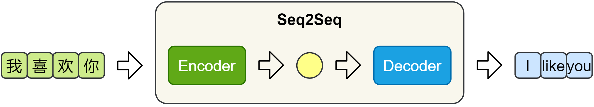

#### 编码器

编码器主要由一个循环神经网络（RNN/LSTM/GRU）构成，其任务是将输入序列的语义信息提取并压缩为一个上下文向量。

在模型处理输入序列时，循环神经网络会依次接收每个token的输入，并在每个时间步步更新隐藏状态。每个隐藏状态都携带了截止到当前位置为止的信息。随着序列推进，信息不断累积，最终会在最后一个时间步形成一个包含整句信息的隐藏状态。

这个最后的隐藏状态就会作为上下文向量（context vector），传递给解码器，用于指导后续的序列生成。

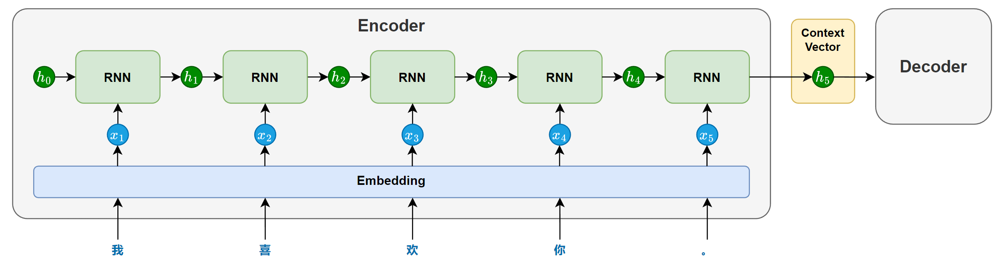

为增强编码器的理解能力，循环网络也可以采用双向结构（结合前文与后文信息）或多层结构（提取更深的语义特征）。

#### 解码器

解码器主要也由一个循环神经网络（RNN / LSTM / GRU）构成，其任务是基于编码器传递的上下文向量，逐步生成目标序列。

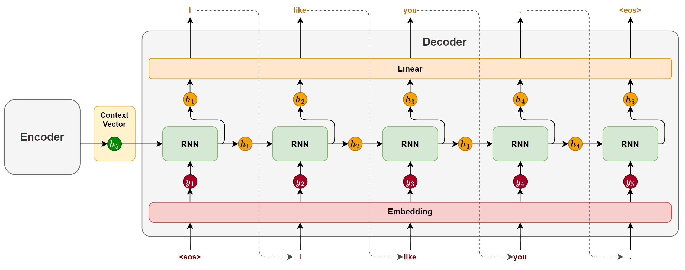

在生成开始时，循环神经网络以上下文向量作为初始隐藏状态，并接收一个特殊的起始标记 &lt;sos&gt;（start of sentence）作为第一个时间步的输入，用于预测第一个 token。

随后，在每一个时间步，模型都会根据前一时刻的隐藏状态和上一步生成的 token，预测当前的输出。这种“将前一步的输出作为下一步输入”的方式被称为自回归生成（Autoregressive Generation），它确保了生成结果的连贯性。

生成过程会持续进行，直到模型生成了一个特殊的结束标记 &lt;eos&gt;（end of sentence），表示句子生成完成。

说明：起始标记和结束标记会在训练数据中显式添加，模型会在训练中学会何时开始、如何续写，以及何时结束，从而掌握完整的生成流程。

### 模型训练和推理机制

#### 模型训练

Seq2Seq 模型的训练目标，是在给定输入序列的条件下，逐步生成完整且准确的目标序列。下面以一个中–英机器翻译样本为例，说明训练过程的各个环节。

假设某个训练样本为：

中文输入：“我喜欢你。”

英文输出：“I like you.”

###### 数据准备

为了让模型明确目标序列的起点和终点，通常在目标句前添加 &lt;sos&gt;（start of sequence），句末添加 &lt;eos&gt;（end of sequence）：

“I like you.” → “&lt;sos&gt; I like you. &lt;eos&gt;”

这两个特殊标记帮助模型学会从哪里开始生成，以及何时停止生成。

###### 前向传播

模型由编码器和解码器两部分组成：

###### 编码器

编码器接收源语言序列“我喜欢你。”，通过嵌入层和循环神经网络（RNN / LSTM / GRU）的逐步处理，将整句编码为上下文向量。

###### 解码器

解码器使用该上下文向量初始化其隐藏状态，然后逐步生成目标序列。

需要特别注意的是，训练阶段与推理阶段的解码策略是不同的：

在推理阶段，解码器采用自回归生成方式：每一步的输入是模型自己上一步的预测结果。

而在训练阶段，通常使用一种称为 Teacher Forcing 的策略，即：

解码器每一步的输入不是模型上一步的预测结果，而是目标序列中真实的前一个token。如图下图所示

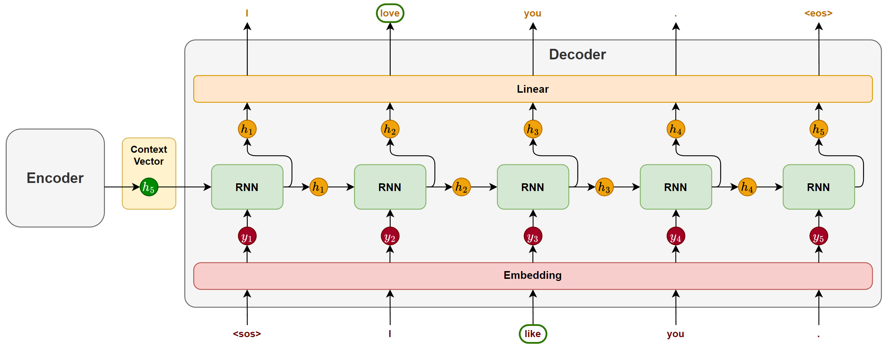

这种做法带来了两个明显好处：

- 训练更快，误差不会累积；

- 梯度传播更稳定，有利于优化收敛。

###### 计算损失

解码器每一步输出一个token的概率分布，我们通过交叉熵损失函数衡量模型对真实词的预测质量。训练过程中，每一个时间步都会产生一个损失值。该样本的总损失，就是所有时间步的损失值逐步累加的结果。

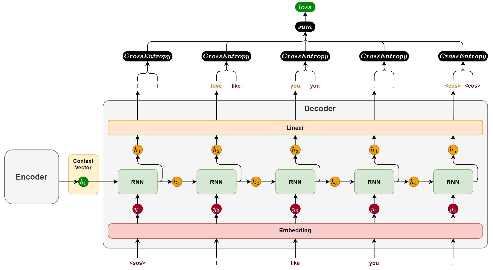

###### 反向传播

在 PyTorch 中，调用 loss.backward() 即可自动完成梯度的反向传播。系统会沿时间维度展开计算图，自动完成所有参数的梯度计算，无需手动推导，实现简洁高效。

#### 模型推理

模型推理是Seq2Seq模型在实际任务中生成目标序列的过程，通常包括以下几个环节：

###### 编码器处理

推理阶段的编码器处理流程与训练时完全一致。

输入序列会经过分词、嵌入和循环神经网络的逐步处理，最终生成一个表示整句语义的上下文向量，该向量将作为解码器的初始隐藏状态，为生成过程提供语义基础。

###### 解码器处理

解码器是推理过程的核心，其生成方式采用自回归生成（Autoregressive Generation）：每一步的输出会作为下一步的输入，逐步构造完整句子。

###### 自回归生成流程

第一步，解码器接收起始标记 &lt;sos&gt;，生成第一个词；

第二步，将上一步生成的词作为当前输入，再预测第二个词；

持续重复以上过程，直到模型生成 &lt;eos&gt;，或达到设定的最大生成步数。

###### 词选择策略

每个时间步，解码器输出的是一个词概率分布。我们需要从中选择一个具体词作为本时间步的输出，选择方式即为生成策略。常见策略包括：

- 贪心解码（Greedy Decoding）

每一步都选择概率最高的词。

优点：简单高效

缺点：容易陷入局部最优，生成不够多样。

- 束搜索（Beam Search）

每一步保留多个候选词序列（如 beam size = 3），并在扩展后选择得分最高的完整句子。

优点：全局考虑，生成质量高

缺点：计算开销大

### 案例实操（中英翻译V1.0）

#### 需求说明

本案例的目标是实现一个简易的中→英翻译模型，输入为中文句子（如“我喜欢你。”），输出为英文翻译结果（如“I like you.”）。

#### 需求分析

###### 数据处理

本案例使用的数据集来自阿里云天池平台，共包含 29,155 对中英文平行语句。原始文件为 TSV 格式，每行包含一对中文句子和对应的英文翻译，结构如下图所示：

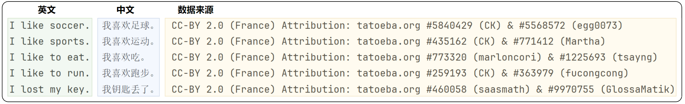

在本案例中，仅使用前两列数据：中文句子作为模型输入（源语言），英文句子作为模型输出（目标语言）。

需要注意的是，输入和输出序列需要单独分词和构建词表，其中中文按照字粒度分词，英文使用NLTK分词工具。

###### 模型设计

模型采用经典的 Seq2Seq 架构，由编码器（Encoder）与解码器（Decoder）两部分构成，具体结构如下：

###### 编码器

编码器由两层组成：

嵌入层（Embedding Layer）：将中文 token 序列映射为稠密向量。

循环神经网络层（GRU）：为更好的提取输入序列的语义信息，采用双向GRU，最终拼接前向与后向的隐藏状态，作为上下文向量传递给解码器。

###### 解码器

解码器由三层组成：

嵌入层（Embedding Layer）：将目标序列中的token 转换为稠密向量。

循环神经网络层（GRU）：结合前一步的词向量和隐藏状态，生成当前的隐藏状态。

全连接层（Linear Layer）：将当前隐藏状态映射为词表大小的概率分布，用于预测下一个词。

###### 训练方案

训练策略：采用 Teacher Forcing，即每一步使用目标序列中真实的前一个词作为解码器输入。

损失函数：使用 CrossEntropyLoss。

优化器：使用 Adam 优化器进行参数更新。

###### 推理方案

推理阶段采用自回归生成策略（Autoregressive Generation）。

词选择策略使用贪心解码（Greedy Decoding）。

###### 评估方案

在机器翻译任务中，BLEU（Bilingual Evaluation Understudy） 是一种常用的自动评估指标，用于衡量模型生成的翻译与人工参考译文之间的相似程度。其核心思想是：

- n-gram 匹配：统计预测译文中有多少 n-gram（词或短语）同时出现在参考译文中，用于衡量翻译内容的准确性。

- 精确率计算：将匹配到的 n-gram 数量除以预测译文中 n-gram 的总数，反映生成译文中“正确部分”的比例。

此外，BLEU 还引入长度惩罚机制，防止模型通过生成过短句子获得不合理的高分。

最终得到的 BLEU 分数越高，说明生成译文与参考译文越接近。

本案例中，使用 Python 的 NLTK 库 中的 bleu_score 模块，对模型在测试集上的翻译结果进行评估，主要参考BLEU-4 的得分情况，作为翻译质量的衡量依据。

#### 需求实现

###### 项目结构

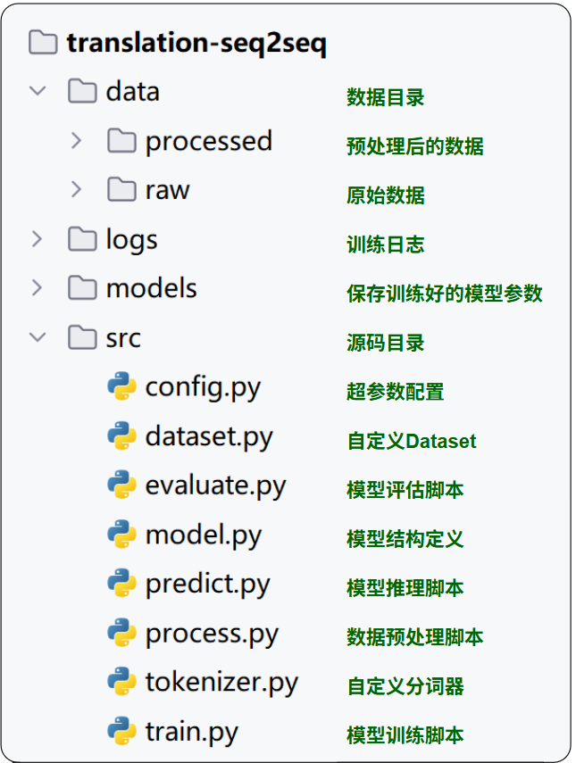

###### 完整代码

###### 数据预处理

```
# process.py

import pandas as pd
from sklearn.model_selection import train_test_split
from tokenizer import ChineseTokenizer, EnglishTokenizer
import config

def process():
    """
    数据预处理主函数。
    """
    print('开始处理数据')

    # 读取原始数据文件
    df = pd.read_csv(
        config.RAW_DATA_DIR / 'cmn.txt',
        sep='\t',
        header=None,
        usecols=[0, 1],
        names=['en', 'zh']
    )

    # 数据清洗：去除空值和空字符串
    df = df.dropna()
    df = df[df['en'].str.strip().ne('') & df['zh'].str.strip().ne('')]

    # 划分训练集和测试集
    train_df, test_df = train_test_split(df, test_size=0.2, random_state=42)

    # 构建词表并保存
    EnglishTokenizer.build_vocab(train_df['en'].tolist(), config.PROCESSED_DATA_DIR / 'en_vocab.txt')
    ChineseTokenizer.build_vocab(train_df['zh'].tolist(), config.PROCESSED_DATA_DIR / 'zh_vocab.txt')

    # 加载词表
    en_tokenizer = EnglishTokenizer.from_vocab(config.PROCESSED_DATA_DIR / 'en_vocab.txt')
    zh_tokenizer = ChineseTokenizer.from_vocab(config.PROCESSED_DATA_DIR / 'zh_vocab.txt')

    # 编码并保存训练集
    train_df['en'] = train_df['en'].apply(
        lambda x: en_tokenizer.encode(x, seq_len=config.SEQ_LEN, add_sos_eos=True)
    )
    train_df['zh'] = train_df['zh'].apply(
        lambda x: zh_tokenizer.encode(x, seq_len=config.SEQ_LEN, add_sos_eos=False)
    )
    train_df.to_json(
        config.PROCESSED_DATA_DIR / 'indexed_train.jsonl',
        orient='records',
        lines=True
    )

    # 编码并保存测试集
    test_df['en'] = test_df['en'].apply(
        lambda x: en_tokenizer.encode(x, seq_len=config.SEQ_LEN, add_sos_eos=True)
    )
    test_df['zh'] = test_df['zh'].apply(
        lambda x: zh_tokenizer.encode(x, seq_len=config.SEQ_LEN, add_sos_eos=False)
    )
    test_df.to_json(
        config.PROCESSED_DATA_DIR / 'indexed_test.jsonl',
        orient='records',
        lines=True
    )

    print('数据处理完成')

if __name__ == '__main__':
process()
```

###### 自定义分词器

```
# tokenizer.py

from abc import abstractmethod
from nltk import word_tokenize, TreebankWordDetokenizer
from tqdm import tqdm

class BaseTokenizer:
    """
    分词器基类，支持词表构建、编码、索引映射等功能。
    """
    unk_token = '<unk>'
    pad_token = '<pad>'
    sos_token = '<sos>'
    eos_token = '<eos>'

    @staticmethod
    @abstractmethod
    def tokenize(sentence):
        """
        分词抽象方法。
        """
        pass

    @abstractmethod
    def decode(self, indexes):
        """
        解码抽象方法。
        """
        pass

    @classmethod
    def build_vocab(cls, sentences, vocab_file):
        """
        构建并保存词表。

        :param sentences: 句子列表。
        :param vocab_file: 词表文件路径。
        """
        unique_words = set()
        for sentence in tqdm(sentences, desc='分词'):
            # 收集唯一词汇
            for word in cls.tokenize(sentence):
                unique_words.add(word)

        vocab_list = [cls.pad_token, cls.unk_token, cls.sos_token, cls.eos_token] + list(unique_words)

        with open(vocab_file, 'w', encoding='utf-8') as f:
            for word in vocab_list:
                f.write(word + '\n')

    def __init__(self, vocab_list):
        """
        初始化分词器。

        :param vocab_list: 词表列表。
        """
        self.vocab_list = vocab_list
        self.vocab_size = len(vocab_list)
        self.word2index = {word: index for index, word in enumerate(vocab_list)}
        self.index2word = {index: word for index, word in enumerate(vocab_list)}
        self.unk_token_index = self.word2index[self.unk_token]
        self.pad_token_index = self.word2index[self.pad_token]
        self.sos_token_index = self.word2index[self.sos_token]
        self.eos_token_index = self.word2index[self.eos_token]

    @classmethod
    def from_vocab(cls, vocab_file):
        """
        加载词表并创建分词器。

        :param vocab_file: 词表文件路径。
        :return: 分词器对象。
        """
        with open(vocab_file, 'r', encoding='utf-8') as f:
            vocab_list = [line.strip() for line in f.readlines()]
        return cls(vocab_list)

    def encode(self, sentence, seq_len, add_sos_eos=False):
        """
        编码句子为索引。

        :param sentence: 输入句子。
        :param seq_len: 序列长度。
        :param add_sos_eos: 是否加起始结束符。
        :return: 索引列表。
        """
        tokens = self.tokenize(sentence)
        indexes = [self.word2index.get(token, self.unk_token_index) for token in tokens]

        if add_sos_eos:
            indexes = indexes[:seq_len - 2]
            indexes = [self.sos_token_index] + indexes + [self.eos_token_index]
        else:
            indexes = indexes[:seq_len]

        if len(indexes) < seq_len:
            indexes += [self.pad_token_index] * (seq_len - len(indexes))

        return indexes

class ChineseTokenizer(BaseTokenizer):
    @staticmethod
    def tokenize(sentence):
        return list(sentence)

    def decode(self, indexes):
        return "".join([self.index2word[index] for index in indexes])

class EnglishTokenizer(BaseTokenizer):
    @staticmethod
    def tokenize(sentence):
        return word_tokenize(sentence)

    def decode(self, indexes):
        tokens = [self.index2word[index] for index in indexes]
        return TreebankWordDetokenizer().detokenize(tokens)
```

###### 自定义数据集

```
# dataset.py

import pandas as pd
import torch
from torch.utils.data import Dataset, DataLoader
import config

class TranslationDataset(Dataset):
    def __init__(self, data_path):
        self.data = pd.read_json(data_path, lines=True).to_dict(orient='records')

    def __len__(self):
        return len(self.data)

    def __getitem__(self, index):
        input_tensor = torch.tensor(self.data[index]['zh'], dtype=torch.long)
        target_tensor = torch.tensor(self.data[index]['en'], dtype=torch.long)
        return input_tensor, target_tensor

def get_dataloader(train=True):
    data_path = config.PROCESSED_DATA_DIR / ('indexed_train.jsonl' if train else 'indexed_test.jsonl')
    dataset = TranslationDataset(data_path)
    return DataLoader(dataset, batch_size=config.BATCH_SIZE, shuffle=True)

if __name__ == '__main__':
    train_loader = get_dataloader(train=True)
    for inputs, targets in train_loader:
        print(inputs.shape)
        print(targets.shape)
        break
```

###### 模型定义

```
# model.py

import torch
from torch import nn
from torchinfo import summary

import config

class TranslationEncoder(nn.Module):
    """
    翻译模型编码器，基于双向 GRU。
    """

    def __init__(self, vocab_size, padding_index):
        """
        初始化编码器。

        :param vocab_size: 词表大小。
        :param padding_index: padding token 的索引。
        """
        super().__init__()
        # 嵌入层：将 token 索引映射为稠密向量
        self.embedding = nn.Embedding(
            num_embeddings=vocab_size,
            embedding_dim=config.EMBEDDING_DIM,
            padding_idx=padding_index
        )
        # 双向 GRU
        self.rnn = nn.GRU(
            input_size=config.EMBEDDING_DIM,
            hidden_size=config.ENCODER_HIDDEN_DIM,
            num_layers=config.ENCODER_LAYERS,
            batch_first=True,
            bidirectional=True
        )

    def forward(self, src):
        """
        前向传播。

        :param src: 输入张量，形状 (batch_size, seq_len)。
        :return: (输出张量, 最终隐藏状态)。
        """
        embedded = self.embedding(src)  # (batch_size, seq_len, embedding_dim)
        output, hidden = self.rnn(embedded)
        return output, hidden

class TranslationDecoder(nn.Module):
    """
    翻译模型解码器，基于单向 GRU。
    """

    def __init__(self, vocab_size, padding_index):
        """
        初始化解码器。

        :param vocab_size: 词表大小。
        :param padding_index: padding token 的索引。
        """
        super().__init__()
        # 嵌入层
        self.embedding = nn.Embedding(
            num_embeddings=vocab_size,
            embedding_dim=config.EMBEDDING_DIM,
            padding_idx=padding_index
        )
        # GRU
        self.rnn = nn.GRU(
            input_size=config.EMBEDDING_DIM,
            hidden_size=config.DECODER_HIDDEN_DIM,
            batch_first=True
        )
        # 线性层：映射到词表概率分布
        self.linear = nn.Linear(
            in_features=config.DECODER_HIDDEN_DIM,
            out_features=vocab_size
        )

    def forward(self, tgt, hidden):
        """
        前向传播。

        :param tgt: 输入张量，形状 (batch_size, 1)。
        :param hidden: 隐藏状态张量，形状 (1, batch_size, hidden_dim)。
        :return: (输出张量, 新的隐藏状态)。
        """
        embedded = self.embedding(tgt)  # (batch_size, 1, embedding_dim)
        output, hidden = self.rnn(embedded, hidden)  # output: (batch_size, 1, hidden_dim)
        output = self.linear(output)  # (batch_size, 1, vocab_size)
        return output, hidden

if __name__ == '__main__':
    encoder = TranslationEncoder(vocab_size=10000, padding_index=0)
    dummy_encoder_input = torch.randint(low=0, high=10000, size=(config.BATCH_SIZE, config.SEQ_LEN))
    summary(encoder, input_data=dummy_encoder_input)

    print('-' * 100)

    decoder = TranslationDecoder(vocab_size=10000, padding_index=0)
    dummy_decoder_input = torch.randint(low=0, high=10000, size=(config.BATCH_SIZE, 1))
    dummy_decoder_hidden = torch.randn(size=(1, config.BATCH_SIZE, config.DECODER_HIDDEN_DIM))
    summary(decoder, input_data=[dummy_decoder_input, dummy_decoder_hidden])
```

###### 模型训练

```
# train.py

import time
from itertools import chain

import torch
from torch.nn import CrossEntropyLoss
from torch.utils.tensorboard import SummaryWriter
from tqdm import tqdm

from dataset import get_dataloader
from tokenizer import ChineseTokenizer, EnglishTokenizer
import config
from model import TranslationEncoder, TranslationDecoder

def train_one_epoch(dataloader, encoder, decoder, loss_function, optimizer, device):
    """
    训练一个 epoch。

    :param dataloader: 数据加载器。
    :param encoder: 编码器。
    :param decoder: 解码器。
    :param loss_function: 损失函数。
    :param optimizer: 优化器。
    :param device: 设备。
    :return: 平均损失。
    """
    encoder.train()
    decoder.train()
    total_loss = 0

    for src, tgt in tqdm(dataloader, desc='训练'):
        src = src.to(device)
        tgt = tgt.to(device)

        optimizer.zero_grad()

        # 编码器处理
        _, encoder_hidden = encoder(src)

        # 拼接前向后向隐藏状态
        forward_hidden = encoder_hidden[-2]
        backward_hidden = encoder_hidden[-1]
        context_vector = torch.cat([forward_hidden, backward_hidden], dim=1)

        # 初始化解码器输入和隐藏状态
        decoder_input = tgt[:, 0:1]
        decoder_hidden = context_vector.unsqueeze(0)

        decoder_outputs = []
        for step in range(1, config.SEQ_LEN):
            decoder_output, decoder_hidden = decoder(decoder_input, decoder_hidden)
            decoder_outputs.append(decoder_output)
            decoder_input = tgt[:, step:step + 1]

        decoder_outputs = torch.cat(decoder_outputs, dim=1)
        decoder_targets = tgt[:, 1:]

        loss = loss_function(
            decoder_outputs.reshape(-1, decoder_outputs.shape[-1]),
            decoder_targets.reshape(-1)
        )

        loss.backward()
        optimizer.step()

        total_loss += loss.item()

    return total_loss / len(dataloader)

def train():
    """
    模型训练主函数。
    """
    device = torch.device('cuda' if torch.cuda.is_available() else 'cpu')

    dataloader = get_dataloader()

    zh_tokenizer = ChineseTokenizer.from_vocab(config.PROCESSED_DATA_DIR / 'zh_vocab.txt')
    en_tokenizer = EnglishTokenizer.from_vocab(config.PROCESSED_DATA_DIR / 'en_vocab.txt')

    encoder = TranslationEncoder(
        vocab_size=zh_tokenizer.vocab_size,
        padding_index=zh_tokenizer.pad_token_index
    ).to(device)
    decoder = TranslationDecoder(
        vocab_size=en_tokenizer.vocab_size,
        padding_index=en_tokenizer.pad_token_index
    ).to(device)

    loss_function = CrossEntropyLoss(ignore_index=en_tokenizer.pad_token_index)
    optimizer = torch.optim.Adam(chain(encoder.parameters(), decoder.parameters()), lr=config.LEARNING_RATE)

    writer = SummaryWriter(log_dir=config.LOGS_DIR / time.strftime('%Y-%m-%d_%H-%M-%S'))

    best_loss = float('inf')

    for epoch in range(1, config.EPOCHS + 1):
        print(f'========== Epoch {epoch} ==========')

        avg_loss = train_one_epoch(dataloader, encoder, decoder, loss_function, optimizer, device)

        print(f'平均损失: {avg_loss:.4f}')
        writer.add_scalar('Loss', avg_loss, epoch)

        if avg_loss < best_loss:
            best_loss = avg_loss
            torch.save(encoder.state_dict(), config.MODELS_DIR / 'encoder.pt')
            torch.save(decoder.state_dict(), config.MODELS_DIR / 'decoder.pt')
            print('已保存模型')

if __name__ == '__main__':
    train()
```

###### 模型预测

```
# predict.py

import torch
from tokenizer import ChineseTokenizer, EnglishTokenizer
from model import TranslationEncoder, TranslationDecoder
import config

def predict_batch(input_tensor, encoder, decoder, en_tokenizer, device):
    """
    对一个 batch 的输入进行翻译预测。

    :param input_tensor: 中文输入张量，形状 (batch_size, seq_len)。
    :param encoder: 编码器。
    :param decoder: 解码器。
    :param en_tokenizer: 英文分词器。
    :param device: 设备。
    :return: 英文 token 索引列表。
    """
    encoder.eval()
    decoder.eval()

    with torch.no_grad():
        # 编码器前向传播
        encoder_output, encoder_hidden = encoder(input_tensor)

        # 拼接双向 GRU 的最后隐藏状态作为上下文向量
        context_vector = torch.cat([encoder_hidden[-2], encoder_hidden[-1]], dim=1)

        batch_size = input_tensor.shape[0]
        decoder_input = torch.full(
            size=(batch_size, 1),
            fill_value=en_tokenizer.sos_token_index,
            device=device
        )
        decoder_hidden = context_vector.unsqueeze(0)

        generated = [[] for _ in range(batch_size)]
        finished = [False for _ in range(batch_size)]

        for step in range(1, config.SEQ_LEN):
            decoder_output, decoder_hidden = decoder(decoder_input, decoder_hidden)
            predict_indexes = decoder_output.argmax(dim=-1)

            for i in range(batch_size):
                if finished[i]:
                    continue
                token_id = predict_indexes[i].item()
                if token_id == en_tokenizer.eos_token_index:
                    finished[i] = True
                    continue
                generated[i].append(token_id)

            if all(finished):
                break

            decoder_input = predict_indexes

        return generated

def predict(zh_sentence, encoder, decoder, zh_tokenizer, en_tokenizer, device):
    """
    对单条中文句子进行翻译。

    :param zh_sentence: 中文句子。
    :param encoder: 编码器。
    :param decoder: 解码器。
    :param zh_tokenizer: 中文分词器。
    :param en_tokenizer: 英文分词器。
    :param device: 设备。
    :return: 英文翻译句子。
    """
    input_ids = zh_tokenizer.encode(zh_sentence, seq_len=config.SEQ_LEN, add_sos_eos=False)
    input_tensor = torch.tensor([input_ids], device=device)

    generated = predict_batch(input_tensor, encoder, decoder, en_tokenizer, device)
    en_indexes = generated[0]
    en_sentence = en_tokenizer.decode(en_indexes)

    return en_sentence

def run_predict():
    """
    启动交互式翻译程序。
    """
    device = torch.device('cuda' if torch.cuda.is_available() else 'cpu')

    zh_tokenizer = ChineseTokenizer.from_vocab(config.PROCESSED_DATA_DIR / 'zh_vocab.txt')
    en_tokenizer = EnglishTokenizer.from_vocab(config.PROCESSED_DATA_DIR / 'en_vocab.txt')

    encoder = TranslationEncoder(
        vocab_size=zh_tokenizer.vocab_size,
        padding_index=zh_tokenizer.pad_token_index
    ).to(device)
    encoder.load_state_dict(torch.load(config.MODELS_DIR / 'encoder.pt'))

    decoder = TranslationDecoder(
        vocab_size=en_tokenizer.vocab_size,
        padding_index=en_tokenizer.pad_token_index
    ).to(device)
    decoder.load_state_dict(torch.load(config.MODELS_DIR / 'decoder.pt'))

    print('欢迎使用翻译系统，请输入中文句子：（输入 q 或 quit 退出）')
    while True:
        user_input = input('中文：')
        if user_input in ['q', 'quit']:
            print('谢谢使用，再见！')
            break
        if not user_input:
            print('请输入内容')
            continue

        result = predict(user_input, encoder, decoder, zh_tokenizer, en_tokenizer, device)
        print(f'英文：{result}')

if __name__ == '__main__':
    run_predict()
```

###### 模型评估

```
# evaluate.py

import torch
from nltk.translate.bleu_score import corpus_bleu
from tqdm import tqdm

import config
from tokenizer import ChineseTokenizer, EnglishTokenizer
from model import TranslationEncoder, TranslationDecoder
from dataset import get_dataloader
from predict import predict_batch

def evaluate(dataloader, encoder, decoder, zh_tokenizer, en_tokenizer, device):
    """
    执行模型评估。

    :param dataloader: 数据加载器。
    :param encoder: 编码器。
    :param decoder: 解码器。
    :param zh_tokenizer: 中文分词器。
    :param en_tokenizer: 英文分词器。
    :param device: 设备。
    :return: BLEU 分数。
    """
    all_references = []
    all_predictions = []

    special_tokens = [
        zh_tokenizer.pad_token_index,
        zh_tokenizer.eos_token_index,
        zh_tokenizer.sos_token_index
    ]

    for src, tgt in tqdm(dataloader, desc="评估"):
        src = src.to(device)
        tgt = tgt.tolist()

        predict_indexes = predict_batch(src, encoder, decoder, en_tokenizer, device)
        all_predictions.extend(predict_indexes)

        for indexes in tgt:
            indexes = [index for index in indexes if index not in special_tokens]
            all_references.append([indexes])

    bleu = corpus_bleu(all_references, all_predictions)
    return bleu

def run_evaluate():
    """
    启动评估流程。
    """
    device = torch.device('cuda' if torch.cuda.is_available() else 'cpu')

    zh_tokenizer = ChineseTokenizer.from_vocab(config.PROCESSED_DATA_DIR / 'zh_vocab.txt')
    en_tokenizer = EnglishTokenizer.from_vocab(config.PROCESSED_DATA_DIR / 'en_vocab.txt')

    encoder = TranslationEncoder(
        vocab_size=zh_tokenizer.vocab_size,
        padding_index=zh_tokenizer.pad_token_index
    ).to(device)
    encoder.load_state_dict(torch.load(config.MODELS_DIR / 'encoder.pt'))

    decoder = TranslationDecoder(
        vocab_size=en_tokenizer.vocab_size,
        padding_index=en_tokenizer.pad_token_index
    ).to(device)
    decoder.load_state_dict(torch.load(config.MODELS_DIR / 'decoder.pt'))

    dataloader = get_dataloader(train=False)

    bleu = evaluate(dataloader, encoder, decoder, zh_tokenizer, en_tokenizer, device)

    print('========== 评估结果 ==========')
    print(f'BLEU: {bleu:.2f}')
    print('=============================')

if __name__ == '__main__':
    run_evaluate()
```

###### 配置文件

```
# config.py

from pathlib import Path

# 获取项目根目录
BASE_DIR = Path(__file__).parent.parent

# 定义项目中常用路径
MODELS_DIR = BASE_DIR / 'models'  # 模型保存路径
PROCESSED_DATA_DIR = BASE_DIR / 'data' / 'processed'  # 处理后的数据保存路径
RAW_DATA_DIR = BASE_DIR / 'data' / 'raw'  # 原始数据保存路径
LOGS_DIR = BASE_DIR / 'logs'  # TensorBoard 日志目录

# 模型结构参数
EMBEDDING_DIM = 128  # 词向量维度
ENCODER_HIDDEN_DIM = 512  # GRU 隐藏状态维度
DECODER_HIDDEN_DIM = 2 * ENCODER_HIDDEN_DIM
ENCODER_LAYERS = 1

# 训练相关超参数
BATCH_SIZE = 128  # 每个 batch 的样本数
SEQ_LEN = 30  # 序列长度（输入与输出最大长度）
LEARNING_RATE = 1e-3  # 学习率
EPOCHS = 30  # 总训练轮数
```

### 存在问题

在上述 Seq2Seq 架构中，编码器会将整个源句压缩为一个固定长度的上下文向量，并将其作为解码器生成目标序列的唯一参考。这种“压缩再解压”的方式虽然结构简洁，但在实际任务中暴露出两个核心问题：

###### 信息压缩困难，语义表达受限

对于编码器而言，用一个定长向量去表达任意复杂的句子，是一项非常困难的任务。尤其在面对长句时，信息很容易在压缩过程中丢失，导致语义表达不完整。

这种“信息瓶颈”限制了模型在处理长文本或复杂语义结构时的表现。

###### 缺乏动态感知，解码难以精准生成

解码器始终只能基于同一个上下文向量进行生成。

但在实际生成过程中，不同位置的目标词，往往依赖源句中不同的关键信息：

生成主语时，可能更依赖源句的开头；

生成谓语或宾语时，可能需要参考句中或句末内容。

然而在固定表示下，解码器无法“有选择地关注”输入序列的不同部分，只能一视同仁地处理所有信息，从而降低了生成的准确性与灵活性。

## Attention机制

### 概述

传统的 Seq2Seq 模型中，编码器在处理源句时，无论其长度如何，最终都只能将整句信息压缩为一个固定长度的上下文向量，用作解码器的唯一参考。这种设计存在两个显著问题：

- 信息压缩困难：固定向量难以完整表达长句或复杂语义，容易丢失关键信息；

- 缺乏动态感知：解码器在每一步生成中都只能依赖同一个上下文向量，难以根据不同位置的生成需要灵活提取信息。

为了解决上述问题，研究者引入了 Attention 机制。其核心思想是：

解码器在生成目标序列的每一步时，不再依赖于一个静态的上下文向量，而是根据当前的解码状态，动态地从编码器各时间步的隐藏状态中选取最相关的信息，以辅助当前步的生成。

这种机制赋予模型“对齐”能力，使其能够自动判断源句中哪些位置对当前的目标词更为重要，从而有效缓解信息瓶颈问题，提升生成质量与表达能力。

### 工作原理

注意力机制的核心思想，是解码器在生成目标序列的每一步时，动态地从编码器的各个时间步的隐藏状态中提取当前所需的信息，而不再只依赖一个固定的上下文向量。


这一机制通常通过以下 4 个关键步骤实现：

#### 相关性计算

在目标序列生成的每一步，解码器都会计算当前时间步的隐藏状态与编码器各个时间步输出之间的相关性。这些相关性衡量了源句中每个位置对当前生成内容的重要程度，从而决定模型应将多少注意力分配给不同的源位置。

相关性的计算依赖于特定的函数，通常被称为注意力评分函数（attention scoring function）。常见的评分函数实现方式将在下一节中详细介绍。

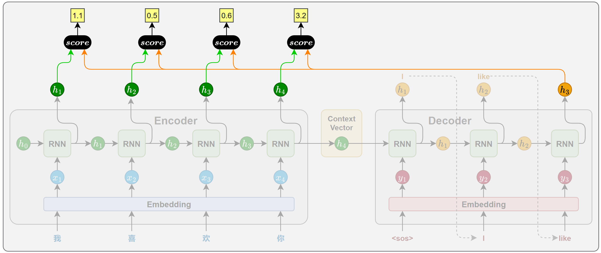

#### 注意力权重计算

得到所有源位置的注意力评分后，使用 Softmax 函数将其归一化为概率分布，作为注意力权重。得分越高的位置，其对应的权重越大，代表模型在当前生成中更关注该位置的信息。

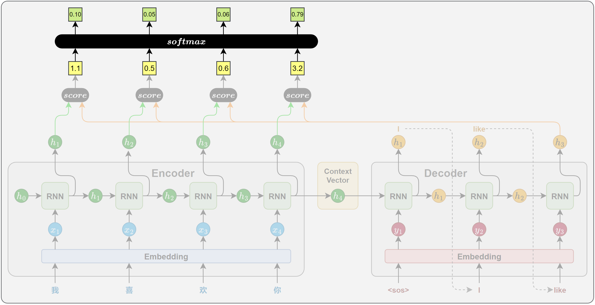

#### 上下文向量计算

将所有编码器输出按照注意力权重进行加权求和，得到一个上下文向量。这个向量就表示当前时间步，模型从源句中提取出的关键信息。

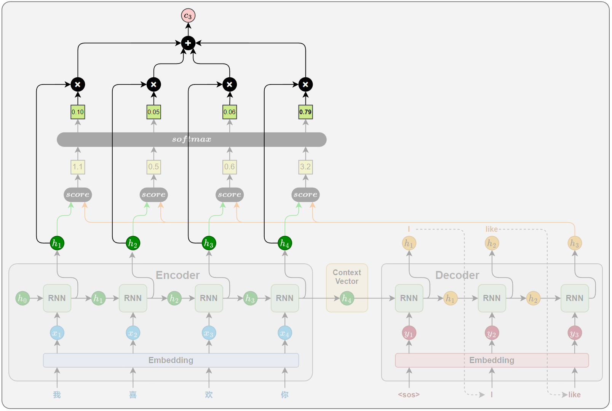

#### 解码信息融合

在得到上下文向量后，解码器将其与当前时间步的隐藏状态进行拼接，以融合两者信息，最终通过线性变换和 Softmax，生成当前时间步目标词的概率分布。


### 注意力评分函数

#### 概述

注意力评分函数有多种实现方式。本节将介绍三种常见的计算方法：点积评分（Dot）、通用点积评分（General）和拼接评分（Concat）。它们虽然在结构上各有差异，但本质上都是用于衡量解码器当前隐藏状态与编码器各时间步隐藏状态之间的相关性，并据此分配注意力权重。

#### 点积评分（Dot）

点积评分是注意力机制中最简单、最直接的一种相关性评分方法。它通过计算解码器当前时间步的隐藏状态与编码器每个时间步的隐藏状态的点积，来衡量二者之间的相关性：

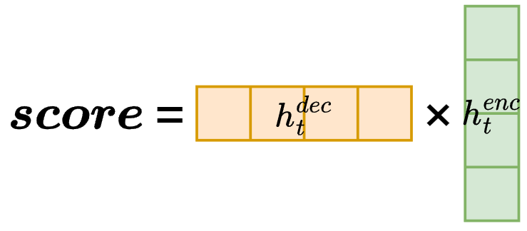

其含义可以理解为：如果两个向量方向越一致（即越接近），它们的点积就越大，表示相关性越强，模型应当给予更多注意力。

#### 通用点积评分（General）

通用点积评分在点积的基础上引入了一个可学习的权重矩阵W,用于先对编码器隐藏状态进行线性变换，再与解码器隐藏状态进行点积：

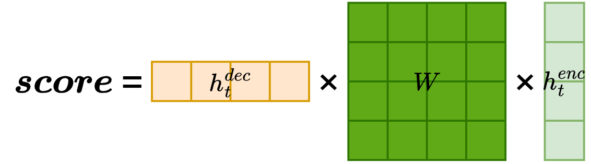

该方法的设计动机主要是为了解决编码器和解码器隐藏状态维度不一致的问题。通过引入权重矩阵W，不仅实现了维度对齐，也增强了模型对编码器输出的适应能力，从而提升了注意力机制的表达能力。

#### 拼接评分（Concat）

拼接评分是一种表达能力更强的相关性评分方法。它的核心思想是：将解码器当前隐藏状态与编码器每个时间步的隐藏状态拼接为一个长向量，经过线性变换和非线性激活，最后用一个向量进行投影，得到最终打分值：

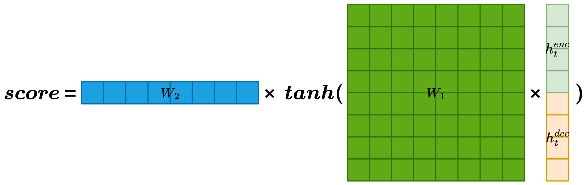

相比前两种方法，Concat 评分方式在建模能力上更强。它不仅考虑了两个状态的数值关系，还引入非线性变换，能够捕捉更复杂的交互模式，更适合处理对齐关系复杂的任务场景。

### 案例实操（中英翻译V2.0）

#### 需求说明

本案例要求在已有的 Seq2Seq 模型基础上，引入注意力机制，以提升模型在处理长句或复杂句时的表达能力和生成质量。

#### 需求分析

为引入Attention机制，模型结构做出如下改变：

- 编码器

编码器无需任何改变。

- 解码器

解码器在每个时间步，都需要将当前隐藏状态与编码器输出序列共同用于计算注意力权重（使用点积评分函数）；之后根据权重对编码器各位置进行加权求和，得到上下文向量；最后再将上下文向量与当前解码状态拼接，作为输出的最终依据。

#### 需求实现

###### 项目结构

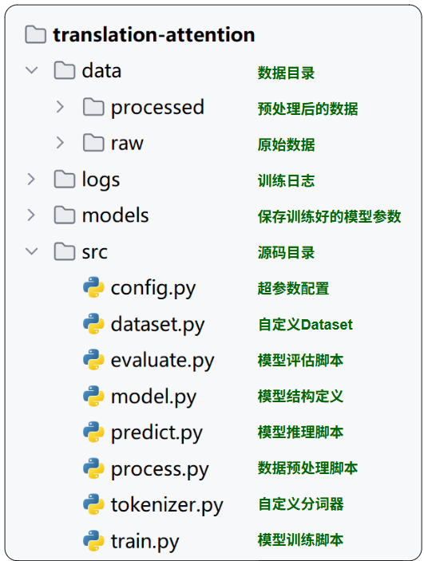

###### 完整代码

###### 数据预处理

```
# process.py

import pandas as pd
from sklearn.model_selection import train_test_split
from tokenizer import ChineseTokenizer, EnglishTokenizer
import config

def process():
    """
    数据预处理主函数。
    """
    print('开始处理数据')

    # 读取中英文对齐数据
    df = pd.read_csv(
        config.RAW_DATA_DIR / 'cmn.txt',
        sep='\t',
        header=None,
        usecols=[0, 1],
        names=['en', 'zh']
    )

    # 清理空值数据
    df = df.dropna()
    df = df[df['en'].str.strip().ne('') & df['zh'].str.strip().ne('')]

    # 划分训练集和测试集
    train_df, test_df = train_test_split(df, test_size=0.2, random_state=42)

    # 构建词表
    EnglishTokenizer.build_vocab(train_df['en'].tolist(), config.PROCESSED_DATA_DIR / 'en_vocab.txt')
    ChineseTokenizer.build_vocab(train_df['zh'].tolist(), config.PROCESSED_DATA_DIR / 'zh_vocab.txt')

    # 加载词表
    en_tokenizer = EnglishTokenizer.from_vocab(config.PROCESSED_DATA_DIR / 'en_vocab.txt')
    zh_tokenizer = ChineseTokenizer.from_vocab(config.PROCESSED_DATA_DIR / 'zh_vocab.txt')

    # 编码训练集
    train_df['en'] = train_df['en'].apply(
        lambda x: en_tokenizer.encode(x, seq_len=config.SEQ_LEN, add_sos_eos=True)
    )
    train_df['zh'] = train_df['zh'].apply(
        lambda x: zh_tokenizer.encode(x, seq_len=config.SEQ_LEN, add_sos_eos=False)
    )
    train_df.to_json(
        config.PROCESSED_DATA_DIR / 'indexed_train.jsonl',
        orient='records',
        lines=True
    )

    # 编码测试集
    test_df['en'] = test_df['en'].apply(
        lambda x: en_tokenizer.encode(x, seq_len=config.SEQ_LEN, add_sos_eos=True)
    )
    test_df['zh'] = test_df['zh'].apply(
        lambda x: zh_tokenizer.encode(x, seq_len=config.SEQ_LEN, add_sos_eos=False)
    )
    test_df.to_json(
        config.PROCESSED_DATA_DIR / 'indexed_test.jsonl',
        orient='records',
        lines=True
    )

    print('数据处理完成')

if __name__ == '__main__':
    process()
```

###### 自定义分词器

```
# tokenizer.py

from abc import abstractmethod
from nltk import word_tokenize, TreebankWordDetokenizer
from tqdm import tqdm

class BaseTokenizer:
    """
    分词器基类，提供词表构建、编码、解码等基础功能。
    """
    unk_token = '<unk>'
    pad_token = '<pad>'
    sos_token = '<sos>'
    eos_token = '<eos>'

    @staticmethod
    @abstractmethod
    def tokenize(sentence):
        """
        分词抽象方法。

        :param sentence: 输入句子。
        :return: 分词结果。
        """
        pass

    @abstractmethod
    def decode(self, indexes):
        """
        解码抽象方法。

        :param indexes: 索引列表。
        :return: 解码后的句子。
        """
        pass

    @classmethod
    def build_vocab(cls, sentences, vocab_file):
        """
        构建词表并保存。

        :param sentences: 句子列表。
        :param vocab_file: 保存词表文件路径。
        """
        unique_words = set()
        for sentence in tqdm(sentences, desc='分词'):
            for word in cls.tokenize(sentence):
                unique_words.add(word)

        vocab_list = [cls.pad_token, cls.unk_token, cls.sos_token, cls.eos_token] + list(unique_words)

        with open(vocab_file, 'w', encoding='utf-8') as f:
            for word in vocab_list:
                f.write(word + '\n')

    def __init__(self, vocab_list):
        """
        初始化分词器。

        :param vocab_list: 词表列表。
        """
        self.vocab_list = vocab_list
        self.vocab_size = len(vocab_list)
        self.word2index = {word: idx for idx, word in enumerate(vocab_list)}
        self.index2word = {idx: word for idx, word in enumerate(vocab_list)}
        self.unk_token_index = self.word2index[self.unk_token]
        self.pad_token_index = self.word2index[self.pad_token]
        self.sos_token_index = self.word2index[self.sos_token]
        self.eos_token_index = self.word2index[self.eos_token]

    @classmethod
    def from_vocab(cls, vocab_file):
        """
        加载词表文件。

        :param vocab_file: 文件路径。
        :return: 分词器实例。
        """
        with open(vocab_file, 'r', encoding='utf-8') as f:
            vocab_list = [line.strip() for line in f.readlines()]
        return cls(vocab_list)

    def encode(self, sentence, seq_len, add_sos_eos=False):
        """
        将句子编码为索引列表。

        :param sentence: 输入句子。
        :param seq_len: 最大序列长度。
        :param add_sos_eos: 是否添加 <sos> 和 <eos>。
        :return: 索引列表。
        """
        tokens = self.tokenize(sentence)
        indexes = [self.word2index.get(token, self.unk_token_index) for token in tokens]

        if add_sos_eos:
            indexes = indexes[:seq_len - 2]
            indexes = [self.sos_token_index] + indexes + [self.eos_token_index]
        else:
            indexes = indexes[:seq_len]

        if len(indexes) < seq_len:
            indexes += [self.pad_token_index] * (seq_len - len(indexes))

        return indexes

class ChineseTokenizer(BaseTokenizer):
    @staticmethod
    def tokenize(sentence):
        return list(sentence)

    def decode(self, indexes):
        return ''.join([self.index2word[index] for index in indexes])

class EnglishTokenizer(BaseTokenizer):
    @staticmethod
    def tokenize(sentence):
        return word_tokenize(sentence)

    def decode(self, indexes):
        tokens = [self.index2word[index] for index in indexes]
        return TreebankWordDetokenizer().detokenize(tokens)
```

###### 自定义数据集

```
# dataset.py

import pandas as pd
import torch
from torch.utils.data import Dataset, DataLoader
import config

class TranslationDataset(Dataset):
    def __init__(self, data_path):
        self.data = pd.read_json(data_path, lines=True).to_dict(orient='records')

    def __len__(self):
        return len(self.data)

    def __getitem__(self, index):
        input_tensor = torch.tensor(self.data[index]['zh'], dtype=torch.long)
        target_tensor = torch.tensor(self.data[index]['en'], dtype=torch.long)
        return input_tensor, target_tensor

def get_dataloader(train=True):
    data_path = config.PROCESSED_DATA_DIR / ('indexed_train.jsonl' if train else 'indexed_test.jsonl')
    dataset = TranslationDataset(data_path)
    return DataLoader(dataset, batch_size=config.BATCH_SIZE, shuffle=True)

if __name__ == '__main__':
    train_loader = get_dataloader(train=True)
    for inputs, targets in train_loader:
        print(inputs.shape)
        print(targets.shape)
        break
```

###### 模型定义

```
# model.py

import torch
from torch import nn
from torchinfo import summary

import config

class Attention(nn.Module):
    """
    注意力机制模块：计算当前 decoder 状态与 encoder 输出的注意力上下文向量。
    """

    def forward(self, decoder_hidden, encoder_outputs):
        """
        计算注意力权重并加权求和生成上下文向量。

        :param decoder_hidden: 当前时间步解码器的隐藏状态 (1, batch_size, decoder_hidden_dim)
        :param encoder_outputs: 编码器所有时间步输出 (batch_size, seq_len, decoder_hidden_dim)
        :return: 上下文向量 (batch_size, 1, decoder_hidden_dim)
        """
        # 计算注意力分数
        attention_scores = torch.bmm(
            decoder_hidden.transpose(0, 1),  # (batch_size, 1, hidden_dim)
            encoder_outputs.transpose(1, 2)  # (batch_size, hidden_dim, seq_len)
        )
        attention_weights = torch.softmax(attention_scores, dim=2)  # (batch_size, 1, seq_len)

        # 加权求和，得到上下文向量
        context_vector = torch.bmm(attention_weights, encoder_outputs)  # (batch_size, 1, hidden_dim)

        return context_vector

class TranslationEncoder(nn.Module):
    """
    编码器模块：双向 GRU 编码中文句子。
    """

    def __init__(self, vocab_size, padding_index):
        """
        初始化编码器。

        :param vocab_size: 中文词表大小。
        :param padding_index: padding 索引。
        """
        super().__init__()
        self.embedding = nn.Embedding(
            num_embeddings=vocab_size,
            embedding_dim=config.EMBEDDING_DIM,
            padding_idx=padding_index
        )
        self.rnn = nn.GRU(
            input_size=config.EMBEDDING_DIM,
            hidden_size=config.ENCODER_HIDDEN_DIM,
            num_layers=config.ENCODER_LAYERS,
            batch_first=True,
            bidirectional=True
        )

    def forward(self, src):
        """
        前向传播。

        :param src: 中文输入索引序列 (batch_size, seq_len)
        :return: (encoder_outputs, encoder_hidden)
        """
        embedded = self.embedding(src)  # (batch_size, seq_len, embedding_dim)
        output, hidden = self.rnn(embedded)
        return output, hidden

class TranslationDecoder(nn.Module):
    """
    解码器模块：单向 GRU + Attention，逐步生成英文翻译。
    """

    def __init__(self, vocab_size, padding_index):
        """
        初始化解码器。

        :param vocab_size: 英文词表大小。
        :param padding_index: padding 索引。
        """
        super().__init__()
        self.embedding = nn.Embedding(
            num_embeddings=vocab_size,
            embedding_dim=config.EMBEDDING_DIM,
            padding_idx=padding_index
        )
        self.rnn = nn.GRU(
            input_size=config.EMBEDDING_DIM,
            hidden_size=config.DECODER_HIDDEN_DIM,
            batch_first=True
        )
        # 输出维度是 hidden + context 拼接
        self.linear = nn.Linear(in_features=2 * config.DECODER_HIDDEN_DIM, out_features=vocab_size)
        self.attention = Attention()

    def forward(self, tgt, hidden, encoder_outputs):
        """
        前向传播。

        :param tgt: 当前输入 token，形状 (batch_size, 1)
        :param hidden: 上一时间步隐藏状态 (1, batch_size, hidden_dim)
        :param encoder_outputs: 编码器所有输出 (batch_size, seq_len, hidden_dim)
        :return: (output_logits, new_hidden)
        """
        embedded = self.embedding(tgt)  # (batch_size, 1, embedding_dim)
        output, hidden = self.rnn(embedded, hidden)  # output: (batch_size, 1, hidden_dim)

        context_vector = self.attention(hidden, encoder_outputs)  # (batch_size, 1, hidden_dim)

        combined = torch.cat((output, context_vector), dim=2)  # 拼接当前输出和上下文向量
        output = self.linear(combined)  # 输出词表上概率 (batch_size, 1, vocab_size)

        return output, hidden

if __name__ == '__main__':
    encoder = TranslationEncoder(vocab_size=10000, padding_index=0)
    dummy_encoder_input = torch.randint(low=0, high=10000, size=(config.BATCH_SIZE, config.SEQ_LEN))
    summary(encoder, input_data=dummy_encoder_input)

    print('-' * 100)

    decoder = TranslationDecoder(vocab_size=10000, padding_index=0)
    dummy_decoder_input = torch.randint(low=0, high=10000, size=(config.BATCH_SIZE, 1))
    dummy_decoder_hidden = torch.randn(size=(1, config.BATCH_SIZE, config.DECODER_HIDDEN_DIM))
    dummy_encoder_outputs = torch.randn(size=(config.BATCH_SIZE, config.SEQ_LEN, config.DECODER_HIDDEN_DIM))
    summary(decoder, input_data=[dummy_decoder_input, dummy_decoder_hidden, dummy_encoder_outputs])
```

###### 模型训练

```
# train.py

import time
from itertools import chain

import torch
from torch.nn import CrossEntropyLoss
from torch.utils.tensorboard import SummaryWriter
from tqdm import tqdm

from dataset import get_dataloader
from tokenizer import ChineseTokenizer, EnglishTokenizer
import config
from model import TranslationEncoder, TranslationDecoder

def train_one_epoch(dataloader, encoder, decoder, loss_function, optimizer, device):
    encoder.train()
    decoder.train()
    total_loss = 0
    for src, tgt in tqdm(dataloader, desc='训练'):
        src = src.to(device)  # src.shape: (batch_size , seq_len)
        tgt = tgt.to(device)  # tgt.shape: (batch_size , seq_len)

        optimizer.zero_grad()

        # 编码器
        encoder_outputs, encoder_hidden = encoder(src)
        # 上下文向量
        forward_hidden = encoder_hidden[-2]  # forward_hidden.shape: (batch_size , encoder_hidden_size)
        backward_hidden = encoder_hidden[-1]  # backward_hidden.shape: (batch_size , encoder_hidden_size)
        context_vector = torch.cat([forward_hidden, backward_hidden],
                                   dim=1)  # context_vector.shape: ( batch_size , decoder_hidden_size)

        # 解码器
        decoder_input = tgt[:, 0:1]  # decoder_input.shape: (batch_size,1)

        decoder_hidden = context_vector.unsqueeze(0)  # decoder_hidden.shape: (1, batch_size, decoder_hidden_size)

        decoder_outputs = []
        for step in range(1, config.SEQ_LEN):
            decoder_output, decoder_hidden = decoder(decoder_input, decoder_hidden, encoder_outputs)
            decoder_outputs.append(decoder_output)
            decoder_input = tgt[:, step:step + 1]

        decoder_outputs = torch.cat(decoder_outputs, dim=1)
        # decoder_outputs.shape: (batch_size, seq_len-1, vocab_size)

        decoder_targets = tgt[:, 1:]
        # decoder_targets.shape: (batch_size, seq_len-1)

        loss = loss_function(decoder_outputs.reshape(-1, decoder_outputs.shape[-1]), decoder_targets.reshape(-1))
        loss.backward()
        optimizer.step()
        total_loss += loss.item()
    return total_loss / len(dataloader)

def train():
    # 设备
    device = torch.device('cuda' if torch.cuda.is_available() else 'cpu')

    # 数据集
    dataloader = get_dataloader()

    # tokenizer
    zh_tokenizer = ChineseTokenizer.from_vocab(config.PROCESSED_DATA_DIR / 'zh_vocab.txt')
    en_tokenizer = EnglishTokenizer.from_vocab(config.PROCESSED_DATA_DIR / 'en_vocab.txt')

    # 模型
    encoder = TranslationEncoder(vocab_size=zh_tokenizer.vocab_size, padding_index=zh_tokenizer.pad_token_index).to(
        device)
    decoder = TranslationDecoder(vocab_size=en_tokenizer.vocab_size, padding_index=en_tokenizer.pad_token_index).to(
        device)

    # 损失函数
    loss_function = CrossEntropyLoss(ignore_index=en_tokenizer.pad_token_index)

    # 优化器
    optimizer = torch.optim.Adam(params=chain(encoder.parameters(), decoder.parameters()), lr=config.LEARNING_RATE)

    # tensorboard
    writer = SummaryWriter(log_dir=config.LOGS_DIR / time.strftime('%Y-%m-%d_%H-%M-%S'))

    # 开始训练
    best_loss = float('inf')
    for epoch in range(1, config.EPOCHS + 1):
        print(f'========== Epoch {epoch} ==========')
        avg_loss = train_one_epoch(dataloader, encoder, decoder, loss_function, optimizer, device)

        print(f'平均损失: {avg_loss}')
        writer.add_scalar('Loss', avg_loss, epoch)

        if avg_loss < best_loss:
            best_loss = avg_loss
            torch.save(encoder.state_dict(), config.MODELS_DIR / 'encoder.pt')
            torch.save(decoder.state_dict(), config.MODELS_DIR / 'decoder.pt')
            print('已保存模型')
        else:
            print('未保存模型')

if __name__ == '__main__':
    train()
```

###### 模型预测

```
# predict.py

import torch
from tokenizer import ChineseTokenizer, EnglishTokenizer
from model import TranslationEncoder, TranslationDecoder
import config

def predict_batch(input_tensor, encoder, decoder, en_tokenizer, device):
    """
    对一个 batch 的中文输入进行翻译。

    :param input_tensor: 中文输入张量 (batch_size, seq_len)
    :param encoder: 编码器
    :param decoder: 解码器
    :param en_tokenizer: 英文分词器
    :param device: 设备
    :return: 生成的英文索引列表
    """
    encoder.eval()
    decoder.eval()

    with torch.no_grad():
        # 编码器前向传播
        encoder_output, encoder_hidden = encoder(input_tensor)

        # 拼接双向 GRU 最后一层隐藏状态作为上下文向量
        context_vector = torch.cat([encoder_hidden[-2], encoder_hidden[-1]], dim=1)  # (batch_size, hidden_dim*2)

        batch_size = input_tensor.size(0)
        decoder_input = torch.full(
            size=(batch_size, 1),
            fill_value=en_tokenizer.sos_token_index,
            device=device
        )  # 初始输入 <sos>
        decoder_hidden = context_vector.unsqueeze(0)  # 初始化解码器隐藏状态 (1, batch_size, hidden_dim)

        generated = [[] for _ in range(batch_size)]
        finished = [False for _ in range(batch_size)]

        for step in range(1, config.SEQ_LEN):
            decoder_output, decoder_hidden = decoder(decoder_input, decoder_hidden, encoder_output)

            predict_indexes = decoder_output.argmax(dim=-1)  # (batch_size, 1)

            for i in range(batch_size):
                if finished[i]:
                    continue
                token_id = predict_indexes[i].item()
                if token_id == en_tokenizer.eos_token_index:
                    finished[i] = True
                else:
                    generated[i].append(token_id)

            if all(finished):
                break

            decoder_input = predict_indexes

        return generated

def predict(zh_sentence, encoder, decoder, zh_tokenizer, en_tokenizer, device):
    """
    对单条中文句子进行翻译。

    :param zh_sentence: 中文句子
    :param encoder: 编码器
    :param decoder: 解码器
    :param zh_tokenizer: 中文分词器
    :param en_tokenizer: 英文分词器
    :param device: 设备
    :return: 英文翻译句子
    """
    input_ids = zh_tokenizer.encode(zh_sentence, seq_len=config.SEQ_LEN, add_sos_eos=False)
    input_tensor = torch.tensor([input_ids], device=device)
    generated = predict_batch(input_tensor, encoder, decoder, en_tokenizer, device)
    en_indexes = generated[0]
    en_sentence = en_tokenizer.decode(en_indexes)
    return en_sentence

def run_predict():
    """
    启动交互式翻译程序。
    """
    device = torch.device('cuda' if torch.cuda.is_available() else 'cpu')

    zh_tokenizer = ChineseTokenizer.from_vocab(config.PROCESSED_DATA_DIR / 'zh_vocab.txt')
    en_tokenizer = EnglishTokenizer.from_vocab(config.PROCESSED_DATA_DIR / 'en_vocab.txt')

    encoder = TranslationEncoder(
        vocab_size=zh_tokenizer.vocab_size,
        padding_index=zh_tokenizer.pad_token_index
    ).to(device)
    encoder.load_state_dict(torch.load(config.MODELS_DIR / 'encoder.pt'))

    decoder = TranslationDecoder(
        vocab_size=en_tokenizer.vocab_size,
        padding_index=en_tokenizer.pad_token_index
    ).to(device)
    decoder.load_state_dict(torch.load(config.MODELS_DIR / 'decoder.pt'))

    print('欢迎使用翻译系统，请输入中文句子：（输入 q 或 quit 退出）')
    while True:
        user_input = input('中文：')
        if user_input in ['q', 'quit']:
            print('谢谢使用，再见！')
            break
        if not user_input:
            print('请输入内容')
            continue

        result = predict(user_input, encoder, decoder, zh_tokenizer, en_tokenizer, device)
        print(f'英文：{result}')

if __name__ == '__main__':
    run_predict()
```

###### 模型评估

```
# evaluate.py

import torch
from nltk.translate.bleu_score import corpus_bleu
from tqdm import tqdm

import config
from tokenizer import ChineseTokenizer, EnglishTokenizer
from model import TranslationEncoder, TranslationDecoder
from dataset import get_dataloader
from predict import predict_batch

def evaluate(dataloader, encoder, decoder, zh_tokenizer, en_tokenizer, device):
    """
    执行模型评估，计算 BLEU 分数。

    :param dataloader: 数据加载器。
    :param encoder: 编码器。
    :param decoder: 解码器。
    :param zh_tokenizer: 中文分词器。
    :param en_tokenizer: 英文分词器。
    :param device: 设备。
    :return: BLEU 分数。
    """
    all_references = []
    all_predictions = []
    special_tokens = [
        zh_tokenizer.pad_token_index,
        zh_tokenizer.eos_token_index,
        zh_tokenizer.sos_token_index
    ]

    for src, tgt in tqdm(dataloader, desc="评估"):
        src = src.to(device)
        tgt = tgt.tolist()

        predict_indexes = predict_batch(src, encoder, decoder, en_tokenizer, device)
        all_predictions.extend(predict_indexes)

        for indexes in tgt:
            indexes = [index for index in indexes if index not in special_tokens]
            all_references.append([indexes])

    bleu = corpus_bleu(all_references, all_predictions)
    return bleu

def run_evaluate():
    """
    启动评估流程。
    """
    device = torch.device('cuda' if torch.cuda.is_available() else 'cpu')

    zh_tokenizer = ChineseTokenizer.from_vocab(config.PROCESSED_DATA_DIR / 'zh_vocab.txt')
    en_tokenizer = EnglishTokenizer.from_vocab(config.PROCESSED_DATA_DIR / 'en_vocab.txt')

    encoder = TranslationEncoder(zh_tokenizer.vocab_size, zh_tokenizer.pad_token_index).to(device)
    encoder.load_state_dict(torch.load(config.MODELS_DIR / 'encoder.pt'))

    decoder = TranslationDecoder(en_tokenizer.vocab_size, en_tokenizer.pad_token_index).to(device)
    decoder.load_state_dict(torch.load(config.MODELS_DIR / 'decoder.pt'))

    dataloader = get_dataloader(train=False)

    bleu = evaluate(dataloader, encoder, decoder, zh_tokenizer, en_tokenizer, device)
    print('========== 评估结果 ==========')
    print(f'BLEU: {bleu:.2f}')
    print('=============================')

if __name__ == '__main__':
    run_evaluate()
```

###### 配置文件

```
# config.py

from pathlib import Path

# 获取项目根目录
BASE_DIR = Path(__file__).parent.parent

# 定义项目中常用路径
MODELS_DIR = BASE_DIR / 'models'  # 模型保存路径
PROCESSED_DATA_DIR = BASE_DIR / 'data' / 'processed'  # 处理后的数据保存路径
RAW_DATA_DIR = BASE_DIR / 'data' / 'raw'  # 原始数据保存路径
LOGS_DIR = BASE_DIR / 'logs'  # TensorBoard 日志目录

# 模型结构参数
EMBEDDING_DIM = 128  # 词向量维度
ENCODER_HIDDEN_DIM = 512  # GRU 隐藏状态维度
DECODER_HIDDEN_DIM = 2 * ENCODER_HIDDEN_DIM
ENCODER_LAYERS = 1

# 训练相关超参数
BATCH_SIZE = 128  # 每个 batch 的样本数
SEQ_LEN = 30  # 序列长度（输入与输出最大长度）
LEARNING_RATE = 1e-3  # 学习率
EPOCHS = 30  # 总训练轮数
```

### 存在问题

尽管注意力机制极大地增强了 Seq2Seq 模型的建模能力，但由于其核心依然依赖于 RNN 结构，仍面临两个根本性问题：

- 计算过程无法并行

RNN 的时间步之间存在强依赖，必须顺序执行，限制了训练效率和硬件资源的利用率。

- 长期依赖问题仍未根除

模型需要跨多个时间步传递信息，对于超长序列，训练过程中容易出现梯度消失，难以有效建模长距离依赖关系。

## Transformer模型

### 概述

此前的Seq2Seq模型通过注意力机制取得了一定提升，但由于整体结构仍依赖 RNN，依然存在计算效率低、难以建模长距离依赖等结构性限制。

为了解决这些问题，Google在2017 年发表一篇论文《Attention Is All You Need》，提出了一种全新的模型架构——Transformer。该模型完全摒弃了 RNN 结构，转而使用注意力机制直接建模序列中各位置之间的关系。通过这种方式，Transformer不仅显著提升了训练效率，也增强了模型对长距离依赖的建模能力。


Transformer 的提出对自然语言处理产生了深远影响。在机器翻译任务中，它首次超越了 RNN 模型的表现，并成为后续各类预训练语言模型的基础框架，如 BERT、GPT 等。这些模型推动 NLP 进入了“预训练 + 微调”的新时代，极大地提升了模型在多种任务上的通用性与性能。如今，Transformer 架构不仅广泛应用于 NLP，还扩展至语音识别、图像处理、代码生成等多个领域，成为现代深度学习中最具代表性的通用模型之一。

### 模型结构详解

#### 核心思想

在 Seq2Seq 模型中，注意力机制的引入显著增强了模型的表达能力。它允许解码器在生成每一个目标词时，根据当前解码状态动态选择源序列中最相关的位置，并据此融合信息。这一机制有效缓解了将整句信息压缩为固定向量所带来的信息瓶颈，显著提升了翻译等任务中的建模效果。

进一步分析可以发现，注意力机制不仅是信息提取的工具，其本质是在每一个目标位置上，显式建模该位置与源序列中各位置之间的依赖关系。

与此同时，循环神经网络（RNN）作为 Seq2Seq 模型的核心结构，其作用也在于建模序列中的依赖关系。通过隐藏状态的递归传递，RNN 使当前位置的表示能够整合前文信息，从而隐式捕捉上下文依赖。从功能角度看，RNN 与注意力机制完成的是同一类任务：建立序列中不同位置之间的依赖联系。

既然注意力机制也具备建模依赖关系的能力，那么理论上，它就可以在功能上替代 RNN。

此外，相比 RNN，注意力机制在结构上具备明显优势：无需顺序计算，便于并行处理；任意位置间可直接建立联系，更适合捕捉长距离依赖。因此，它不仅具备替代的可能，也在效率与效果上表现更优。

既然如此，是否可以将 Seq2Seq 中的 RNN 结构全部替换为注意力机制呢？


Transformer 模型正是在这一思路下诞生的。它摒弃了传统的循环结构，仅依靠注意力机制完成输入序列和输出序列中所有位置之间的依赖建模任务。这一结构上的彻底变革，也正是论文标题 Attention is All You Need 所体现的核心理念。

#### 整体结构

Transformer 的整体结构延续了 Seq2Seq 模型中 “编码器-解码器” 的设计理念，其中，编码器（Encoder）负责对输入序列进行理解和表示，而解码器（Decoder）则根据编码器的输出逐步生成目标序列。

与基于 RNN 的 Seq2Seq 模型一样，Transformer 的解码器采用自回归方式生成目标序列。不同之处在于，每一步的输入是此前已生成的全部词，模型会输出一个与输入长度相同的序列，但我们只取最后一个位置的结果作为当前预测。这个过程不断重复，直到生成结束标记 &lt;eos&gt;。

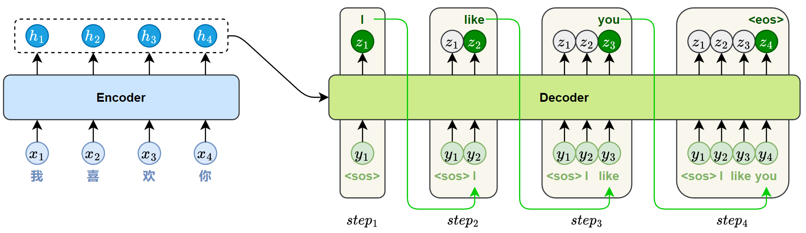

此外，Transformer 的编码器和解码器模块分别由多个结构相同的层堆叠而成。通过层层堆叠，模型能够逐步提取更深层次的语义特征，从而增强对复杂语言现象的建模能力。标准的 Transformer 模型通常包含 6个编码器层和 6 个解码器层。

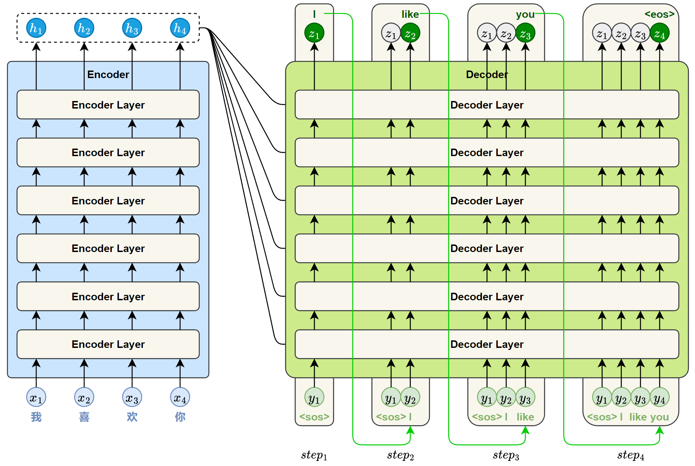

#### 编码器

##### 概述

Transformer 的编码器用于理解输入序列的语义信息，并生成每个token的上下文表示，为解码器生成目标序列提供基础。

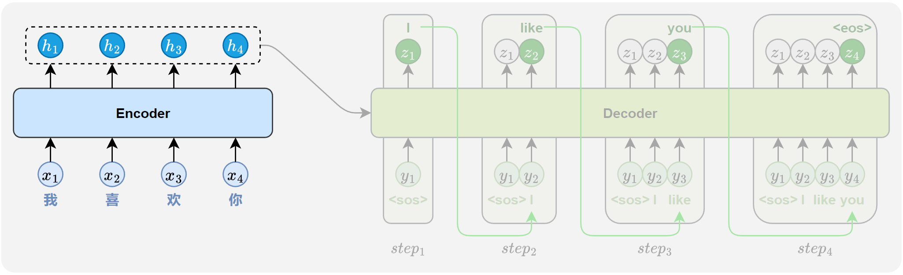

编码器由多个结构相同的编码器层（Encoder Layer）堆叠而成。


每个 Encoder Layer的主要任务都是对其输入序列进行上下文建模，使每个位置的表示都能融合来自整个序列的全局信息。每个 Encoder Layer都包含两个子层（sublayer），分别是自注意力子层（Self-Attention Sublayer）和前馈神经网络子层（Feed-Forward Sublayer）。

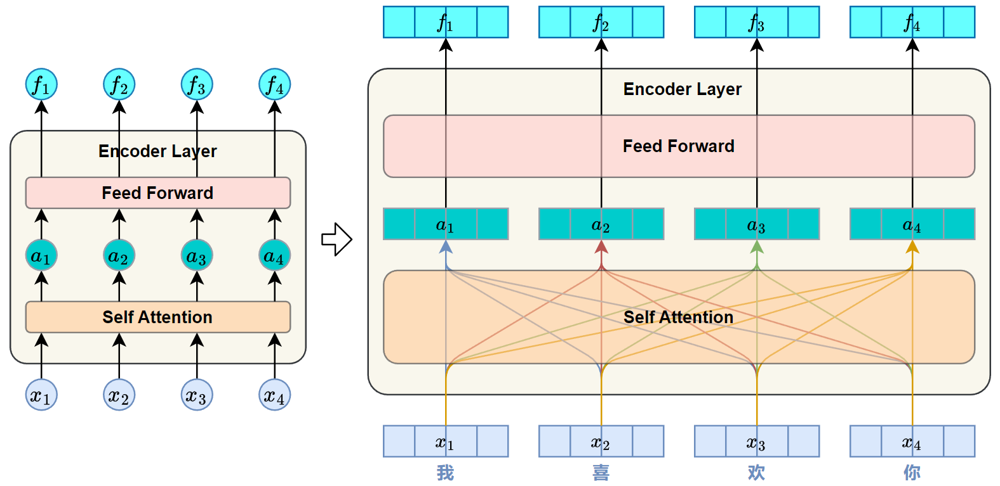

各层作用如下：

- Self-Attention

用于捕捉序列中各位置之间的依赖关系。

- Feed-Forward

用于对每个位置的表示进行非线性变换，从而提升模型的表达能力。

##### 自注意力层

自注意力机制（Self-Attention）是 Transformer 编码器的核心结构之一，它的作用是在序列内部建立各位置之间的依赖关系，使模型能够为每个位置生成融合全局信息的表示。


之所以被称为“自”注意力，是因为模型在计算每个位置的表示时，所参考的信息全部来自同一个输入序列本身，而不是来自另一个序列。

###### 自注意力计算过程

自注意力的完整计算过程如下：

###### 生成Query、Key、Value向量

自注意力机制的第一步，是将输入序列中的每个位置表示映射为三个不同的向量，分别是 查询（Query）、键（Key） 和 值（Value）。

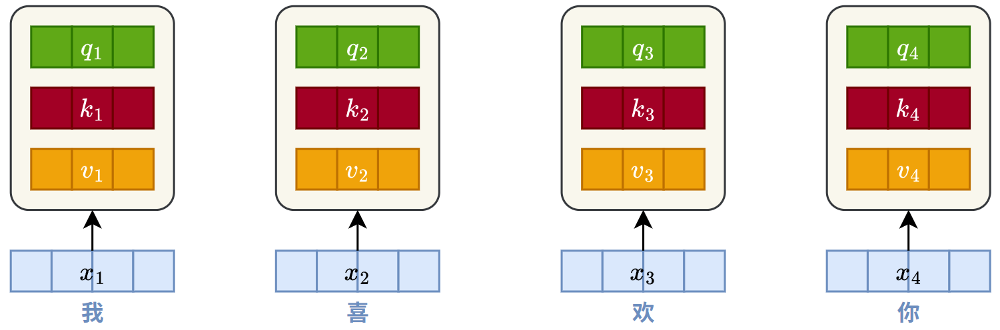

这些向量的作用如下：

Query：表示当前词的用于发起注意力匹配的向量；

Key：表示序列中每个位置的内容标识，用于与 Query 进行匹配；

Value：表示该位置携带的信息，用于加权汇总得到新的表示。

自注意力的核心思想是：每个位置用自身的 Query 向量，与整个序列中所有位置的 Key 向量进行相关性计算，从而得到注意力权重，并据此对对应的 Value 向量加权汇总，形成新的表示。

三个向量的计算公式如下：

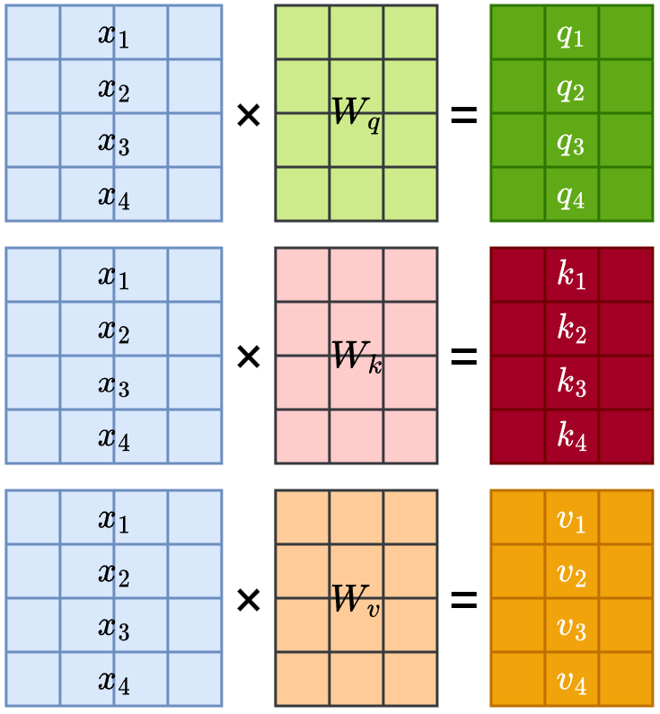

其中均为可学习的参数矩阵。

###### 计算位置间相关性

完成 Query、Key、Value 向量的生成后，模型会使用每个位置的 Query 向量与所有位置的 Key 向量进行相关性评分。

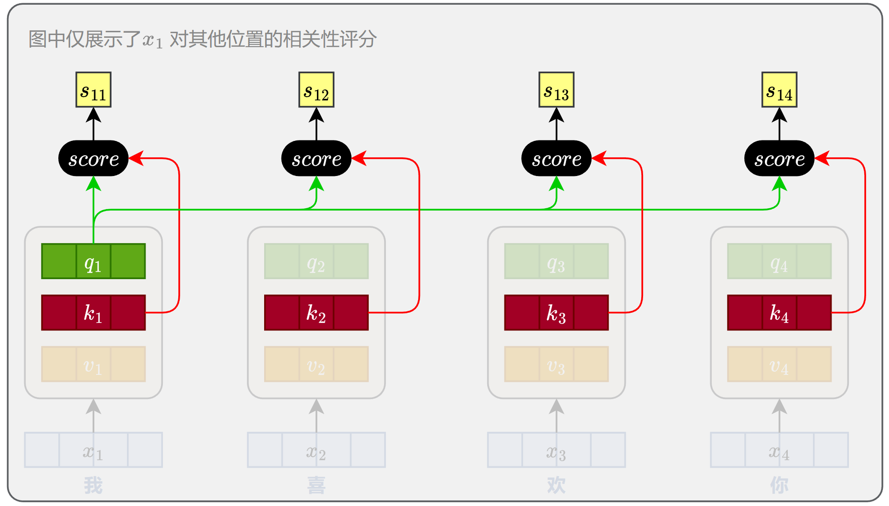

评分函数采用向量点积形式。由于在高维空间中，点积的数值可能过大，会影响 softmax 的稳定性，因此在实际计算中对结果进行了缩放。最终的评分函数为：

其中是key向量的维度，用于缩放点积的幅度。这个分数越大，表示第 i 个位置越应该关注第 j 个位置的信息。

对于整个序列，可以通过矩阵运算一次性计算所有位置之间的评分，计算公式如下图所示：

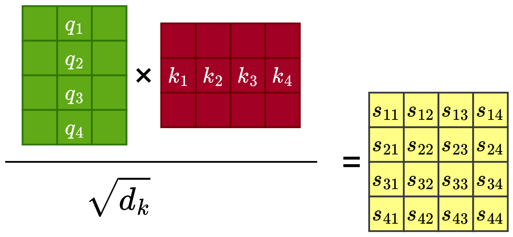

###### 计算注意力权重

在得到每个位置与所有位置之间的相关性评分后，模型会使用 softmax 函数进行归一化，确保每个位置对所有位置的关注程度之和为 1，从而形成一个有效的加权分布。

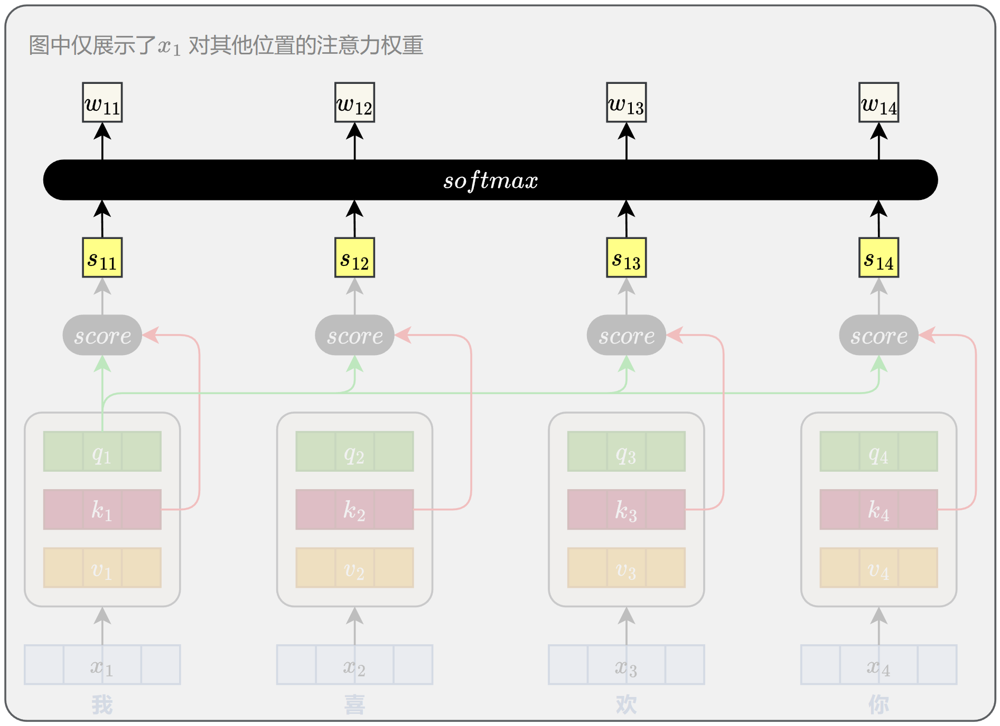

对于整个序列，模型要做的是对之前得到的注意力评分矩阵的每一行进行softmax归一化。

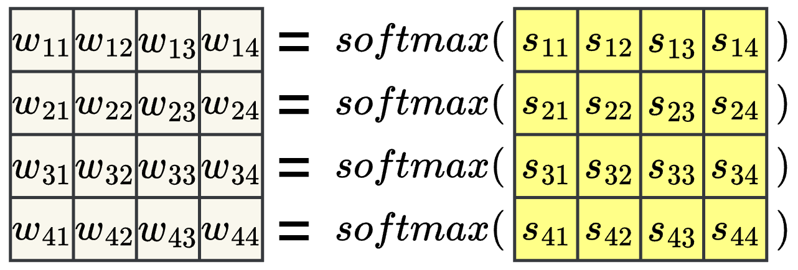

###### 加权汇总生成输出

最后，模型会根据注意力权重对所有位置的 Value 向量进行加权求和，得到每个位置融合全局信息后的新表示。


对于整个序列，同样可以通过矩阵运算一次性计算所有位置的输出，如下图所示

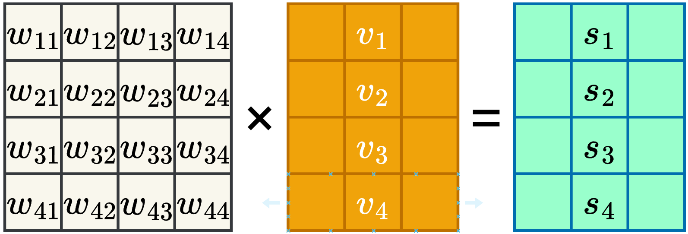

综上所述，可得整个自注意力机制的完整的计算公式如下

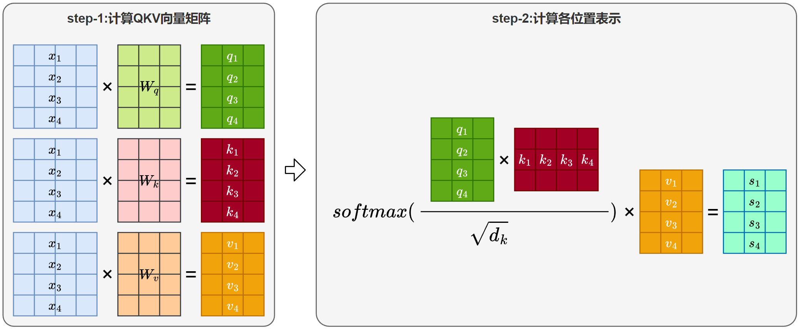

对应原始论文中的：

###### 多头自注意力计算过程

自注意力机制通过 Query、Key 和 Value 向量计算每个位置与其他位置之间的依赖关系，使模型能够有效捕捉序列中的全局信息。

然而，自然语言本身具有高度的语义复杂性，一个句子往往同时包含多种类型的语义关系。例如，句子“那只动物没有过马路，因为它太累了”中就涉及多个层面的语言关系：

- “它”指代“那只动物”，属于跨句的代指关系；

- “因为”连接前后两个分句，体现语义上的因果逻辑；

- “过马路”构成动词短语，属于固定的动宾结构。

要准确理解这类句子，模型需要同时识别并建模多种层次和类型的依赖关系。但这些信息很难通过单一视角或一套注意力机制完整捕捉。

为此，Transformer 引入了多头注意力机制（Multi-Head Attention）。其核心思想是通过多组独立的 Query、Key、Value 投影，让不同注意力头分别专注于不同的语义关系，最后将各头的输出拼接融合。

多头注意力的计算过程如下：

###### 分别计算各头注意力

每个 Self-Attention Head 独立计算一套注意力输出。

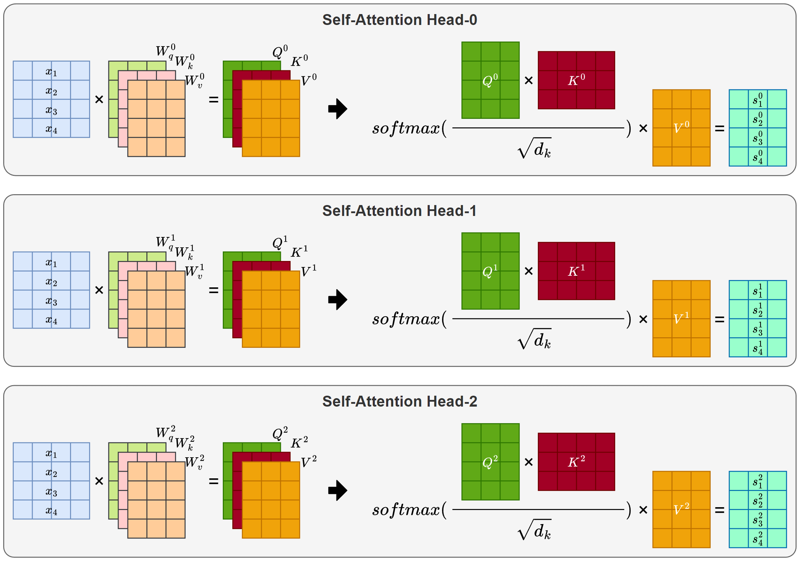

###### 合并多头注意力

多个输出矩阵按维度拼接，再乘以得到最终多头注意力的输出。

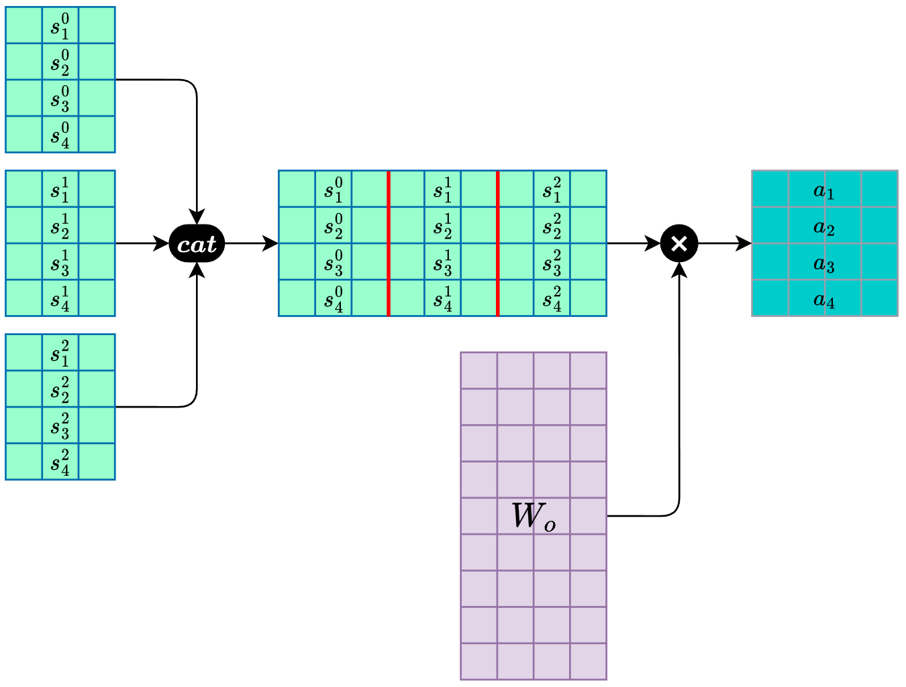

##### 前馈神经网络层

前馈神经网络（Feed-Forward Network，简称 FFN）是 Transformer 编码器中每个子层的重要组成部分，紧接在多头注意力子层之后。它通过对每个位置的表示进行逐位置、非线性的特征变换，进一步提升模型对复杂语义的建模能力。

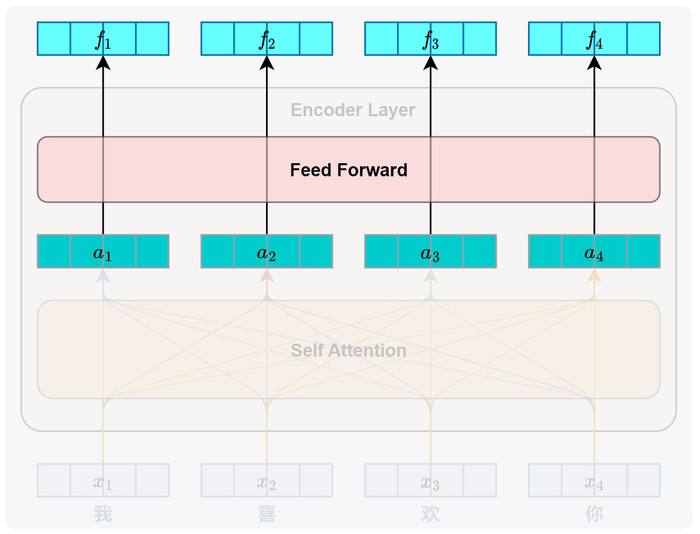

一个标准的 FFN 子层包含两个线性变换和一个非线性激活函数，中间通常使用 ReLU激活。其计算公式如下：

计算图如下：


##### 残差连接与层归一化

在 Transformer 的每个编码器层中，每个子层，包括自注意力子层和前馈神经网络子层，其输出都要经过残差连接（Residual Connection）和层归一化（Layer Normalization）处理。这两者是深层神经网络中常用的结构，用于缓解模型训练中的梯度消失、收敛困难等问题，对于Transformer能够堆叠多层至关重要。


###### 残差连接

残差连接（Residual Connection，也称“跳跃连接”或“捷径连接”）最初在计算机视觉领域被提出，用于缓解深层神经网络中的梯度消失问题。其核心思想是：

将子层的输入直接与其输出相加，形成一条跨越子层的“捷径”，其数学形式为：

具体计算过程如图所示：

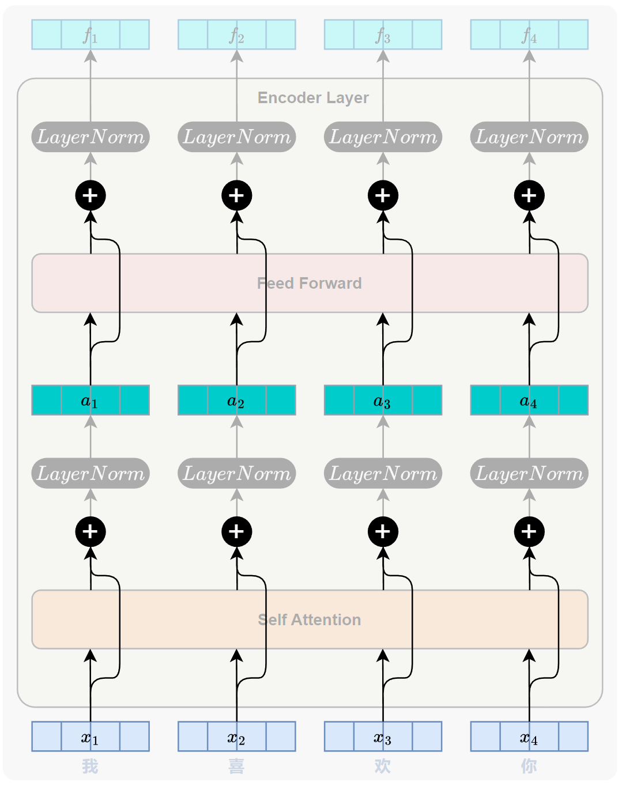

残差连接确保反向传播时，梯度至少有一条稳定通路可回传，是深层网络可稳定训练的关键结构。

###### 层归一化

每个子层在残差连接之后都会进行层归一化（Layer Normalization，简称 LayerNorm）。它的主要作用是规范输入序列中每个token的特征分布（某个token的表示可能在不同维度上有较大数值差异），提升模型训练的稳定性。

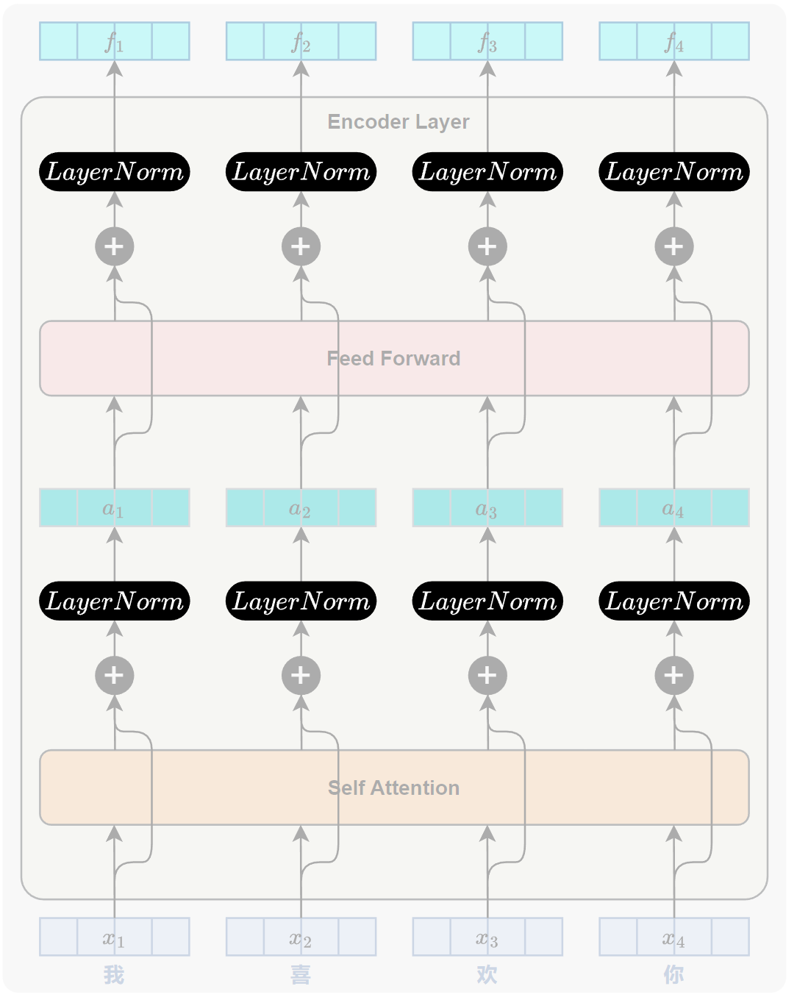

该操作会将每个token的向量调整为均值为 0、方差为 1 的规范分布，具体效果如下图所示：

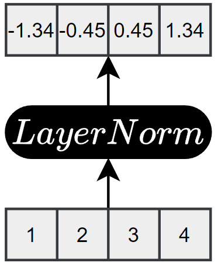

具体的计算公式如下：

假如某个token的特征向量为，

###### 均值计算：

计算该向量在所有特征维度上的平均值

其中为特征维度（向量长度）。

###### 标准差计算

计算向量各维度的标准差

###### 标准化变换

将每个特征值转换为均值为 0、方差为 1 的标准正态分布；

为一个小的常数，防止出现除以0的情况。

###### 缩放和平移

让模型可以学习在归一化后的基础上进行适当的调整，保证归一化不会限制模型的表示能力。

和为可学习参数。

##### 位置编码

Transformer 模型完全摒弃了 RNN 结构，意味着它不再按顺序处理序列，而是可以并行处理所有位置的信息。尽管这带来了显著的计算效率提升，却也引发了一个问题：Transformer 无法像 RNN 那样天然地捕捉词语之间的顺序关系。换句话说，在没有额外机制的情况下，Transformer 无法区分“猫吃鱼”和“鱼吃猫”这类语序不同但词汇相同的句子。

为了解决这一问题，Transformer 引入了一个关键机制——位置编码（Positional Encoding）。该机制为每个词引入一个表示其位置信息的向量，并将其与对应的词向量相加，作为模型输入的一部分。这样一来，模型在处理每个词时，既能获取词义信息，也能感知其在句子中的位置，从而具备对基本语序的理解能力。

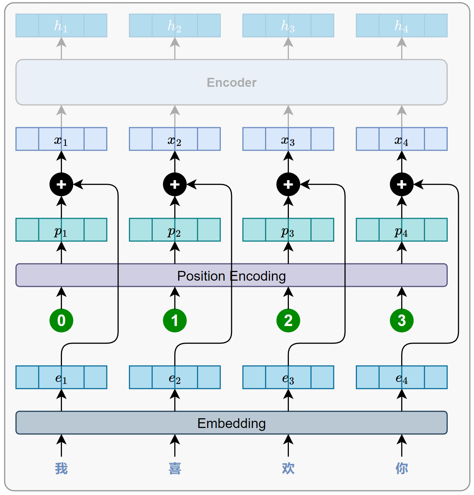

位置编码最直接的方式是使用绝对位置编号来表示每个词的位置，例如第一个词用 0，第二个词用 1，依此类推：

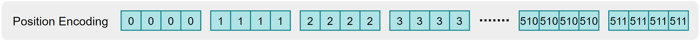

这样做虽然简单，但有一个明显的问题，越靠后的 token 位置编码就越大，若直接与词向量相加，会造成数值倾斜，让模型更关注位置，而忽视词义。

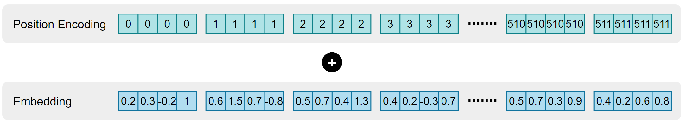

为缓解这一问题，可以考虑将位置编号归一化为[0, 1]区间，例如用表示位置，其中 T是句子长度。

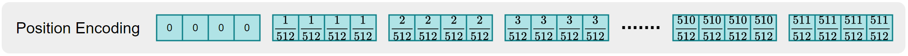

这种方式虽然使数值范围更平稳，但也引入了一个严重的问题：

相同位置的词在不同长度句子中的位置编码不再一致。

例如，位置 5 在长度为 10 的句子中被编码为，在长度为 1000 的句子中则为。这种依赖输入长度的表示方式会导致模型难以形成稳定的位置感知能力。理想的做法是：每个位置都拥有一个唯一且一致的编码，与句子长度无关。

为了解决上述问题，Transformer 使用了一种基于正弦（sin）和余弦（cos）函数的位置编码方式，具体定义如下：

其中：

- pos是当前词在序列中的位置；

- i用于表示位置编码向量的维度索引，2i表示偶数维，2i+1表示奇数维；

- 是词向量的维度大小。

序列中的每个位置 pos 对应一个长度为的位置编码向量。该向量的偶数维度通过正弦函数生成，奇数维度通过余弦函数生成，如下图所示

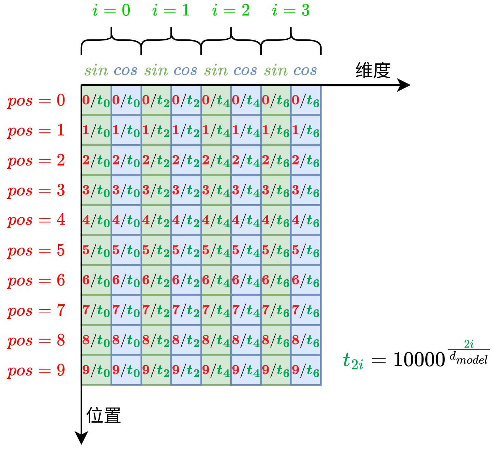

为帮助更直观地理解正余弦位置编码的构造和变化规律，可以使用以下可视化工具进行交互体验：

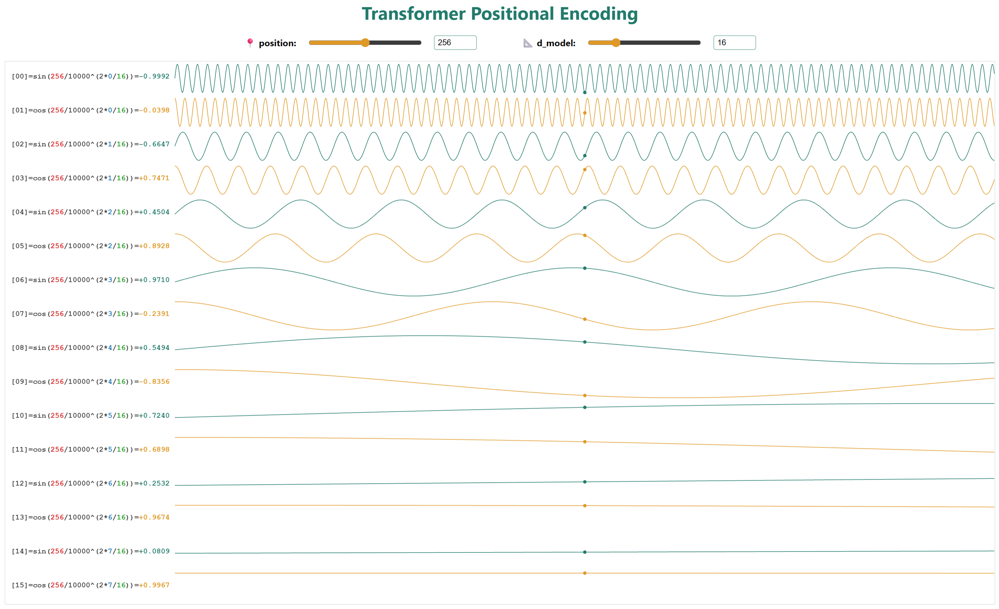

Transformer提出的这种编码方式不依赖任何可学习参数，数值稳定，并具备以下优势：

- 所有值都在[−1,1]范围内，数值稳定

- 编码方式固定、可预计算，无需训练；

- 相同位置的编码在不同句子中保持一致；

- 编码之间具有数学规律，便于模型在注意力机制中感知词语之间的相对位置关系。

##### 小结

Transformer 编码器通过多个结构一致的编码器层堆叠构成，每一层由两个核心子层组成：

###### 自注意力子层（Self-Attention）：

通过 Query、Key、Value 向量机制计算全序列中各位置之间的相关性，提取全局上下文信息，使每个词的表示能够融合整个序列的信息。

###### 前馈神经网络子层（Feed-Forward Network）：

对每个位置独立进行非线性特征变换，增强模型的表示能力。

另外，在这两个子层之后，Transformer 引入了两个关键结构：

- 残差连接（Residual Connection）：缓解深层网络中的梯度消失问题；

- 层归一化（Layer Normalization）：规范向量分布，提升训练稳定性。

最后，为弥补模型并行结构下缺乏顺序感的缺陷，Transformer 使用基于正余弦函数的位置编码来提供序列中每个词的位置信息。

编码器的完整结构如下图所示：

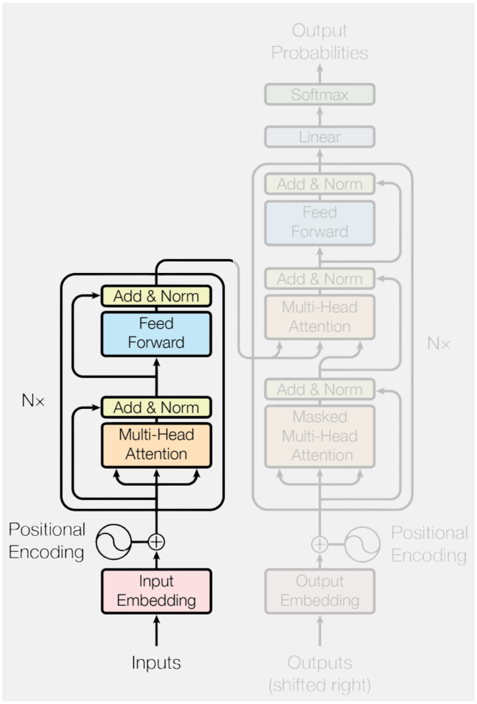

#### 解码器

##### 概述

Transformer 解码器的主要功能是：根据编码器的输出，逐步生成目标序列中的每一个词。其生成方式采用自回归机制（autoregressive）：每一步的输入由此前已生成的所有词组成，模型将输出一个与当前输入长度相同的序列表示。我们只取最后一个位置的输出，作为当前步的预测结果。这一过程会不断重复，直到生成特殊的结束标记 &lt;eos&gt;，表示序列生成完成。

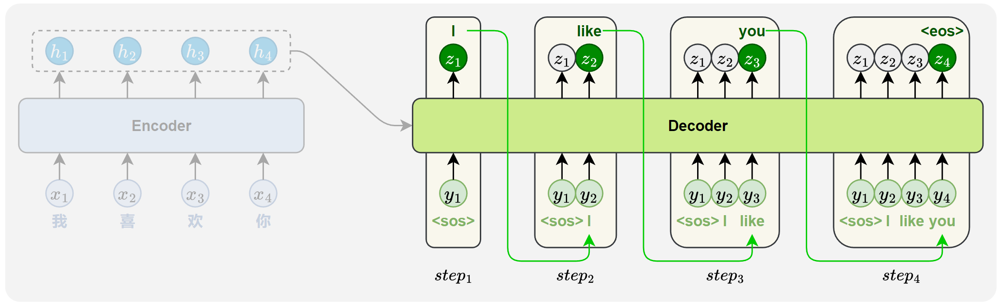

编码器也由多个结构相同的解码器层堆叠组成。

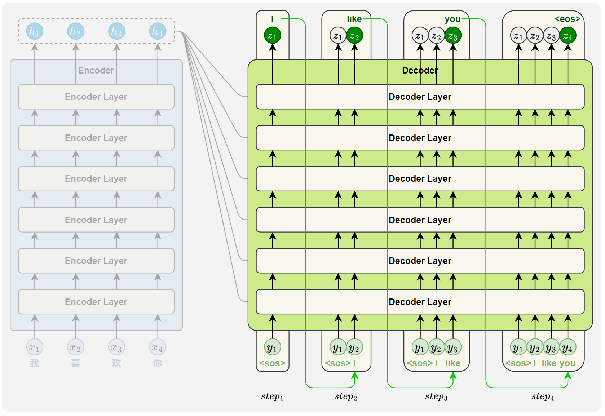

每个Decoder Layer都包含三个子层，分别是Masked自注意力子层、编码器-解码器注意力子层（Encoder-Decoder Attention）和前馈神经网络子层（Feed-Forward Network）。


各层作用如下：

- Masked自注意力子层（Masked Self Attention）

用于建模当前位置与前文词之间的依赖关系。为了在训练时模拟逐词生成的过程，引入遮盖机制（Mask），限制每个位置只能关注它前面的词。

- 编码器-解码器注意力子层（Encoder-Decoder Attention）

用于建模当前解码位置与源序列各位置之间的依赖关系。通过注意力机制，模型能够根据当前状态从编码器的输出中提取相关上下文信息（相当于 Seq2Seq 模型中的 Attention 机制）。

- 前馈神经网络子层（Feed-Forward Network）

与编码器中结构完全一致，对每个位置的表示进行非线性变换，增强模型的表达能力。

每个子层后也都配有残差连接与层归一化（Layer Normalization），结构设计与编码器保持一致，确保训练的稳定性和效率。


此外，解码器在输入端同样需要加入位置编码（Positional Encoding），用于提供序列中的位置信息，其计算方式与编码器中相同。

在输出端，解码器的隐藏向量会送入一个线性变换层（Linear），映射为词表大小的向量，并通过 Softmax 生成一个概率分布，用于预测当前应输出的词。

##### Masked 自注意力子层

该子层的主要作用是：建模目标序列中当前位置与前文之间的依赖关系，为当前词的生成提供上下文语义支持。

由于 Transformer 不具备像 RNN 那样的隐藏状态传递机制，无法在序列生成过程中保留上下文信息，因此在生成每一个词时，必须将此前已生成的所有词作为输入，通过自注意力机制重新建模上下文关系，以预测下一个词。

此外，从结构上看，Transformer 编解码器都具有一个典型特性：输入多少个词，就输出多少个表示。需要注意的是，在推理阶段，我们只使用解码器最后一个位置的输出作为当前步的预测结果，如下图所示：

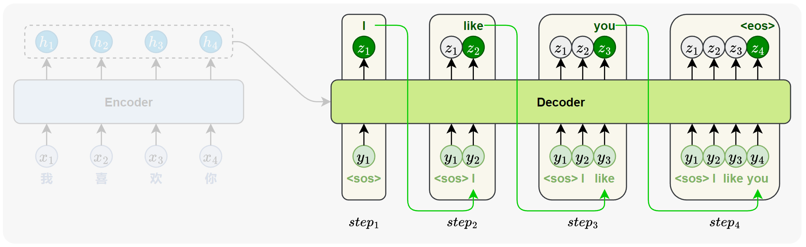

如果训练阶段也完全按照推理流程进行，就必须将每个目标序列拆分成多个训练样本，每个样本输入一段前文，只预测一个词。如下图所示：

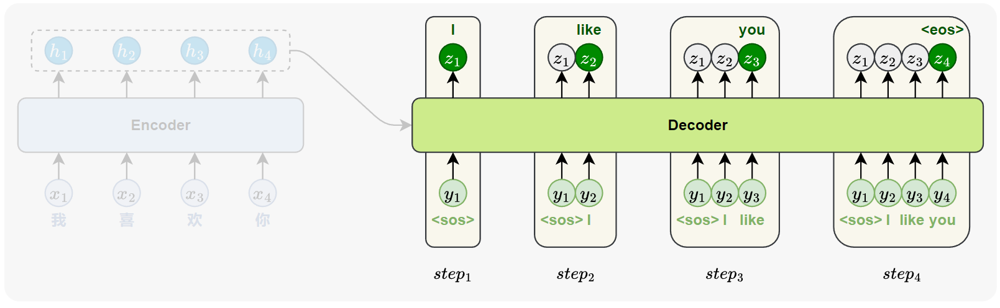

这种方式虽然逻辑合理，但训练效率极低，完全无法利用 Transformer 并行计算的优势。

为提升效率，Transformer 采用了并行训练策略：一次性输入完整目标序列，同时预测每个位置的词。如下图所示：

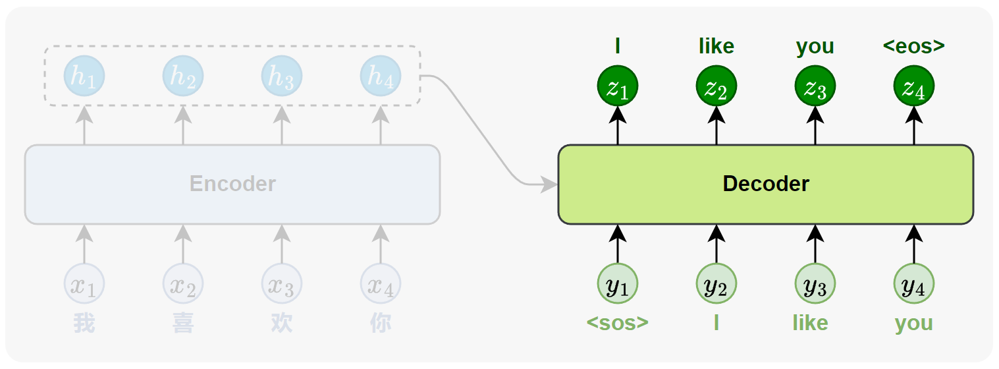

但如果不加限制，这种方式会让模型在预测每个位置时“看到”后面的词，即提前访问未来信息，破坏生成任务的因果结构，如下图所示：

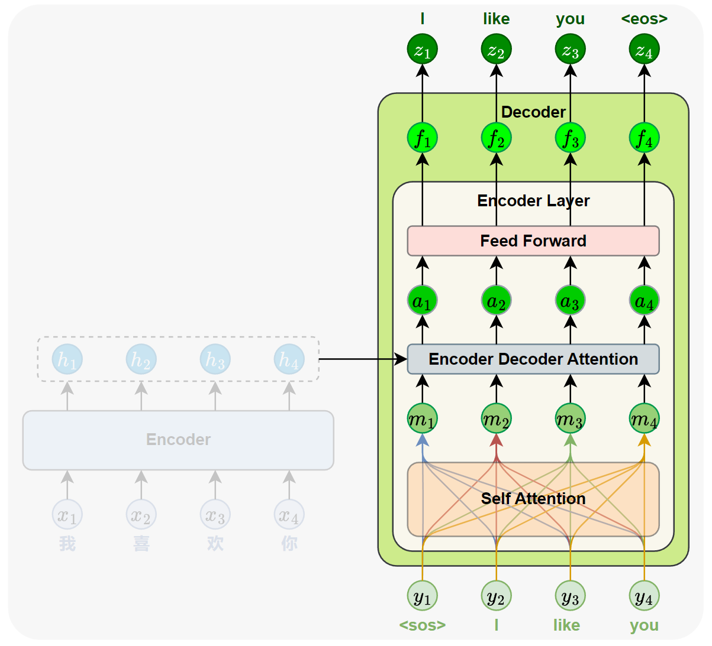

为解决这个问题，解码器在自注意力机制中引入了遮盖机制（Mask）。该机制会在计算注意力时，阻止模型访问当前位置之后的词，只允许它依赖自身及前文的信息。这样，即使在并行训练时，模型也只能像逐词生成一样“看见”它应该看到的内容，从而保持训练与推理阶段的一致性。如下图所示：

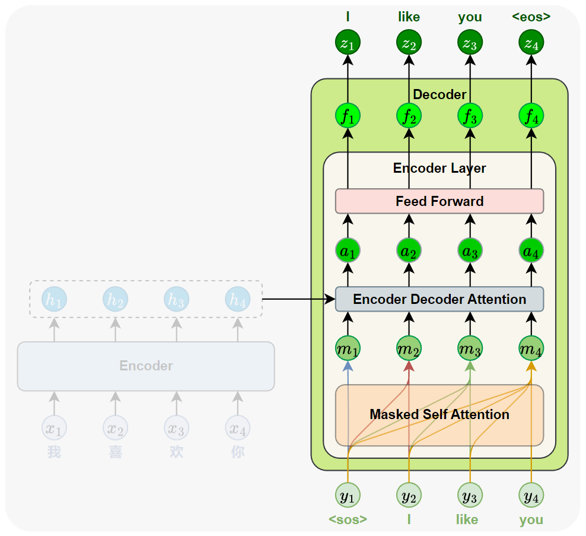

Mask 机制的实现非常简单：只需将注意力得分矩阵中当前位置对其后续位置的评分设置为 −∞，如下图所示：


这样，在经过 softmax 运算后，这些位置的权重会趋近于 0。最终在加权求和时，来自未来位置的信息几乎不会参与计算，从而实现了“当前词只能看到它前面的词”的约束。如下图所示：

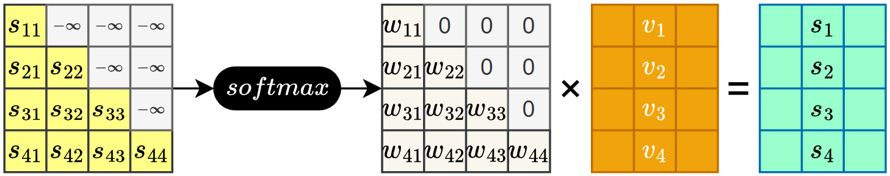

##### 编码器-解码器注意力子层

该子层的主要作用是：建模当前解码位置与源语言序列中各位置之间的依赖关系，帮助模型在生成目标词时有效地参考输入内容，相当于Seq2Seq模型中的注意力机制。

编码器-解码器注意力的核心机制与前面讲过的自注意力机制完全一致，区别仅在于：

Query 来自解码器当前的输入表示，即当前生成状态；

Key和Value 来自编码器的输出表示，即整个源序列的上下文。

也就是说，当前生成位置使用自己的Query，去“询问”编码器输出中的哪些位置最相关。注意力机制会根据 Query 与所有 Key 的相似度，为每个源位置分配一个权重，然后用这些权重对 Value 进行加权求和，得到当前生成词所需的上下文信息。

##### 小结

Transformer 解码器通过自回归方式，逐步生成目标序列中的每一个词。其内部由多个结构相同的解码器层堆叠构成，每一层包含三个核心子层：

- Masked 自注意力子层：

负责建模目标序列内部的上下文关系。通过引入遮盖机制（Mask），限制训练时每个位置只能关注它前面的词，从而在结构上模拟逐词生成，防止信息泄露。

- 编码器-解码器注意力子层：

负责建模目标序列与源序列之间的依赖关系。该机制允许解码器根据当前生成状态动态聚焦源语言中的关键信息，实现跨序列的信息对齐。

- 前馈神经网络子层：

对每个位置的表示进行独立的非线性变换，增强模型的表达能力，与编码器中的结构一致。

为了确保训练稳定，每个子层之后都配有残差连接与层归一化（LayerNorm），与编码器的设计保持一致，便于模型堆叠和优化。

此外，解码器同样采用了 位置编码 来注入顺序信息；输出端则通过线性变换和 Softmax 层将隐藏表示映射为词表概率分布，从而逐步生成目标序列。

在输出阶段，解码器最后会通过一个 线性层 + Softmax 将隐藏表示映射为词表上的概率分布，逐步生成完整的目标句子。

整体来看，Transformer 解码器通过合理设计的多层结构与注意力机制，既保持了训练效率，又满足了生成任务的因果约束，是现代自然语言生成模型的核心组件之一。

解码器完整结构如下图所示：

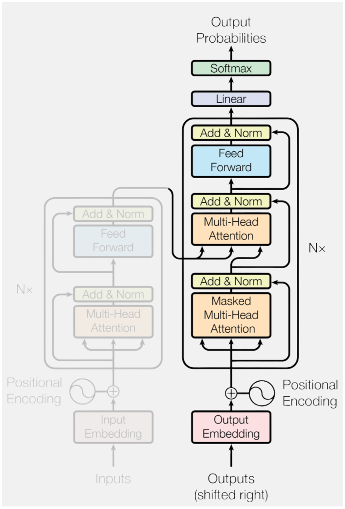

### 模型训练与推理机制

Transformer 的训练与推理都基于自回归生成机制（Autoregressive Generation）：模型逐步生成目标序列中的每一个词。然而，在实现方式上，训练与推理存在明显区别。

#### 模型训练

训练时，Transformer 将目标序列整体输入解码器，并在每个位置同时进行预测。为防止模型“看到”后面的词，破坏因果顺序，解码器在自注意力机子层中引入了 遮盖机制（Mask），限制每个位置只能关注它前面的词。

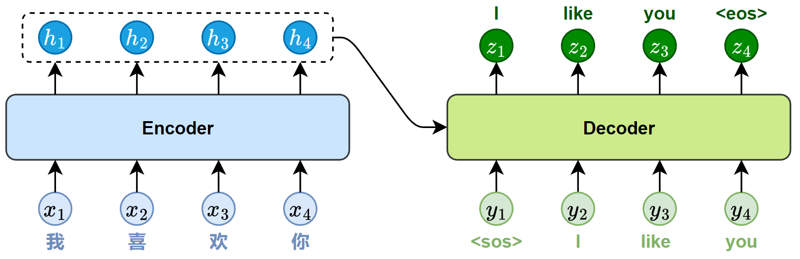

这种机制让模型在结构上模拟逐词生成，但在实现上能充分利用并行计算，大幅提升训练效率。

#### 模型推理

推理时，每一步都要重新输入整个已生成序列，模型需要基于全量前文重新计算注意力分布，决定下一个词的输出。整个过程必须顺序执行，无法并行。

推理阶段，模型每一步都要重新输入当前已生成的全部词，通过自注意力机制建模上下文关系，预测下一个词。

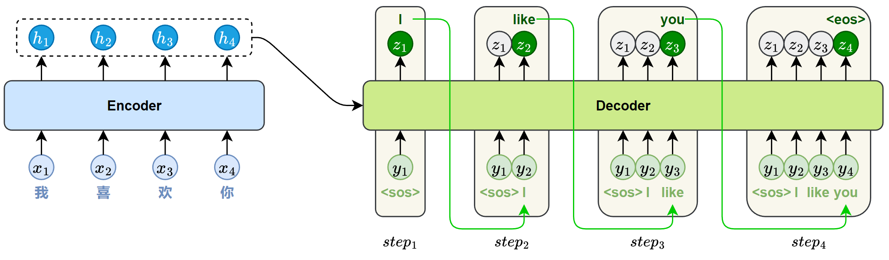

模型会基于完整前文重新计算注意力分布，生成当前步的输出。由于每一步的输入依赖前一步结果，整个过程必须顺序执行，无法并行。

每步输出的是一个词的概率分布，最终生成结果也可使用不同的解码策略（如贪心搜索、束搜索等）。

### API使用

#### 概述

PyTorch 提供了对 Transformer 的官方实现，该模块封装了完整的编码器-解码器结构，可直接应用于机器翻译、文本生成等典型的序列建模任务。

#### 核心类

PyTorch 中的 Transformer 模块由以下几个核心类构成：

- nn.Transformer

封装了完整的 Transformer架构，由编码器和解码器组成。作为顶层接口，适用于需要同时使用编码器和解码器的任务，如机器翻译。支持用户通过参数自定义层数、注意力头数、隐藏维度等模型结构。

- nn.TransformerEncoder

实现了Transformer编码器结构，由多个编码器层的堆叠而成，用于将输入序列编码为上下文相关的表示。

- nn.TransformerDecoder

实现了Transformer解码器结构，由多个解码器层堆叠而成，用于基于编码结果逐步生成目标序列。

- nn.TransformerEncoderLayer

实现了单个编码器层结构，包含一个多头自注意力子层和一个前馈神经网络子层，两者均带有残差连接和 LayerNorm。

- nn.TransformerDecoderLayer

实现了单个解码器层结构，包含自注意力、编码器-解码器注意力、前馈子层，同样配有残差连接和 LayerNorm。

#### Transformer构造参数

构造Transformer模型所需参数如下：

```
torch.nn.Transformer(d_model=512,
                     nhead=8,
                     num_encoder_layers=6,
                     num_decoder_layers=6,
                     dim_feedforward=2048,
                     dropout=0.1,
                     activation='relu',
                     custom_encoder=None,
                     custom_decoder=None,
                     layer_norm_eps=1e-05,
                     batch_first=False,
                     norm_first=False,
                     bias=True,
                     device=None,
                     dtype=None)
```

各参数含义如下：

- 基础核心参数

| 参数名 | 默认值 | 说明 |
| --- | --- | --- |
| d_model | 512 | 编码器和解码器输入的特征维度，即每个 token 的表示向量长度。 |
| nhead | 8 | 多头注意力中的头数，要求 d_model 能被整除。 |
| num_encoder_layers | 6 | 编码器中堆叠的层数，决定模型深度。 |
| num_decoder_layers | 6 | 解码器中堆叠的层数，结构与编码器相似。 |
| dim_feedforward | 2048 | 前馈神经网络中的隐藏层维度，默认是 d_model 的 4 倍。 |
| dropout | 0.1 | Dropout 概率，用于缓解过拟合，作用于注意力层和前馈层。 |
| batch_first | False | 若设为 True，输入和输出张量的维度格式为 (batch_size, seq_len, d_model)；否则为 (seq_len, batch_size, d_model)。推荐设为 True。 |
| device | None | 模型参数所使用的设备，如 'cuda' 或 'cpu'。 |
| dtype | None | 模型参数的数据类型，如 torch.float32 或 torch.float16。 |

- 高级参数

| 参数名 | 默认值 | 说明 |
| --- | --- | --- |
| activation | 'relu' | 编码器/解码器中间层的激活函数，支持字符串（'relu' 或 'gelu'）或自定义函数。 |
| custom_encoder | None | 自定义编码器模块。 |
| custom_decoder | None | 自定义解码器模块。 |
| layer_norm_eps | 1e-5 | LayerNorm 层中的 epsilon 值，用于防止除零。 |
| norm_first | False | 若为 True，编码器和解码器层将在注意力或前馈操作之前执行 LayerNorm。 |
| bias | True | 若为 False，则所有 Linear 和 LayerNorm 层不使用偏置项。 |

示例代码如下：

```
from torch import nn

# 初始化 Transformer
transformer = nn.Transformer(
    d_model=512,
    nhead=8,
    num_encoder_layers=6,
    num_decoder_layers=6,
    batch_first=True
)
```

#### Transformer.forward

nn.Transformer 封装了完整的前向传播逻辑，其 forward() 方法定义了编码器解码器的执行流程。该函数接收源语言序列（src_sequence，编码器输入）和目标语言序列（tgt_sequence，解码器输入）作为输入，以解码器预测结果作为输出。如下图所示：

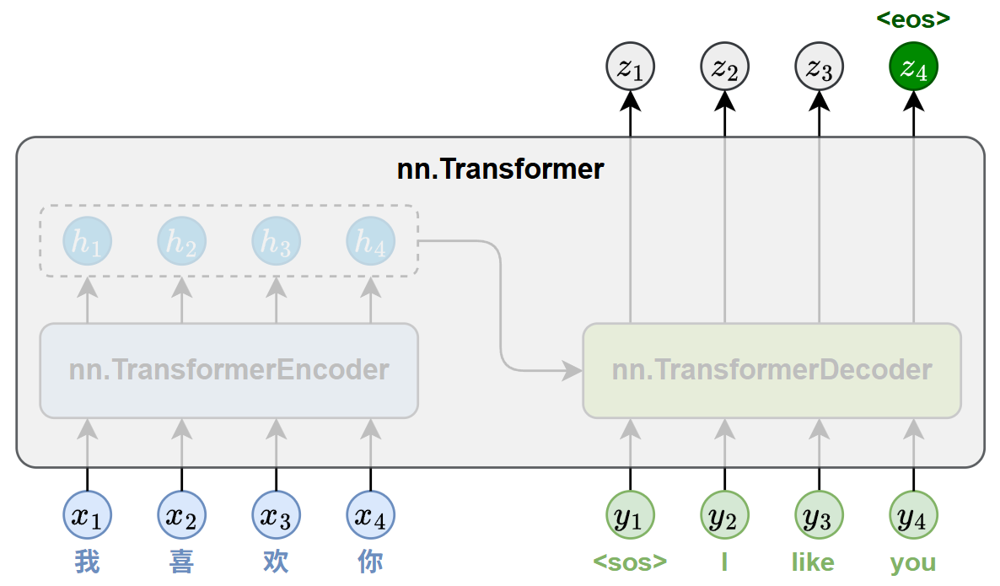

示例代码如下：

```
output = transformer(
    src=src_emb,
    tgt=tgt_emb,
    src_key_padding_mask=src_pad_mask,
    tgt_key_padding_mask=tgt_pad_mask,
    tgt_mask=tgt_mask,
    memory_key_padding_mask=src_pad_mask
)
```

假设当前的源序列和目标序列为：

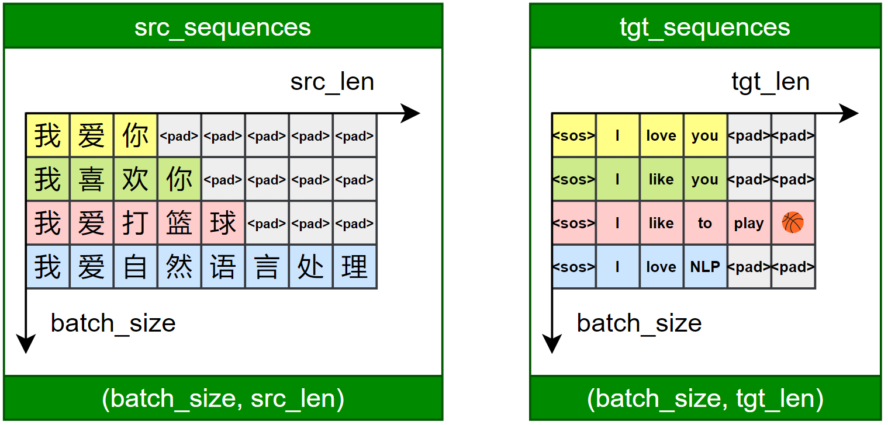

则具体的输入和输出内容如下表所示

- 输入

| 类别 | 项 | 说明 |
| --- | --- | --- |
| src | 源序列的嵌入表示，通常由词向量与位置编码相加得到，作为编码器的输入。其形状为 (batch_size, src_len, d_model) |  |
| tgt | 目标序列的嵌入表示，通常由词向量与位置编码相加得到，作为解码器的输入。其形状为 (batch_size, tgt_len, d_model)。 |  |
| src_key_padding_mask | 用于编码器中的自注意力机制，用以屏蔽源序列中填充（&lt;pad&gt;）的位置，防止模型在计算注意力时关注无意义的内容。其张量形状为 (batch_size, src_len)，其中值为 True 的位置表示应被忽略（即不参与注意力计算）。 |  |
| tgt_key_padding_mask | 用于解码器中的自注意力机制，用以屏蔽目标序列中填充（&lt;pad&gt;）的位置，防止模型在计算注意力时关注无意义的内容。其张量形状为 (batch_size, tgt_len)，其中值为 True 的位置表示应被忽略（即不参与注意力计算）。 |  |
| tgt_mask | 用于解码器的自注意力机制，常用于训练阶段的自回归任务，防止模型关注当前位置之后的 token，避免信息泄露。是一个形状为 (tgt_len, tgt_len) 的上三角矩阵，类型为 float，遮挡位置为 -inf，其余为 0。也支持 bool 类型（True 表示遮挡），内部会自动转换为加性掩码。 |  |
| memory_key_padding_mask | 用于解码器的交叉注意力机制，屏蔽编码器输出中的 &lt;pad&gt; 位置，防止解码器关注源序列中的无效 token。形状为 (batch_size, src_len)，值为 True 的位置将被忽略。通常与 src_key_padding_mask 相同。 |  |

- 输出

| 类别 | 项 | 说明 |
| --- | --- | --- |
| output | 解码器输出的隐藏状态序列，形状为 (batch_size, tgt_len, d_model)。表示目标序列中每个位置的上下文表示，通常会送入线性层和 softmax，用于生成词表上的预测概率。 |  |

#### Transformer.encoder

nn.Transformer 模块中包含一个编码器部分，可通过属性 transformer.encoder 访问，其本质是一个 nn.TransformerEncoder 实例。通过其 forward 方法，可以对源序列进行编码，提取上下文相关的语义表示。如下图所示：

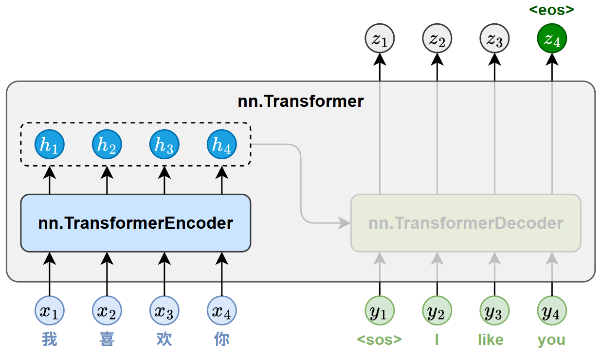

示例代码如下：

```
from torch import nn

# 初始化 Transformer
transformer = nn.Transformer(
    d_model=512, nhead=8,
    num_encoder_layers=6, num_decoder_layers=6,
    batch_first=True
)

# 调用编码器
memory = transformer.encoder(
    src=src_emb,
    src_key_padding_mask=src_pad_mask
)
```

假如源序列为：

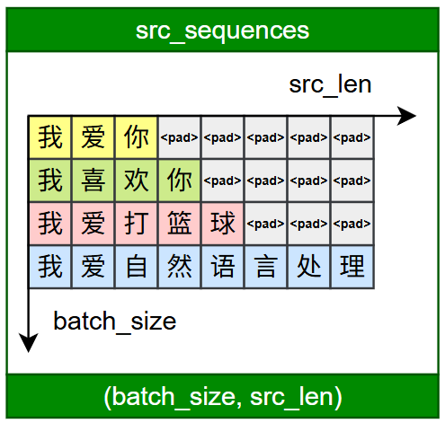

则具体的输入输出为：

- 输入

| 类别 | 项 | 说明 |
| --- | --- | --- |
| src | 源序列的嵌入表示，通常由词向量与位置编码相加得到，作为编码器的输入。其形状为 (batch_size, src_len, d_model) |  |
| src_key_padding_mask | 用于编码器中的自注意力机制，用以屏蔽源序列中填充（&lt;pad&gt;）的位置，防止模型在计算注意力时关注无意义的内容。其张量形状为 (batch_size, src_len)，其中值为 True 的位置表示应被忽略（即不参与注意力计算）。 |  |

- 输出

| 类别 | 项 | 说明 |
| --- | --- | --- |
| memory | 编码器的输出表示，包含每个 token 的上下文语义信息，作为解码器的输入。其形状为 (batch_size, src_len, d_model)。 |  |

#### Transformer.decoder

nn.Transformer 模块中包含一个解码器部分，可通过属性 transformer.decoder 访问，其本质是一个 nn.TransformerDecoder 实例。通过其 forward 方法，可以基于编码器的输出（memory）和目标序列的嵌入表示，逐步生成目标序列中的各个 token。如下图所示：

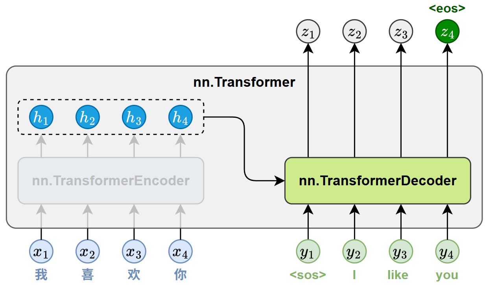

示例代码如下：

```
from torch import nn

# 初始化 Transformer
transformer = nn.Transformer(
    d_model=512, nhead=8,
    num_encoder_layers=6, num_decoder_layers=6,
    batch_first=True
)

# 调用编码器
memory = transformer.encoder(
    src=src_emb,
    src_key_padding_mask=src_pad_mask
)

# 调用解码器（逐步生成）
output = transformer.decoder(
    tgt=tgt_emb,
    memory=memory,
    tgt_mask=tgt_mask,
    tgt_key_padding_mask=tgt_pad_mask,
    memory_key_padding_mask=src_pad_mask
)
```

若源序列和目标序列为：


则具体输出输出为：

- 输入

| 类别 | 项 | 说明 |
| --- | --- | --- |
| tgt | 目标序列的嵌入表示，通常由词向量与位置编码相加得到，作为解码器的输入。其形状为 (batch_size, tgt_len, d_model)。 |  |
| memory | 编码器的输出表示，包含源序列每个 token 的上下文语义信息，作为解码器的输入。其形状为 (batch_size, src_len, d_model)。 |  |
| tgt_mask | 用于解码器的自注意力机制，常用于训练阶段的自回归任务，防止模型关注当前位置之后的 token，避免信息泄露。是一个形状为 (tgt_len, tgt_len) 的上三角矩阵，类型为 float，遮挡位置为 -inf，其余为 0。也支持 bool 类型（True 表示遮挡），内部会自动转换为加性掩码。 |  |
| tgt_key_padding_mask | 用于解码器中的自注意力机制，用以屏蔽源序列中填充（&lt;pad&gt;）的位置，防止模型在计算注意力时关注无意义的内容。其张量形状为 (batch_size, tgt_len)，其中值为 True 的位置表示应被忽略（即不参与注意力计算）。 |  |
| memory_key_padding_mask | 用于解码器的交叉注意力机制，屏蔽编码器输出中的 &lt;pad&gt; 位置，防止解码器关注源序列中的无效 token。形状为 (batch_size, src_len)，值为 True 的位置将被忽略。通常与 src_key_padding_mask 相同。 |  |

- 输出

| 类别 | 项 | 说明 |
| --- | --- | --- |
| output | 解码器输出的隐藏状态序列，形状为 (batch_size, tgt_len, d_model)。表示目标序列中每个位置的上下文表示，通常会送入线性层和 softmax，用于生成词表上的预测概率。 |  |

### 案例实操（中英翻译V3.0）

#### 需求说明

本案例要求使用Transformer模型实现上述中英翻译任务。

#### 需求分析

PyTorch 已提供了 nn.Transformer 模块，包含完整的编码器-解码器结构，因此我们可以直接使用其核心组件来搭建模型。

然而，PyTorch 并未内置位置编码（Positional Encoding）模块，而 Transformer 又不具备处理位置信息的能力，因此我们需要手动实现位置编码，并与嵌入层输出相加，作为 Transformer 的输入。

除此之外，还需要完成以下模块：

- 源语言和目标语言的词嵌入层（nn.Embedding）

- 输出层（nn.Linear）用于将模型输出映射为目标词表大小

#### 需求实现

###### 项目结构

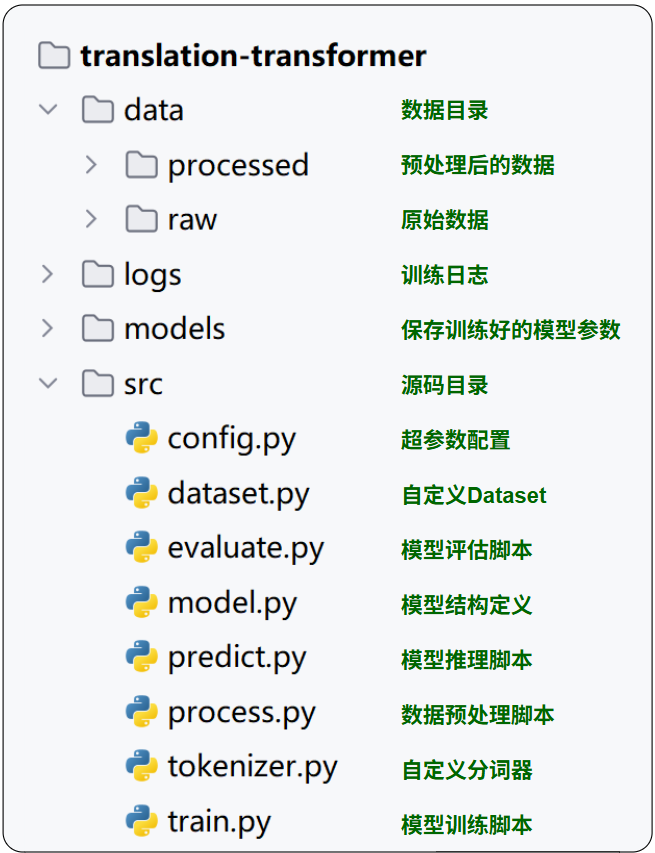

###### 完整代码

###### 数据预处理

```
# process.py

import pandas as pd
from sklearn.model_selection import train_test_split
from tokenizer import ChineseTokenizer, EnglishTokenizer
import config

def process():
    """
    数据预处理主函数。
    """
    print('开始处理数据')

    df = pd.read_csv(
        config.RAW_DATA_DIR / 'cmn.txt',
        sep='\t',
        header=None,
        usecols=[0, 1],
        names=['en', 'zh']
    )

    df = df.dropna()
    df = df[df['en'].str.strip().ne('') & df['zh'].str.strip().ne('')]

    train_df, test_df = train_test_split(df, test_size=0.2, random_state=42)

    EnglishTokenizer.build_vocab(train_df['en'].tolist(), config.PROCESSED_DATA_DIR / 'en_vocab.txt')
    ChineseTokenizer.build_vocab(train_df['zh'].tolist(), config.PROCESSED_DATA_DIR / 'zh_vocab.txt')

    en_tokenizer = EnglishTokenizer.from_vocab(config.PROCESSED_DATA_DIR / 'en_vocab.txt')
    zh_tokenizer = ChineseTokenizer.from_vocab(config.PROCESSED_DATA_DIR / 'zh_vocab.txt')

    train_df['en'] = train_df['en'].apply(
        lambda x: en_tokenizer.encode(x, seq_len=config.SEQ_LEN, add_sos_eos=True)
    )
    train_df['zh'] = train_df['zh'].apply(
        lambda x: zh_tokenizer.encode(x, seq_len=config.SEQ_LEN, add_sos_eos=False)
    )
    train_df.to_json(config.PROCESSED_DATA_DIR / 'indexed_train.jsonl', orient='records', lines=True)

    test_df['en'] = test_df['en'].apply(
        lambda x: en_tokenizer.encode(x, seq_len=config.SEQ_LEN, add_sos_eos=True)
    )
    test_df['zh'] = test_df['zh'].apply(
        lambda x: zh_tokenizer.encode(x, seq_len=config.SEQ_LEN, add_sos_eos=False)
    )
    test_df.to_json(config.PROCESSED_DATA_DIR / 'indexed_test.jsonl', orient='records', lines=True)

    print('数据处理完成')

if __name__ == '__main__':
    process()
```

###### 自定义分词器

```
# tokenizer.py

from abc import abstractmethod
from nltk import word_tokenize, TreebankWordDetokenizer
from tqdm import tqdm

class BaseTokenizer:
    """
    分词器基类。
    """
    unk_token = '<unk>'
    pad_token = '<pad>'
    sos_token = '<sos>'
    eos_token = '<eos>'

    @staticmethod
    @abstractmethod
    def tokenize(sentence):
        pass

    @abstractmethod
    def decode(self, indexes):
        pass

    @classmethod
    def build_vocab(cls, sentences, vocab_file):
        """
        构建词表并保存。

        :param sentences: 句子列表。
        :param vocab_file: 保存文件路径。
        """
        unique_words = set()
        for sentence in tqdm(sentences, desc='分词'):
            for word in cls.tokenize(sentence):
                unique_words.add(word)

        vocab_list = [cls.pad_token, cls.unk_token, cls.sos_token, cls.eos_token] + list(unique_words)
        with open(vocab_file, 'w', encoding='utf-8') as f:
            for word in vocab_list:
                f.write(word + '\n')

    def __init__(self, vocab_list):
        self.vocab_list = vocab_list
        self.vocab_size = len(vocab_list)
        self.word2index = {word: i for i, word in enumerate(vocab_list)}
        self.index2word = {i: word for i, word in enumerate(vocab_list)}
        self.unk_token_index = self.word2index[self.unk_token]
        self.pad_token_index = self.word2index[self.pad_token]
        self.sos_token_index = self.word2index[self.sos_token]
        self.eos_token_index = self.word2index[self.eos_token]

    @classmethod
    def from_vocab(cls, vocab_file):
        with open(vocab_file, 'r', encoding='utf-8') as f:
            vocab_list = [line.strip() for line in f.readlines()]
        return cls(vocab_list)

    def encode(self, sentence, seq_len, add_sos_eos=False):
        tokens = self.tokenize(sentence)
        indexes = [self.word2index.get(token, self.unk_token_index) for token in tokens]
        if add_sos_eos:
            indexes = indexes[:seq_len - 2]
            indexes = [self.sos_token_index] + indexes + [self.eos_token_index]
        else:
            indexes = indexes[:seq_len]
        if len(indexes) < seq_len:
            indexes += [self.pad_token_index] * (seq_len - len(indexes))
        return indexes

class ChineseTokenizer(BaseTokenizer):
    @staticmethod
    def tokenize(sentence):
        return list(sentence)

    def decode(self, indexes):
        return ''.join([self.index2word[i] for i in indexes])

class EnglishTokenizer(BaseTokenizer):
    @staticmethod
    def tokenize(sentence):
        return word_tokenize(sentence)

    def decode(self, indexes):
        tokens = [self.index2word[i] for i in indexes]
        return TreebankWordDetokenizer().detokenize(tokens)
```

###### 自定义数据集

```
# dataset.py

import pandas as pd
import torch
from torch.utils.data import Dataset, DataLoader
import config

class TranslationDataset(Dataset):
    """
    翻译数据集，加载已编码的中英文索引。
    """

    def __init__(self, data_path):
        """
        初始化数据集。

        :param data_path: 数据文件路径（JSONL 格式）。
        """
        self.data = pd.read_json(data_path, lines=True).to_dict(orient='records')

    def __len__(self):
        """
        数据集样本数。
        """
        return len(self.data)

    def __getitem__(self, index):
        """
        获取指定样本。

        :param index: 样本索引。
        :return: (input_tensor, target_tensor)
        """
        input_tensor = torch.tensor(self.data[index]['zh'], dtype=torch.long)
        target_tensor = torch.tensor(self.data[index]['en'], dtype=torch.long)
        return input_tensor, target_tensor

def get_dataloader(train=True):
    """
    构建数据加载器。

    :param train: 是否加载训练集。
    :return: DataLoader 实例。
    """
    data_path = config.PROCESSED_DATA_DIR / ('indexed_train.jsonl' if train else 'indexed_test.jsonl')
    dataset = TranslationDataset(data_path)
    return DataLoader(dataset, batch_size=config.BATCH_SIZE, shuffle=True)

if __name__ == '__main__':
    train_loader = get_dataloader(train=True)
    for inputs, targets in train_loader:
        print(inputs.shape, targets.shape)
        break
```

###### 模型定义

```
# model.py

import torch
from torch import nn
import config

class PositionEncoding(nn.Module):
    def __init__(self, d_model, max_len=500):
        super().__init__()
        self.d_model = d_model
        self.max_len = max_len

        pos = torch.arange(0, self.max_len, dtype=torch.float).unsqueeze(1)  # pos.shape: (max_len, 1)
        _2i = torch.arange(0, self.d_model, step=2, dtype=torch.float)  # _2i.shape: (d_model/2,)
        div_term = torch.pow(10000, _2i / self.d_model)

        sins = torch.sin(pos / div_term)  # sins.shape: (max_len, d_model/2)
        coss = torch.cos(pos / div_term)  # coss.shape: (max_len, d_model/2)

        pe = torch.zeros(self.max_len, self.d_model, dtype=torch.float)  # pe.shape: (max_len, d_model)

        pe[:, 0::2] = sins
        pe[:, 1::2] = coss

        self.register_buffer('pe', pe)

    def forward(self, x):
        seq_len = x.size(1)
        return x + self.pe[:seq_len]

class TranslationModel(nn.Module):
    def __init__(self, zh_vocab_size, en_vocab_size, zh_padding_index, en_padding_index):
        super().__init__()
        self.src_embedding = nn.Embedding(num_embeddings=zh_vocab_size, embedding_dim=config.DIM_MODEL,
                                          padding_idx=zh_padding_index)
        self.tgt_embedding = nn.Embedding(num_embeddings=en_vocab_size, embedding_dim=config.DIM_MODEL,
                                          padding_idx=en_padding_index)
        self.position_encoding = PositionEncoding(d_model=config.DIM_MODEL)

        self.transformer = nn.Transformer(d_model=config.DIM_MODEL,
                                          nhead=config.NUM_HEADS,
                                          num_encoder_layers=config.NUM_ENCODER_LAYERS,
                                          num_decoder_layers=config.NUM_DECODER_LAYERS,
                                          batch_first=True)

        self.linear = nn.Linear(config.DIM_MODEL, en_vocab_size)

    def encode(self, src, src_pad_mask):
        src_embed = self.src_embedding(src)
        src_embed = self.position_encoding(src_embed)

        memory = self.transformer.encoder(src=src_embed, src_key_padding_mask=src_pad_mask)
        return memory

    def decode(self, tgt, memory, tgt_mask, tgt_pad_mask, src_pad_mask):
        tgt_embed = self.tgt_embedding(tgt)
        tgt_embed = self.position_encoding(tgt_embed)

        output = self.transformer.decoder(tgt=tgt_embed, memory=memory, tgt_mask=tgt_mask,
                                          tgt_key_padding_mask=tgt_pad_mask,
                                          memory_key_padding_mask=src_pad_mask)
        return self.linear(output)

    def forward(self, src, tgt, src_pad_mask, tgt_pad_mask, tgt_mask):
        memory = self.encode(src, src_pad_mask)
        output = self.decode(tgt, memory, tgt_mask, tgt_pad_mask, src_pad_mask)
        return output
```

###### 模型训练

```
# train.py

import time
import torch
from torch.nn import CrossEntropyLoss
from torch.utils.tensorboard import SummaryWriter
from tqdm import tqdm

from dataset import get_dataloader
from tokenizer import ChineseTokenizer, EnglishTokenizer
import config
from model import TranslationModel

def train_one_epoch(dataloader, model, loss_function, optimizer, device):
    model.train()
    total_loss = 0
    for src, tgt in tqdm(dataloader, desc='训练'):
        src = src.to(device)
        tgt = tgt.to(device)

        src_pad_mask = (src == model.src_embedding.padding_idx)
        tgt_pad_mask = (tgt == model.tgt_embedding.padding_idx)

        tgt_input = tgt[:, :-1]
        tgt_output = tgt[:, 1:]

        tgt_mask = model.transformer.generate_square_subsequent_mask(tgt_input.shape[1]).to(device)

        optimizer.zero_grad()
        output = model(src, tgt_input, src_pad_mask, tgt_pad_mask[:, :-1], tgt_mask)

        loss = loss_function(
            output.reshape(-1, output.shape[-1]),
            tgt_output.reshape(-1)
        )

        loss.backward()
        optimizer.step()

        total_loss += loss.item()

    return total_loss / len(dataloader)

def train():
    device = torch.device('cuda' if torch.cuda.is_available() else 'cpu')
    dataloader = get_dataloader()

    zh_tokenizer = ChineseTokenizer.from_vocab(config.PROCESSED_DATA_DIR / 'zh_vocab.txt')
    en_tokenizer = EnglishTokenizer.from_vocab(config.PROCESSED_DATA_DIR / 'en_vocab.txt')

    model = TranslationModel(
        zh_tokenizer.vocab_size,
        en_tokenizer.vocab_size,
        zh_tokenizer.pad_token_index,
        en_tokenizer.pad_token_index
    ).to(device)

    loss_function = CrossEntropyLoss(ignore_index=en_tokenizer.pad_token_index)
    optimizer = torch.optim.Adam(model.parameters(), lr=config.LEARNING_RATE)
    writer = SummaryWriter(log_dir=config.LOGS_DIR / time.strftime('%Y-%m-%d_%H-%M-%S'))

    best_loss = float('inf')

    for epoch in range(1, config.EPOCHS + 1):
        print(f'========== Epoch {epoch} ==========')
        avg_loss = train_one_epoch(dataloader, model, loss_function, optimizer, device)
        print(f'平均损失: {avg_loss:.4f}')
        writer.add_scalar('Loss', avg_loss, epoch)

        if avg_loss < best_loss:
            best_loss = avg_loss
            torch.save(model.state_dict(), config.MODELS_DIR / 'model.pt')
            print('模型已保存')
        else:
            print('未保存模型')

if __name__ == '__main__':
    train()
```

###### 模型预测

```
# predict.py

import torch
from tokenizer import ChineseTokenizer, EnglishTokenizer
from model import TranslationModel
import config

def predict_batch(input_tensor, model, en_tokenizer, device):
    """
    批量生成翻译结果。

    :param input_tensor: 中文输入张量 (batch_size, seq_len)。
    :param model: 翻译模型。
    :param en_tokenizer: 英文分词器。
    :param device: 设备。
    :return: 生成的英文索引列表。
    """
    model.eval()
    with torch.no_grad():
        src_pad_mask = (input_tensor == 0)
        memory = model.encode(src=input_tensor, src_pad_mask=src_pad_mask)

        batch_size = input_tensor.shape[0]
        decoder_input = torch.full(
            size=(batch_size, 1),
            fill_value=en_tokenizer.sos_token_index,
            device=device
        )

        generated = [[] for _ in range(batch_size)]
        finished = [False for _ in range(batch_size)]

        for step in range(1, config.SEQ_LEN):
            tgt_mask = model.transformer.generate_square_subsequent_mask(decoder_input.shape[1]).to(device)
            tgt_pad_mask = (decoder_input == en_tokenizer.pad_token_index)

            decoder_output = model.decode(decoder_input, memory, tgt_mask, tgt_pad_mask, src_pad_mask)

            predict_indexes = decoder_output[:, -1, :].argmax(dim=-1)

            for i in range(batch_size):
                if finished[i]:
                    continue
                if predict_indexes[i].item() == en_tokenizer.eos_token_index:
                    finished[i] = True
                    continue
                generated[i].append(predict_indexes[i].item())

            if all(finished):
                break

            decoder_input = torch.cat([decoder_input, predict_indexes.unsqueeze(1)], dim=1)

        return generated

def predict(zh_sentence, model, zh_tokenizer, en_tokenizer, device):
    """
    翻译单句中文。

    :param zh_sentence: 中文句子。
    :param model: 翻译模型。
    :param zh_tokenizer: 中文分词器。
    :param en_tokenizer: 英文分词器。
    :param device: 设备。
    :return: 英文翻译句子。
    """
    input_ids = zh_tokenizer.encode(zh_sentence, seq_len=config.SEQ_LEN, add_sos_eos=False)
    input_tensor = torch.tensor([input_ids], device=device)
    generated = predict_batch(input_tensor, model, en_tokenizer, device)
    en_indexes = generated[0]
    en_sentence = en_tokenizer.decode(en_indexes)
    return en_sentence

def run_predict():
    """
    启动交互式翻译。
    """
    device = torch.device('cuda' if torch.cuda.is_available() else 'cpu')

    zh_tokenizer = ChineseTokenizer.from_vocab(config.PROCESSED_DATA_DIR / 'zh_vocab.txt')
    en_tokenizer = EnglishTokenizer.from_vocab(config.PROCESSED_DATA_DIR / 'en_vocab.txt')

    model = TranslationModel(
        zh_vocab_size=zh_tokenizer.vocab_size,
        en_vocab_size=en_tokenizer.vocab_size,
        zh_padding_index=zh_tokenizer.pad_token_index,
        en_padding_index=en_tokenizer.pad_token_index
    ).to(device)
    model.load_state_dict(torch.load(config.MODELS_DIR / 'model.pt'))

    print('欢迎使用翻译系统，请输入中文句子：（输入 q 或 quit 退出）')
    while True:
        user_input = input('中文：')
        if user_input in ['q', 'quit']:
            print('谢谢使用，再见！')
            break
        if not user_input.strip():
            print('请输入内容')
            continue

        result = predict(user_input, model, zh_tokenizer, en_tokenizer, device)
        print(f'英文：{result}')

if __name__ == '__main__':
    run_predict()
```

###### 模型评估

```
# evaluate.py

import torch
from nltk.translate.bleu_score import corpus_bleu
from tqdm import tqdm

import config
from tokenizer import ChineseTokenizer, EnglishTokenizer
from model import TranslationModel
from dataset import get_dataloader
from predict import predict_batch

def evaluate(dataloader, model, zh_tokenizer, en_tokenizer, device):
    all_references = []
    all_predictions = []
    special_tokens = [zh_tokenizer.pad_token_index, zh_tokenizer.eos_token_index, zh_tokenizer.sos_token_index]
    for src, tgt in tqdm(dataloader, desc="评估"):
        src = src.to(device)
        tgt = tgt.tolist()

        predict_indexes = predict_batch(src, model, en_tokenizer, device)

        all_predictions.extend(predict_indexes)

        for indexes in tgt:
            indexes = [index for index in indexes if index not in special_tokens]
            all_references.append([indexes])

    bleu = corpus_bleu(all_references, all_predictions)
    return bleu

def run_evaluate():
    # 设备
    device = torch.device('cuda' if torch.cuda.is_available() else 'cpu')

    # tokenizer
    zh_tokenizer = ChineseTokenizer.from_vocab(config.PROCESSED_DATA_DIR / 'zh_vocab.txt')
    en_tokenizer = EnglishTokenizer.from_vocab(config.PROCESSED_DATA_DIR / 'en_vocab.txt')

    # 模型
    model = TranslationModel(zh_vocab_size=zh_tokenizer.vocab_size,
                             en_vocab_size=en_tokenizer.vocab_size,
                             zh_padding_index=zh_tokenizer.pad_token_index,
                             en_padding_index=en_tokenizer.pad_token_index).to(device)
    model.load_state_dict(torch.load(config.MODELS_DIR / 'model.pt'))
    # 数据
    dataloader = get_dataloader(train=False)

    bleu = evaluate(dataloader, model, zh_tokenizer, en_tokenizer, device)
    print(f'BLEU: {bleu:.2f}')

if __name__ == '__main__':
    run_evaluate()
```

###### 配置文件

```
# config.py

from pathlib import Path

# 获取项目根目录
BASE_DIR = Path(__file__).parent.parent

# 定义项目中常用路径
MODELS_DIR = BASE_DIR / 'models'  # 模型保存路径
PROCESSED_DATA_DIR = BASE_DIR / 'data' / 'processed'  # 处理后的数据保存路径
RAW_DATA_DIR = BASE_DIR / 'data' / 'raw'  # 原始数据保存路径
LOGS_DIR = BASE_DIR / 'logs'  # TensorBoard 日志目录

# 模型结构参数
DIM_MODEL = 128  # 词向量维度
NUM_HEADS = 4
NUM_ENCODER_LAYERS = 2
NUM_DECODER_LAYERS = 2

# 训练相关超参数
BATCH_SIZE = 128  # 每个 batch 的样本数
SEQ_LEN = 30  # 序列长度（输入与输出最大长度）
LEARNING_RATE = 1e-3  # 学习率
EPOCHS = 30  # 总训练轮数
```

## 预训练模型

### 预训练模型概述

早期的自然语言处理方法通常针对每个具体任务单独训练模型，且严重依赖大量人工标注数据。虽然在部分场景下效果可观，但也暴露出显著局限：

- 语言知识难以复用：每个模型都需从零开始训练，导致训练成本高、效率低；

- 强依赖高质量标注：在医疗、法律等专业领域，标注数据获取困难且代价高昂。

为解决这些问题，研究者提出了新的建模范式——“预训练 + 微调”：

- 预训练阶段：在大规模未标注语料上训练语言模型，学习词汇、句法和上下文等通用语言规律；

- 微调阶段：将预训练模型迁移至具体任务，仅需少量标注数据即可完成任务适配。

这一方法显著提升了模型的通用性和开发效率，已成为当前 NLP 的主流技术路线，并广泛应用于文本分类、问答系统、翻译、对话等任务中。

### 预训练模型分类

预训练语言模型几乎都构建在 Transformer 架构之上。相较于传统的循环神经网络，Transformer具有以下优势：

- 并行计算效率高，适合大规模训练；

- 上下文建模能力强，可捕捉长距离依赖；

- 结构通用灵活，可适配多种任务类型；

- 易于扩展与迁移，支持参数堆叠与多任务学习。

因此，Transformer 成为预训练模型的主流基础架构。根据 Transformer 的使用方式不同，预训练模型大致可分为以下三类：

###### 解码器（Decoder-only）模型

仅使用Transformer解码器，代表模型为GPT（Generative Pre-trained Transformer），其由 OpenAI于2018年6月提出，论文题为《Improving Language Understanding by Generative Pre-Training》。

###### 编码器（Encoder-only）模型

仅使用Transformer 编码器，代表模型为BERT（Bidirectional Encoder Representations from Transformers），由Google于2018年10月提出，论文题为《BERT: Pre-training of Deep Bidirectional Transformers for Language Understanding》。

###### 编码器-解码器（Encoder-Decoder）模型

同时使用Transformer编码器和解码器，代表模型为T5（Text-to-Text Transfer Transformer），由Google于2019年10月提出，论文题为《Exploring the Limits of Transfer Learning with a Unified Text-to-Text Transformer》。

自 GPT、BERT 和 T5 等模型发布以来，基于 Transformer 的预训练模型不断涌现，模型架构和能力持续演进。下图总结了 2018 年至 2023 年间具有代表性的模型及其发展脉络。

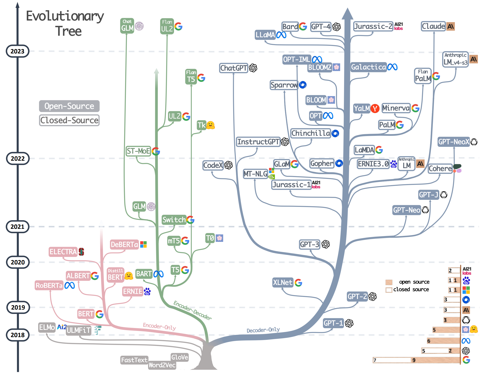

### 主流预训练模型详解

#### GPT

##### 概述

GPT（Generative Pre-trained Transformer）是第一个系统性提出“预训练 + 微调”范式的语言模型。

其核心思想是通过大规模无监督语料进行生成式语言建模预训练，即训练模型根据左侧上下文预测下一个词，从而让模型学习自然语言的通用语法、语义和上下文依赖能力。完成预训练后，再通过微调适应具体的下游任务。

GPT首次展示了生成式语言模型在自然语言理解任务中的广泛迁移能力，为后续 GPT 系列及整个预训练语言模型的发展奠定了基础。

##### 模型结构

GPT基于Transformer的解码器结构，但与标准的Transformer解码器并不完全相同，GPT具体结构如下图所示：

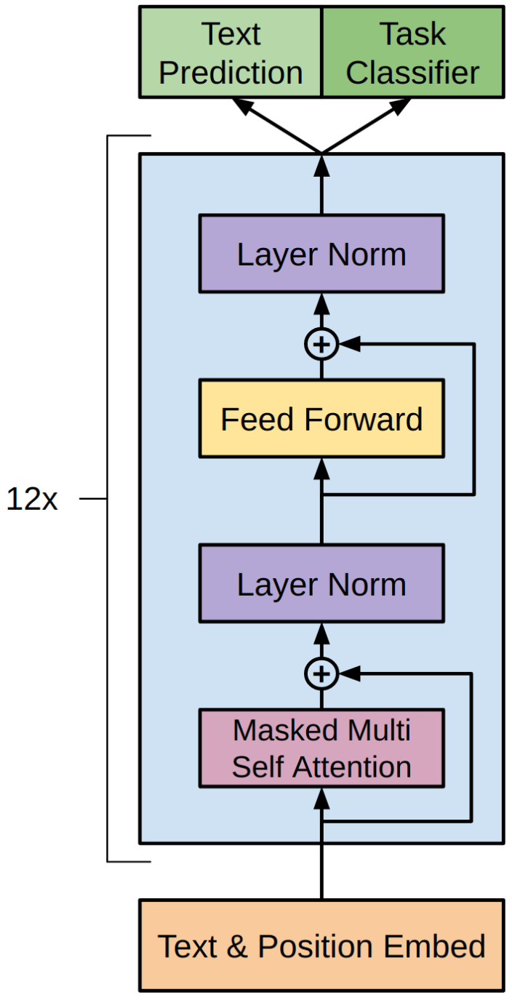

各部分细节如下：

###### 输入嵌入层（Text &amp; Position Embedding）

与原始Transformer一样，每个输入 token 的表示也由两部分组成：

- Text Embedding：将词或子词映射为向量；

- Position Embedding：提供词在序列中的位置信息。

GPT不同于原始Transformer的一点在于：位置编码采用的是可学习的位置嵌入（learnable positional embedding）。这意味着每个位置对应一个可训练的向量，模型可以在训练过程中自动优化这些向量，而非使用不可训练的三角函数编码（如正弦/余弦函数）。

每个token的最终表示是词嵌入与位置嵌入的向量和，向量维度为 768。

###### 解码器

解码器部分由12个结构相同的解码器层堆叠而成，每个解码器层只包含如下两个子层：

- 掩码多头自注意力（12头）

- 前馈网络

###### 输出层

根据任务不同，GPT模型的输出可以接入不同的任务头：

- Text Prediction（文本预测）

用于下一个词的生成，输出是词表大小的概率分布，经过Softmax获得，预训练阶段使用的便是该任务头。

- Task Classifier（任务分类器）

该任务头多用于模型微调阶段，以适配具体的下游任务。通过提取特定位置的表示（如最后一个token）对整个输入文本进行分类（如情感分析、话题识别等）。

##### 预训练

GPT 的预训练阶段采用生成式语言建模（Generative Language Modeling）作为训练目标，在大规模无监督文本上进行自监督学习。具体而言，模型的任务是基于已观察到的前文上下文，预测当前词的位置应出现的词，从而学习自然语言的统计规律与上下文依赖关系。这种自回归语言建模方式不依赖人工标注，训练样本可以直接从原始文本中自动构建，极大地降低了构建数据的成本。

GPT 使用 Transformer 架构，具备全局自注意力机制，能够有效建模长距离依赖信息。同时，Transformer 的并行计算特性使得模型能够高效处理长文本序列，相较于传统的 RNN 架构，训练效率显著提升，也使得在大规模语料上进行预训练成为可能。

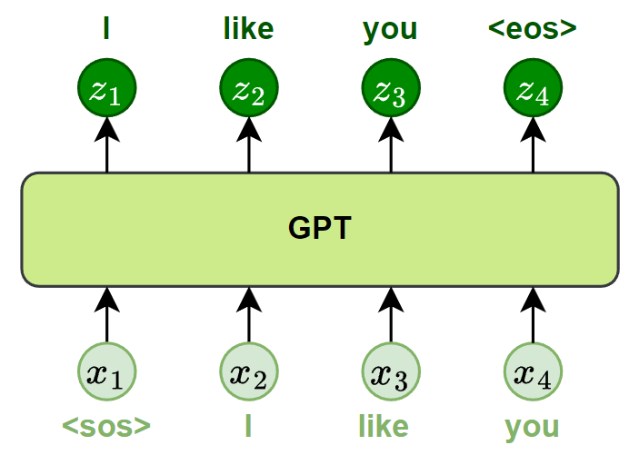

图示：GPT 语言建模任务

在实践中，GPT-1 使用了一个名为 BooksCorpus 的英文语料库，包含来自 7000 多本小说的完整书籍文本，总规模约 8 亿词。该语料语言自然、上下文完整，非常适合训练具备长距离依赖建模能力的语言模型。

##### 微调

GPT的微调阶段是在完成无监督语言建模预训练之后，使用有监督的任务数据对模型进行进一步训练，使其适应具体的下游任务。微调的核心思路是：在保留预训练语言建模能力的基础上，利用标注数据对整个模型进行端到端优化，从而实现知识迁移。

具体实践中，GPT采用了如下两个关键措施：

- 添加任务输出层

在预训练模型顶部引入一个线性输出层（Linear Head），用于将 GPT 的隐藏状态映射为下游任务所需的标签或输出。

- 统一输入格式设计

GPT 作为自回归语言模型，其输入需为连续的文本序列。因此，在微调过程中需将各种下游任务转化为统一的文本输入格式。

下图展示了不同任务的微调逻辑：

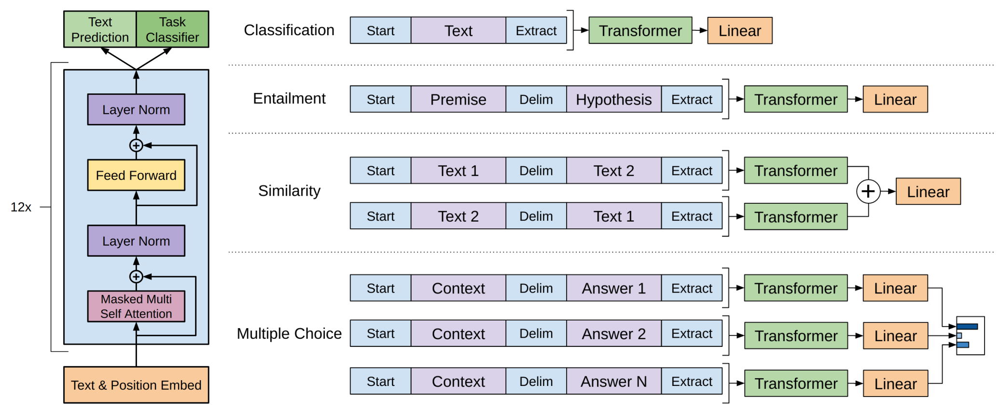

以图中的文本分类任务为例，假设我们有一个带标注的微调数据集如下：

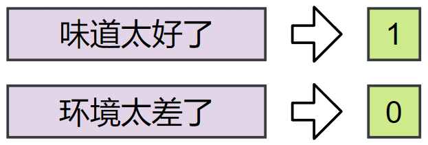

首先，将每条评论转为 token 序列，并添加特殊标记 [Start] 与 [Extract]，形成模型标准输入格式：

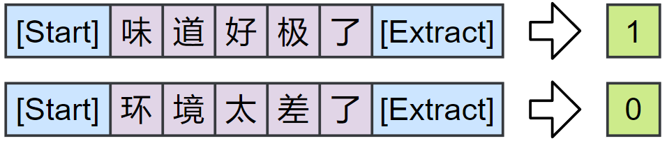

然后，将转换后的序列送入 GPT 模型。模型逐层处理后，输出每个位置的预测。我们只提取序列中最后一个位置 [Extract] 对应的输出，再通过新添加的线性输出层完成分类预测，最中输出标签“0”或“1”。如下图所示：

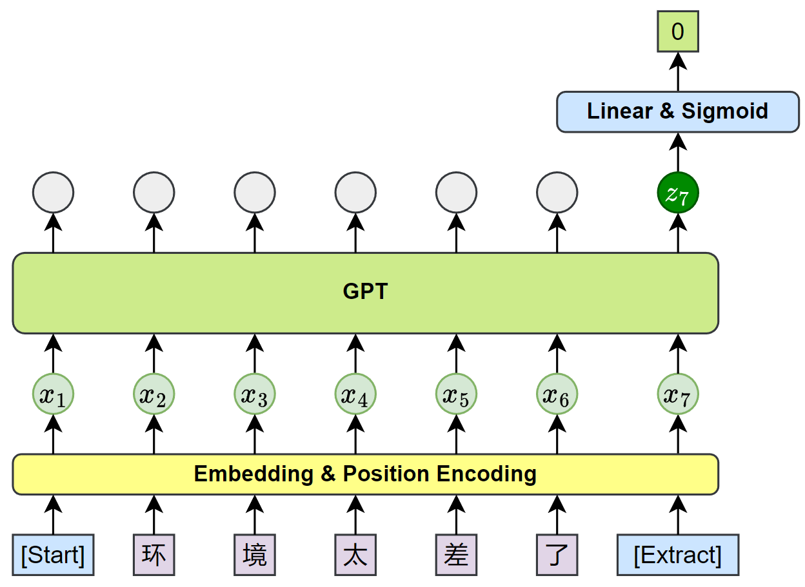

通过这种方式，GPT 在保留预训练模型结构和参数的基础上，仅添加极少量新参数（如线性层），便可高效完成从语言建模到多种下游任务的迁移。

此外，统一的输入格式设计进一步简化了多任务处理流程，使 GPT 能以一致的方式应对多种 NLP 任务，从而展现出强大的通用性与扩展性。

#### BERT

##### 概述

BERT（Bidirectional Encoder Representations from Transformers）是由 Google 于 2018 年提出的一种语言预训练模型。其核心创新在于采用 Transformer 的编码器（Encoder）结构，通过双向自注意力机制，在建模每个 token 表示时同时整合左右两个方向的上下文信息，从而获得更准确、更丰富的语义表示。

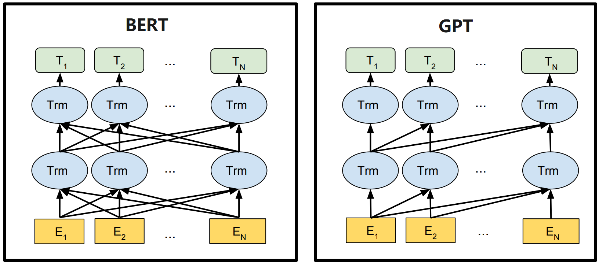

在得到每个 token 的表示后，BERT可通过添加简单的任务特定层，适配不同类型的下游任务。

BERT 的设计更侧重于自然语言理解类任务，广泛应用于文本分类、序列标注、句子匹配等场景。模型发布后，在多个语言理解基准测试中取得了前所未有的领先成绩，推动 NLP 研究全面转向“预训练 + 微调”的通用建模范式。

##### 模型结构

BERT 基于标准的 Transformer 编码器构建，其提供了两种模型规模，分别是BERT-base和BERT-large。

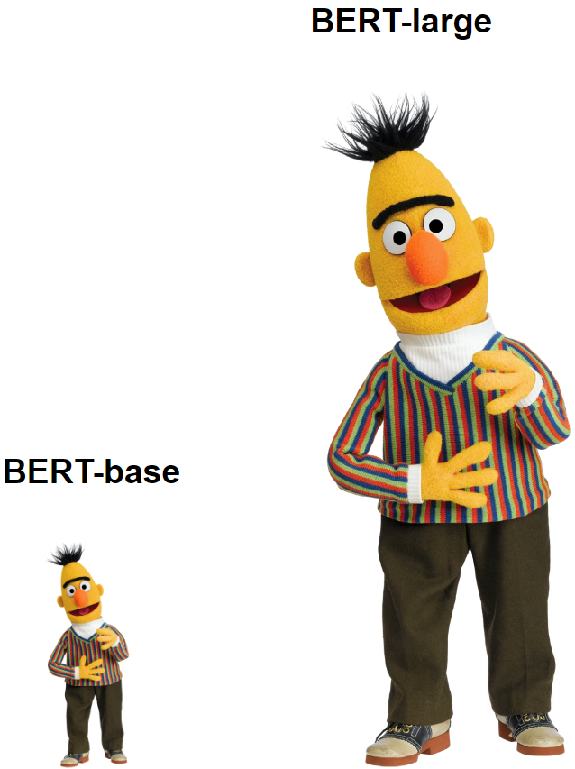

具体参数规格如下：

| 模型版本 | 层数<br>（Layers） | 模型维度<br>（d_model） | 注意力头数<br>（Heads） | 参数量 |
| --- | --- | --- | --- | --- |
| BERT-base | 12 | 768 | 12 | 1.1 亿 |
| BERT-large | 24 | 1024 | 16 | 3.4 亿 |

BERT模型各部分的结构细节如下：

###### 输入表示层

BERT 的每个输入 token 表示由三部分嵌入相加组成：

- Token Embedding：词本身的语义表示；

- Position Embedding：表示 token 在序列中的位置，为可学习向量；

- Segment Embedding：用于区分句子对任务中的两个句子，分别用一个可学习的向量表示。

如下图所示：

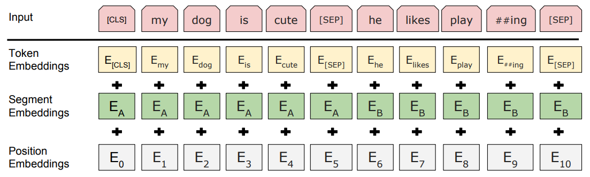

此外，BERT 输入中通常包含两个特殊符号：

[CLS]：句首标志，其输出向量常用于下游的文本分类任务；

[SEP]：句间分隔符，出现在每个句子末尾。

###### 编码器

编码器结构同原始Transformer相同，不再赘述。

###### 输出层

根据下游任务的类型，BERT 可以接入不同的任务输出头：

Token-Level 任务（如命名实体识别）：使用每个位置的输出表示；

Sequence-Level 任务（如文本分类、句子对分类）：使用特殊 token [CLS] 的输出表示，输入时被加在序列开头，专门用于汇总整个序列的语义信息。

##### 预训练

BERT 的预训练阶段包含两个核心任务：掩码语言模型（Masked Language Modeling, MLM） 和 下一句预测（Next Sentence Prediction, NSP），分别用于学习词级语义和句间逻辑关系。

- 掩码语言模型（MLM）

为实现双向语言建模，BERT 不采用传统的从左到右或从右到左预测方式，而是引入了掩码语言模型。在训练中，BERT 会随机遮盖输入序列中约 15% 的 token，并训练模型根据上下文预测被遮盖的词。

遮盖策略如下：

  - 80% 的被遮盖 token 替换为 [MASK]；

  - 10% 替换为随机词；

  - 10% 保持原词不变。

这种机制让模型在预训练时既能看到左侧上下文，也能看到右侧上下文，真正实现深度双向建模。

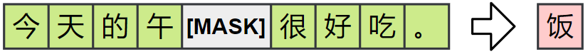

- 下一句预测（NSP）

为了提升模型理解句间关系的能力，BERT 引入了“下一句预测”任务。训练时模型接收两个句子，判断第二句是否是第一句的真实后续句，其中：

50% 的训练样本是上下文中真实相邻的句子（正例）；

50% 是从语料中随机采样的非相邻句子（反例）。

- 正例：

- A：我今天很忙。

- B：所以没去上班。

- 反例：

- A：我今天很忙。

- B：天气很好。

在预训练时，BERT 同时优化 MLM 和 NSP 两个目标，具体操作如下图所示：

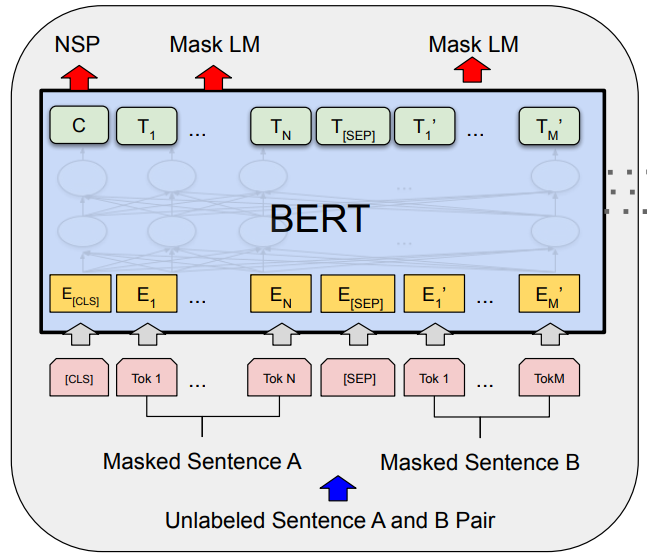

##### 微调

在预训练完成后，BERT 可通过少量微调适配多种下游任务，如文本分类、句子匹配、问答系统、序列标注等。微调时，模型主体结构保持不变，仅在顶部添加一个任务特定的输出层，并使用下游任务数据对整个模型进行训练。

BERT 的输入格式在微调阶段基本保持与预训练一致，仍以 token 序列为输入，使用 [CLS] 和 [SEP] 等特殊符号。不同任务的差异主要体现在输出层设计，以及从模型输出中提取哪些表示进行预测。

下面分别介绍 BERT 在四类典型任务中的微调方式：

(a) 句子对分类任务

输入格式：[CLS] 句子1 [SEP] 句子2 [SEP]

输出方式：使用 [CLS] 的输出向量接入线性层进行分类，用于判断两个句子之间是否存在重复、蕴含、矛盾等关系。

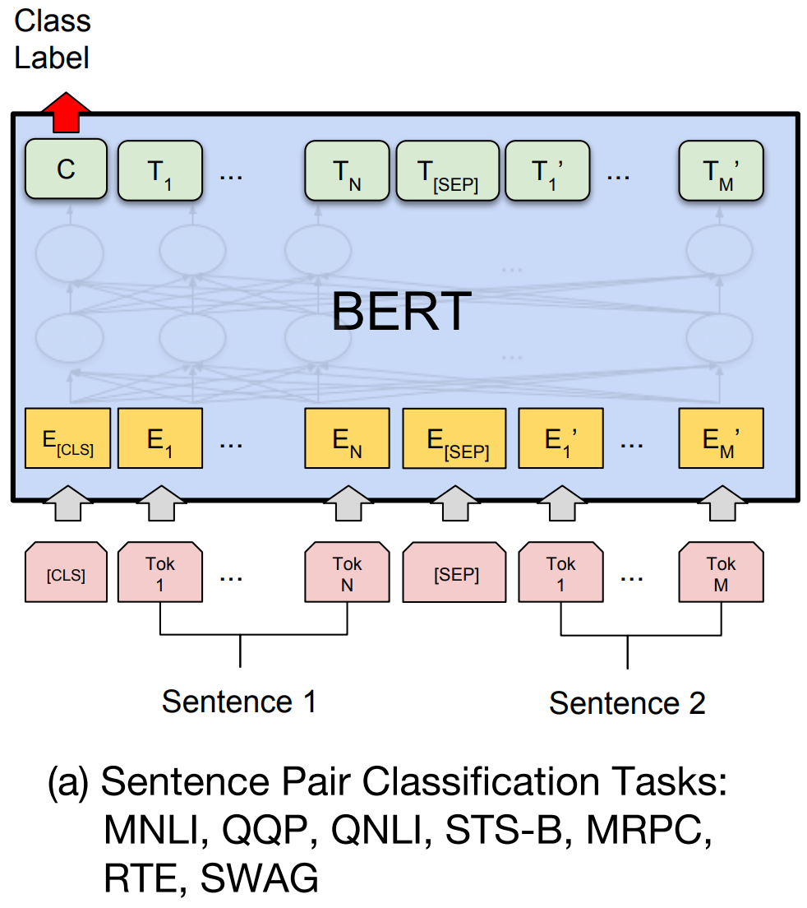

注：

- MNLI：Multi-Genre Natural Language Inference，多类别句子蕴含判断

- QQP: Quora Question Pairs，问句语义重复判断

- QNLI: Question Natural Language Inference ，判断句子是否为问题的答案

- STX-B: Semantic Textual Similarity Benchmark，语义相似度回归

- MRPC: Microsoft Research Paraphrase Corpus，句子复述判断

- RTE: Recognizing Textual Entailment，二分类蕴含判断

- SWAG: Situations With Adversarial Generations，多项选择填句任务

(b) 单句分类任务

输入格式：[CLS] 句子 [SEP]

输出方式：同样使用 [CLS] 的输出向量，经过线性层用于情感极性判断、语法可接受性判断等。

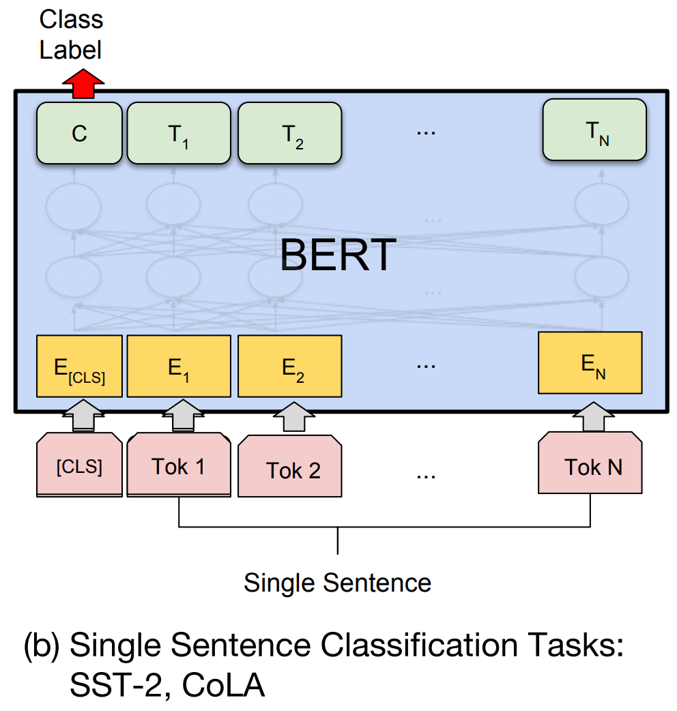

注：

- SST-2: Stanford Sentiment Treebank (binary)，情感极性判断（二分类）

- CoLA: Corpus of Linguistic Acceptability，语法可接受性判断（二分类）

(c) 问答任务

输入格式：[CLS] 问题 [SEP] 段落 [SEP]

输出方式： 模型不会使用 [CLS] 向量，而是对每个 token 分别预测其作为答案起始位置和结束位置的概率。最终根据得分确定答案在段落中的位置范围，从中直接抽取连续的答案文本。

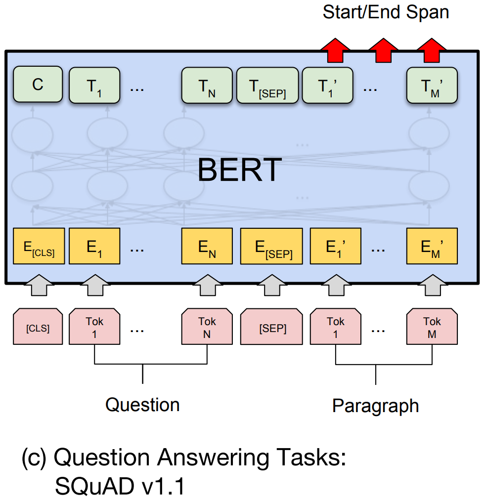

注：

- SQuAD v1.1：Stanford Question Answering Dataset 抽取式问答（起止定位）

(d) 序列标注任务

输入格式：[CLS] 句子 [SEP]

输出方式：对每个 token 的输出向量单独进行分类，例如判断是否为人名（B-PER）、地名（B-LOC）等。

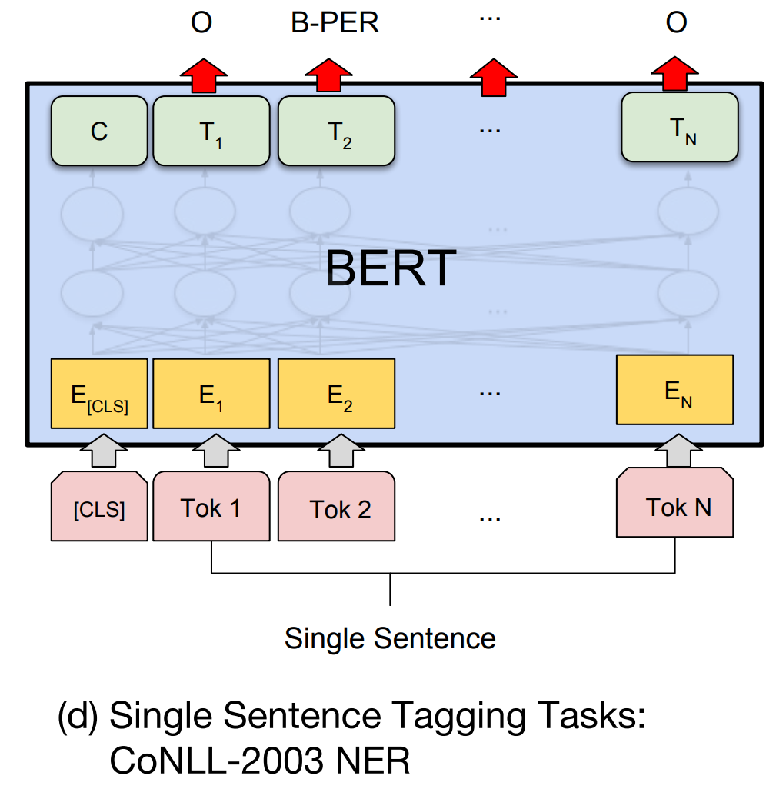

注：

NER：Named Entity Recognition，命名实体识别

#### T5

##### 概述

T5（Text-to-Text Transfer Transformer）是 Google Research 于 2020 年提出的一种统一预训练框架，它首次在完整的 Transformer 编码器-解码器结构（Encoder-Decoder）上实现了预训练语言模型。

T5的核心思想是将所有自然语言处理任务统一表示为“文本到文本”的转换问题（Text-to-Text Framework），即无论输入是文本分类、问答还是翻译，模型的输入输出均是自然语言形式的字符串，如下图所示：

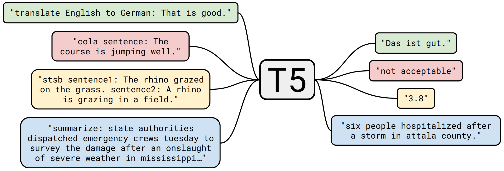

这一设计使得 T5 可以通过同一个模型架构、同一套预训练机制完成多种任务，具备极强的统一性与迁移能力。

##### 模型结构

T5模型大体遵循原始的Transformer架构，此处不再赘述。

##### 预训练

T5模型的预训练目标被称为Corrupted span prediction，具体过程如下：

###### 随机遮盖输入文本中的若干连续片段（span）；

###### 将每个被遮盖的连续片段替换为一个个特殊token；

###### 令模型学习生成这些遮盖片段的内容，作为输出序列。

如下图所示：

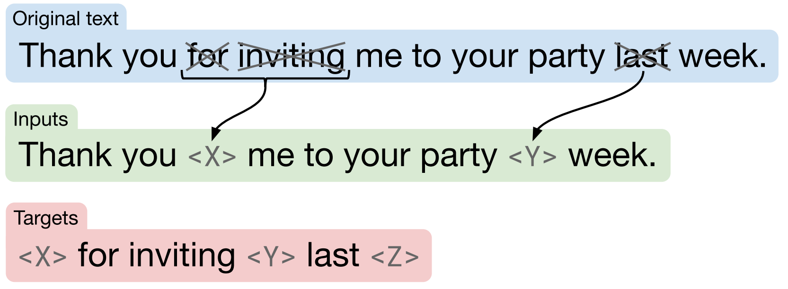

这种方式既保留了模型的双向建模能力，又为训练提供了明确的“生成式”学习信号，使模型可以更自然的适配下游任务。

##### 微调

T5微调阶段需要将所有任务转换为文本到文本的形式，例如：

| 任务类型 | 输入形式 | 目标输出 |
| --- | --- | --- |
| 翻译 | translate English to German: That is good. | Das ist gut. |
| 情感分类 | sentiment: This movie was great. | positive |
| 问答 | question: What is the capital of France? context: France is a country... | Paris |

### HuggingFace快速入门

HuggingFace 是一个提供预训练模型和相关工具链的平台，具体用法可参考见如下文档

### 案例实操（AI智评V3.0）

#### 需求说明

本案例任务是基于预训练 BERT 模型实现评论的情感分析任务。

#### 需求实现

###### 项目结构

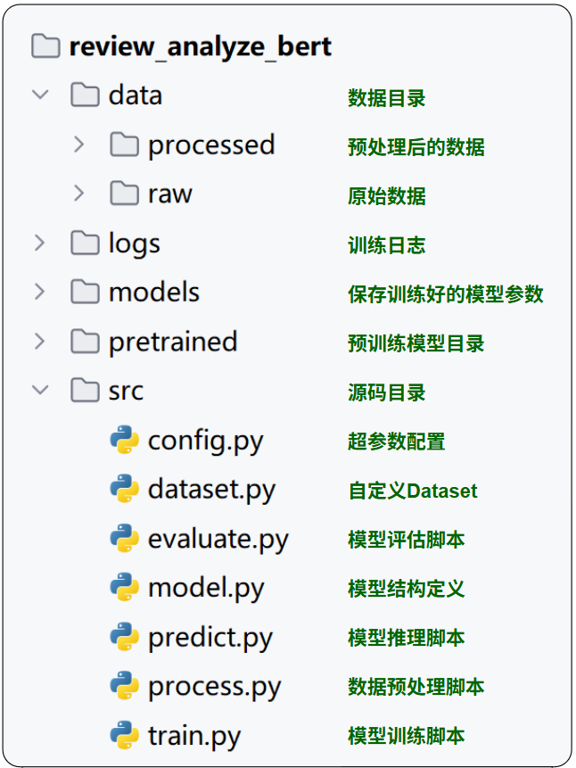

###### 完整代码

###### 数据预处理

```
# process.py

from datasets import load_dataset, ClassLabel
from transformers import AutoTokenizer
import config

def process_data():
    # 加载原始 CSV 数据
    dataset = load_dataset('csv', data_files=str(config.RAW_DATA_DIR / 'online_shopping_10_cats.csv'))['train']

    # 过滤空评论和非二分类标签
    dataset = dataset.filter(lambda x: x['review'] is not None and x['review'].strip() != '' and x['label'] in [0, 1])

    # 划分训练集和测试集
    dataset = dataset.cast_column("label", ClassLabel(names=["neg", "pos"]))
    dataset_dict = dataset.train_test_split(test_size=0.2, seed=42, stratify_by_column='label')
    print("数据划分完成")

    # 加载分词器
    tokenizer = AutoTokenizer.from_pretrained(config.PRE_TRAINED_DIR / 'bert-base-chinese')

    # 编码函数
    def tokenize(example):
        encoded = tokenizer(
            example['review'],
            max_length=config.SEQ_LEN,
            truncation=True,
            padding='max_length'
        )
        return {
            'input_ids': encoded['input_ids'],
            'attention_mask': encoded['attention_mask']
        }

    # 对训练和测试集分别编码
    dataset_dict = dataset_dict.map(tokenize, batched=True)
    print("分词完成")

    # 删除字段
    dataset_dict = dataset_dict.remove_columns(['review', 'cat'])

    # 保存处理结果
    dataset_dict['train'].save_to_disk(str(config.PROCESSED_DATA_DIR / 'train'))
    dataset_dict['test'].save_to_disk(str(config.PROCESSED_DATA_DIR / 'test'))
    print("保存完成")

if __name__ == '__main__':
    process_data()
```

###### 自定义数据集

```
# dataset.py

from datasets import load_from_disk
from torch.utils.data import DataLoader

import config

def get_dataset(train=True):
    path = config.PROCESSED_DATA_DIR / ('train' if train else 'test')
    dataset = load_from_disk(str(path))

    # 设置为 PyTorch 格式，列自动转换为 tensor
    dataset.set_format(type='torch', columns=['input_ids', 'attention_mask', 'label'])

    return dataset

def get_dataloader(train=True):
    dataset = get_dataset(train)
    return DataLoader(dataset, batch_size=config.BATCH_SIZE, shuffle=True)

# 数据加载测试入口
if __name__ == '__main__':
    dataloader = get_dataloader(train=True)
    for batch in dataloader:
        print({k: v.shape for k, v in batch.items()})
        break
```

###### 模型定义

```
# model.py

import torch.nn as nn
from transformers import AutoModel

import config

class ReviewAnalyzeModel(nn.Module):
    def __init__(self, freeze_bert=True):
        super().__init__()

        # 加载本地预训练的 BERT 模型
        self.bert = AutoModel.from_pretrained(config.PRE_TRAINED_DIR / 'bert-base-chinese')

        # 分类器：接收 [CLS] 向量 → 输出二分类的得分
        self.classifier = nn.Linear(self.bert.config.hidden_size, 1)
        # self.classifier 输入: (batch_size, hidden_size)
        # self.classifier 输出: (batch_size, 1)

        # 是否冻结 BERT 参数（只训练分类器部分）
        if freeze_bert:
            for param in self.bert.parameters():
                param.requires_grad = False

    # 前向传播过程
    def forward(self, input_ids, attention_mask):
        # input_ids.shape: (batch_size, seq_len)
        # attention_mask.shape: (batch_size, seq_len)

        # BERT 输出是命名元组，包含多个字段,其中last_hidden_state最后一层所有 token 的输出
        outputs = self.bert(input_ids=input_ids, attention_mask=attention_mask)
        # outputs.last_hidden_state.shape: (batch_size, seq_len, hidden_size)

        # 提取 [CLS] token（第一个位置）的输出向量
        cls_output = outputs.last_hidden_state[:, 0, :]  # cls_output.shape: (batch_size, hidden_size)

        # 通过线性层生成 logits
        logits = self.classifier(cls_output)  # logits.shape: (batch_size, 1)

        return logits.squeeze(-1)  # 返回形状: (batch_size,)
```

###### 模型训练

```
# train.py

import time

import torch
from torch.utils.tensorboard import SummaryWriter
from tqdm import tqdm

import config
from dataset import get_dataloader
from model import ReviewAnalyzeModel

def train_one_epoch(model, dataloader, optimizer, loss_fn, device):
    model.train()
    total_loss = 0

    for batch_index, batch in enumerate(tqdm(dataloader, desc="训练")):
        input_ids = batch['input_ids'].to(device)  # input_ids.shape: (batch_size, seq_len)
        attention_mask = batch['attention_mask'].to(device)  # attention_mask.shape: (batch_size, seq_len)
        labels = batch['label'].float().to(device)  # labels.shape: (batch_size,)

        # 清除历史梯度
        optimizer.zero_grad()

        # 模型前向传播
        outputs = model(input_ids=input_ids, attention_mask=attention_mask)
        # outputs.shape: (batch_size,)

        # 计算损失
        loss = loss_fn(outputs, labels)

        # 反向传播并更新参数
        loss.backward()
        optimizer.step()

        # 统计与显示损失
        total_loss += loss.item()
    avg_loss = total_loss / len(dataloader)
    return avg_loss

# 模型训练主函数
def train():
    # 选择运行设备
    device = torch.device("cuda" if torch.cuda.is_available() else "cpu")
    print(f"device: {device}")

    # 加载训练数据集
    dataloader = get_dataloader(train=True)
    print("数据集加载完成")

    # 初始化模型并移动到设备
    model = ReviewAnalyzeModel(freeze_bert=False).to(device)

    # 使用 Adam 优化器
    optimizer = torch.optim.Adam(model.parameters(), lr=config.LEARNING_RATE)

    # 使用带 sigmoid 的二分类交叉熵损失函数
    loss_function = torch.nn.BCEWithLogitsLoss()

    # 初始化 TensorBoard 写入器
    log_dir = config.LOGS_DIR / time.strftime("%Y%m%d-%H%M%S")
    writer = SummaryWriter(log_dir=str(log_dir))

    # 多轮训练
    best_loss = float("inf")
    for epoch in range(1, config.EPOCHS + 1):
        print(f"========== Epoch {epoch} ==========")
        avg_loss = train_one_epoch(model, dataloader, optimizer, loss_function, device)

        print(f"训练集loss: {avg_loss:.4f}")

        # 写入 TensorBoard 日志
        writer.add_scalar("Loss/train", avg_loss, epoch)

        # 保存训练好的模型
        if avg_loss < best_loss:
            best_loss = avg_loss
            torch.save(model.state_dict(), config.MODELS_DIR / 'model.pt')
    writer.close()

if __name__ == '__main__':
    train()
```

###### 模型预测

```
# predict.py

import torch
from transformers import AutoTokenizer
import config
from model import ReviewAnalyzeModel

# 对一个 batch 的输入进行预测，返回 sigmoid 概率
def predict_batch(input_ids, attention_mask, model):
    model.eval()

    # input_ids.shape: (batch_size, seq_len)
    # attention_mask.shape: (batch_size, seq_len)

    with torch.no_grad():
        logits = model(input_ids=input_ids, attention_mask=attention_mask)
        # logits.shape: (batch_size,)

        probs = torch.sigmoid(logits)  # 概率值 ∈ [0, 1]，表示为正面情感的置信度
        return probs.tolist()  # 返回 Python 列表

def predict_text(user_input, model, tokenizer, device):
    # 文本编码为张量形式（长度固定）
    encoded = tokenizer(
        user_input,
        max_length=config.SEQ_LEN,
        padding='max_length',
        truncation=True,
        return_tensors='pt'
    )
    input_ids = encoded['input_ids'].to(device)  # input_ids.shape: (1, seq_len)
    attention_mask = encoded['attention_mask'].to(device)  # attention_mask.shape: (1, seq_len)

    # 模型预测
    prob = predict_batch(input_ids, attention_mask, model)[0]
    return prob

# 交互式预测主程序
def run_predict():
    # 设置运行设备
    device = torch.device("cuda" if torch.cuda.is_available() else "cpu")

    # 加载分词器和模型
    tokenizer = AutoTokenizer.from_pretrained(config.PRE_TRAINED_DIR / 'bert-base-chinese')
    model = ReviewAnalyzeModel().to(device)
    model.load_state_dict(torch.load(config.MODELS_DIR / 'model.pt', map_location=device))

    # 命令行交互循环
    print('请输入评价（输入q 或者 quit 退出）：')
    while True:
        user_input = input('> ').strip()

        # 输入为空或退出
        if user_input.lower() in {'q', 'quit'}:
            print('感谢使用，再见！')
            break
        if not user_input:
            print('输入不能为空，请重新输入')
            continue

        result = predict_text(user_input, model, tokenizer, device)

        # 显示结果
        if result > 0.5:
            print(f"正面评价（置信度：{result:.2f}）")
        else:
            print(f"负面评价（置信度：{1 - result:.2f}）")

if __name__ == '__main__':
    run_predict()
```

###### 模型评估

```
# evaluate.py

import torch
from tqdm import tqdm

import config
from dataset import get_dataloader
from model import ReviewAnalyzeModel
from predict import predict_batch

def evaluate_model(dataloader, model, device):
    correct = 0
    total = 0

    for batch in tqdm(dataloader, desc="评估"):
        input_ids = batch['input_ids'].to(device)  # input_ids.shape: (batch_size, seq_len)
        attention_mask = batch['attention_mask'].to(device)  # attention_mask.shape: (batch_size, seq_len)
        labels = batch['label'].to(device)  # labels.shape: (batch_size,)

        # 预测每个样本的正面情感概率
        probs = predict_batch(input_ids, attention_mask, model)  # probs 是 float 列表

        # 将概率转换为预测标签（>= 0.5 为正面）
        preds = [1 if p >= 0.5 else 0 for p in probs]

        # 计算准确数量
        for pred, label in zip(preds, labels):
            if pred == int(label.item()):
                correct += 1
            total += 1

    # 输出准确率
    acc = correct / total if total > 0 else 0
    print("======= 评估结果 =======")
    print(f"准确率: {acc:.4f}")
    print("========================")

def run_evaluate():
    # 设置运行设备
    device = torch.device("cuda" if torch.cuda.is_available() else "cpu")

    # 加载模型
    model = ReviewAnalyzeModel().to(device)
    model.load_state_dict(torch.load(config.MODELS_DIR / 'model.pt', map_location=device))

    # 加载测试数据集
    dataloader = get_dataloader(train=False)

    # 执行评估
    evaluate_model(dataloader, model, device)

if __name__ == '__main__':
    run_evaluate()
```

###### 配置文件

```
# config.py

from pathlib import Path

# 项目根目录
BASE_DIR = Path(__file__).parent.parent

# 路径设置
MODELS_DIR = BASE_DIR / 'models'  # 模型参数保存路径
PROCESSED_DATA_DIR = BASE_DIR / 'data' / 'processed'  # 已处理数据存放路径（如 token 序列）
RAW_DATA_DIR = BASE_DIR / 'data' / 'raw'  # 原始 CSV 或文本数据路径
LOGS_DIR = BASE_DIR / 'logs'  # TensorBoard 日志保存路径
PRE_TRAINED_DIR = BASE_DIR / 'pretrained'  # 本地预训练模型存放路径

# 训练超参数
SEQ_LEN = 128  # 最大序列长度
BATCH_SIZE = 128  # 批处理大小
LEARNING_RATE = 1e-5  # 学习率
EPOCHS = 30  # 训练轮数
```

## 附录

###### nltk：自然语言工具包，具体用法见官网

###### Tensorboard：深度学习可视化工具，具体用法见文档
